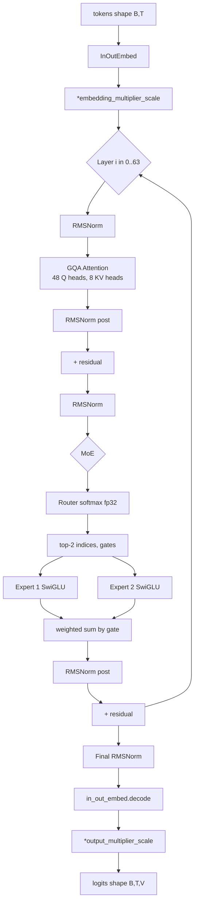

# 第 2 章 总体架构

本章是后续章节的"地图" - 我们先用一张图、一张表、几段叙述，把 Grok-1 的整体形状画清楚，让你在进入逐行精读前心里有数。如果你已经熟悉同代 MoE，这一章可以快速跳过。

## 2.1 一句话先把骨架立起来

Grok-1 是 **64 层 decoder-only transformer**，每一层把 FFN 子层换成 **8 个 SwiGLU 专家中 top-2 路由**的 MoE 块，其余部分（GQA 注意力、RoPE、RMSNorm、残差）与 LLaMA-2 同代设计基本一致。模型整体只接受 token 输入、输出 next-token logits，没有 cross-attention，没有 encoder。

但"基本一致"里藏着几个少见的设计选择，本章先列出来，后面的精读章节再细看：

1. **GQA：48 Q 头对 8 KV 头**，比例 6:1（LLaMA-2 70B 是 64 Q 对 8 KV，比例 8:1）
2. **每个 sub-layer 用了两次 RMSNorm**：pre-norm + post-norm 都做，是 Cohere Command R 同款的"sandwich norm"（`model.py:1056-1060`，下文 2.5 详述）
3. **embedding 用 sqrt(d) 量级放大**，输出再乘 1/sqrt(3) - 这是 µ-Transfer / DeepNet 风格的 scale 控制
4. **attention logit 用 `30 * tanh(x/30)` 软裁剪**，防止溢出（`model.py:864-865`）
5. **MoE 路由没有 auxiliary loss、没有 capacity drop**：纯 softmax + top-2，所有 token 一律走两个专家

下面用一张数据流图把整体串起来。

值得在进入图之前先确认一下"什么是 decoder-only"。Transformer 原始论文（2017）的架构是 encoder + decoder，做翻译时 encoder 编码源语言、decoder 生成目标语言。decoder 里有两种 attention - self-attention（看自己已生成的部分）和 cross-attention（看 encoder 的输出）。

2018-2020 年的研究发现：纯 decoder 训练 language modeling 任务，scale 起来效果更好。GPT 系列从一开始就是 decoder-only，Llama、Mistral、Grok 全部是 decoder-only。decoder-only 的好处：架构统一、可以做 autoregressive 推理、训练效率高。Grok-1 的"decoder-only Transformer"就是这个意思 - 不带 encoder，只有 self-attention 和 FFN 的层堆叠。

## 2.2 数据流总览



几点需要特别注意：

- **InOutEmbed**（`model.py:1110-1143`）输入和输出权重共享 - 输入是 `embed_mat[token_id]`，输出是 `embeddings @ embed_mat.T`
- **每个 sub-layer 后做了两次 RMSNorm** - 一次 pre（在子层输入前），一次 post（在子层输出后再加到 residual 前）
- **MoE 的两个专家输出是按 gate 加权求和后再过 post-RMSNorm**，不是各自单独 norm

### 2.2.1 数据流图的几个细节再说明

图里的关键步骤：

- **InOutEmbed**：输入 token id 通过查表得到 hidden 向量。输出阶段同样的 embedding 矩阵转置后做 logit 投影。这种"输入输出共享 embedding"叫 tied embedding，节省 0.81B 参数
- **\*embedding_multiplier_scale**：embedding 出来后乘以 78.38（≈ $\sqrt{d}$）的放大因子，这是 Vaswani 2017 风格的设计
- **每层 RMSNorm 共出现 4 次**：pre-attn、post-attn、pre-FFN、post-FFN，这是 Grok-1 的"sandwich norm"
- **GQA 48Q vs 8KV**：48 个 query head 分 8 组，每组 6 个 Q 共享一组 K/V
- **Router**：fp32 softmax + top-2 路由
- **MoE 选 2 个专家加权求和**：每个 token 走 2 个专家的 FFN，输出按 routing prob 加权
- **Final RMSNorm**：所有 64 层后再做一次 norm
- **\*output_multiplier_scale**：logits 出来后乘以 0.577（$1/\sqrt{3}$）

这 8 个步骤是 Grok-1 推理时每个 token 都要走的"宏路径"。第 4-6 章会把每个步骤展开到代码级。

## 2.3 模型规模账：314B 到底从哪里来

精确算一遍。设：

- $d = 6144$（emb_size）
- $L = 64$（num_layers）
- $E = 8$ 专家，$k = 2$ 激活
- $V = 131072$（vocab_size = 128 × 1024）
- $H_q = 48$, $H_{kv} = 8$, $d_h = 128$
- FFN 中间维度由 `ffn_size(d, w)` 计算（`model.py:85-89`）：

```python
# model.py:85-89
def ffn_size(emb_size, widening_factor):
    _ffn_size = int(widening_factor * emb_size) * 2 // 3
    _ffn_size = _ffn_size + (8 - _ffn_size) % 8  # ensure it's a multiple of 8
    return _ffn_size
```

代入 `widening_factor=8`：`int(8 * 6144) * 2 // 3 = 49152 * 2 // 3 = 32768`，已经是 8 的倍数，所以 $d_{\text{ffn}} = 32768$。

### 2.3.1 每层参数

**Attention：**

| 矩阵 | shape | 参数 |
| --- | --- | --- |
| Q 投影 | $(d, H_q d_h) = (6144, 6144)$ | 37.7 M |
| K 投影 | $(d, H_{kv} d_h) = (6144, 1024)$ | 6.3 M |
| V 投影 | $(d, H_{kv} d_h) = (6144, 1024)$ | 6.3 M |
| Output 投影 | $(H_q d_h, d) = (6144, 6144)$ | 37.7 M |
| 合计 | - | **88.1 M** |

注意：Q/K/V 都有 bias（`with_bias=True` 是 `Linear` 的默认值，但 MHA 调用时显式 `with_bias=False`，见 `model.py:887` 的 `final_projection` 与 `_linear_projection` 中 `Linear(num_heads * head_size, with_bias=False, ...)` 的 `model.py:905`）。所以 attention 内部所有 Linear 都没 bias。

**FFN（每个 expert 是一个 SwiGLU）：**

`DenseBlock` 在 `model.py:963-1007` 定义，三个 Linear 都是 `with_bias=False`：

| 矩阵 | shape | 参数 |
| --- | --- | --- |
| linear_v | $(d, d_{\text{ffn}}) = (6144, 32768)$ | 201.3 M |
| linear (gate) | $(6144, 32768)$ | 201.3 M |
| linear_1 | $(32768, 6144)$ | 201.3 M |
| 单 expert 合计 | - | **603.9 M** |
| 8 个 expert | - | **4.83 B** |

**LayerNorm（RMSNorm）：** 每层 4 个 RMSNorm（attention pre/post + FFN pre/post，见 `model.py:137-140` partition rules 中的 `rms_norm` ~ `rms_norm_3`），每个 6144 个 scale，共 24576 参数 - 可忽略。

**Router：** $d \times E = 6144 \cdot 8 = 49152$ 参数 - 可忽略。

**每层总计：** $88.1\text{M} + 4830\text{M} \approx 4.92\,\text{B}$

### 2.3.2 整模型

| 组件 | 参数 |
| --- | --- |
| 64 层 × 4.92 B | 314.9 B |
| InOutEmbed (131072 × 6144) | 0.81 B |
| 最终 RMSNorm | 6144 |
| **总计** | **~315.7 B** |

官方说 "314B"，与上面的估算吻合（差额来自 router、norm、对 ffn_size 取整等小项；权重 tying 让 embedding 不重复计算）。

### 2.3.3 激活参数

每个 token 只激活 2 个 expert：

$$
P_{\text{active}} = 64 \cdot (0.088 + 2 \cdot 0.604) + 0.81 \approx 84\,\text{B}
$$

加上 router（每层 49K，可忽略）后约 86B - 与官方"约 86B 激活"对得上。

### 2.3.4 为什么 widening_factor=8 而 SwiGLU 通常是 widening=2.67

这是个看起来奇怪的细节。SwiGLU/GeGLU 的"中间维度"惯例是 $d_{\text{ffn}} \approx \frac{2}{3} \cdot 4 \cdot d = \frac{8}{3} \cdot d$，即 widening = 8/3 ≈ 2.67。Llama2 70B 的 hidden=8192、ffn=28672，正好 ratio = 3.5（略大于 8/3）。

Grok-1 的 widening_factor=8 看起来是 Llama2 的 3 倍。但 `ffn_size` 函数对它再乘 2/3，最终得到 $8 \cdot 6144 \cdot 2/3 = 32768$，是 $d=6144$ 的 5.33 倍。这比 SwiGLU 的 2.67 倍多了一倍。

为什么 Grok-1 选这么"胖"的 FFN？

可能的解释是：**MoE 里每个 expert 只服务 1/4 的 token**（top-2/8 = 25% 概率激活），如果想让 expert"看到足够多 token 学到特征"，就需要让每个 expert 的容量更大、参数更多，否则容量浪费。胖 expert 路线在 Mixtral 8x22B 也能看到（widening = 32768 / 6144 ≈ 5.33... 不对，Mixtral 8x22B 是 16384 / 6144 ≈ 2.67，标准 SwiGLU）。

所以 Grok-1 比 Mixtral 8x22B 在 FFN 上更胖 - 这又一次印证"Grok-1 是胖专家派的极端"。

## 2.4 与稠密 70B、Mixtral 8x7B 的参数账对比

| 模型 | 总参 | 激活参 | 激活比 | 路由 | $d$ | $L$ | $H_q$/$H_{kv}$ | $d_{\text{ffn}}$ | 专家数 / top-k |
| --- | --- | --- | --- | --- | --- | --- | --- | --- | --- |
| LLaMA-2 70B (dense) | 70 B | 70 B | 100% | - | 8192 | 80 | 64 / 8 | 28672 | 1 / - |
| Mixtral 8x7B | 46.7 B | 12.9 B | 27.6% | top-2 of 8 | 4096 | 32 | 32 / 8 | 14336 | 8 / 2 |
| Mixtral 8x22B | 141 B | 39 B | 27.7% | top-2 of 8 | 6144 | 56 | 48 / 8 | 16384 | 8 / 2 |
| **Grok-1** | **314 B** | **86 B** | **27.4%** | **top-2 of 8** | **6144** | **64** | **48 / 8** | **32768** | **8 / 2** |
| DeepSeek-V2 | 236 B | 21 B | 8.9% | top-6 of 160 + 2 shared | 5120 | 60 | 128 / 128 (MLA) | 12288 | 160 / 6 |

看到这张表，几个观察立刻浮现：

1. **Grok-1 几乎是 Mixtral 8x22B 的"放大版"**：相同的 $d=6144$、相同的 $H_q/H_{kv}=48/8$、相同 8/2 路由，区别只在层数（64 vs 56）和 FFN 中间维度（32768 vs 16384）
2. **激活比都在 27% 上下**：top-2/8 的设计让激活参 ≈ 总参 × (2/8 + 一点 attention) ≈ 总参 × 0.3
3. **Grok 用"层多 + 专家胖"的组合**：64 层、单专家 0.6B，是同代 MoE 里最胖的专家
4. **DeepSeek-V2 走了完全不同的路线**：细粒度专家（160 个，每个很小）+ shared expert + MLA，激活比降到 9%

这里"胖专家 vs 细粒度专家"是 MoE 设计的核心 trade-off。胖专家的优势：每个 expert 容量足，对单一任务学得透；缺点：选择空间小（8 选 2 只有 28 种组合），不同 token 之间的"路由分工"较粗。细粒度专家的优势：选择空间大（160 选 6 是天文数字），不同 token 可以分得很细；缺点：每个 expert 容量小，需要更多 expert 协作才能完成单一任务，路由开销高、负载均衡难。

Grok-1 选了胖专家路线，这是 2023 年初到中期最自然的选择 - 当时 Switch Transformer、GShard、GLaM 都用相对小数量的专家（8-64 个）。直到 2024 年下半年 DeepSeek-V2 用 160 个专家做出好效果，业界才开始大规模转向细粒度。

把表展开看更直观。dense 70B 把所有参数都激活，等同于"无专家的胖网络"；Mixtral 8x7B 是"小胖专家"；Mixtral 8x22B 和 Grok-1 是"大胖专家"；DeepSeek-V2 是"很多小专家 + shared expert"的混合策略。这是一条连续的设计谱，Grok-1 站在最靠近 dense 的那一端。

第 10 章会在这个表的基础上展开详细对比。

## 2.5 Sandwich norm：少见的归一化布局

主流的 pre-norm Transformer 写法是：

```
y = x + SubLayer(LayerNorm(x))
```

Grok-1 不这么写。看 `model.py:1048-1061`：

```python
# model.py:1048-1061
attn_output = MHABlock(...)(layer_norm(h), mask, layer_memory)
h_attn = attn_output.embeddings

h_attn = layer_norm(h_attn)       # 注意：再 norm 一次
h += h_attn
h = with_sharding_constraint(h, sharding)
```

即：

```
y = x + LayerNorm(SubLayer(LayerNorm(x)))
```

输入做 pre-norm 进子层，子层的输出**再做一次 post-norm**才加回 residual。两次 norm 把 residual 流和子层流都钳制住了。

这种"sandwich"布局在 Cohere Command R / Command R+ 里也有，被认为能让深层网络（80+ 层）训练更稳。Grok-1 64 层，使用这个 trick 应该是出于稳定性考虑。代价是每层多了 1 次 RMSNorm 计算 - 在 314B 的 FLOPs 占比里可以忽略。

第 6 章会在 DecoderLayer 精读时再展开。

## 2.5.1 双重 norm 的代价与收益

每层多一次 RMSNorm 的成本：

- **参数**：每 RMSNorm 多 6144 个 scale，4 个 norm 每层 24576 个参数。64 层共 1.57M 参数 - 在 314B 里可以忽略
- **计算**：每个 RMSNorm 需要 sum-of-squares + rsqrt + 乘 scale，约 3·d FLOPs。在 d=6144 时约 18K FLOPs，与一次 6144x6144 matmul（约 76M FLOPs）比小 4000 倍 - 几乎免费
- **内存带宽**：RMSNorm 是 memory-bound（读一次写一次 hidden），不显著但存在

收益：

- **训练稳定性**：64 层在 pre-norm 下也可能稳定，但 sandwich 给了"双保险"
- **量级控制**：residual stream 的量级被 post-norm 显式约束，避免深层后激活爆炸
- **与 unnormalized MoE gating 互补**：第 5 章会看到 Grok-1 的 expert gate 不归一化，输出量级会变化；post-RMSNorm 把它"重新校准"

这是一个典型的"小代价换大安心"工程决策。如果你训过深网络遇过 loss spike，会理解这种保守的价值。

## 2.6 Sharding 策略概览

`model.py:112-160` 的 `TRANSFORMER_PARTITION_RULES` 列出了每个权重的 partition 方案，分两轴 `data` / `model`。

```python
# model.py:112-160 节选
TRANSFORMER_PARTITION_RULES = [
    (("multi_head_attention", "(query|key|value)", "w"), P("data", "model")),
    (("multi_head_attention", "linear", "w"), P("model", "data")),
    ((r"decoder_layer_[0-9]+", "linear", "w"), P("data", "model")),
    ((r"decoder_layer_[0-9]+", "linear_v", "w"), P("data", "model")),
    ((r"decoder_layer_[0-9]+", "linear_1", "w"), P("model", "data")),
    (("router", "w"), P("data")),
    (("moe", "linear", "w"), P(None, "data", "model")),
    (("moe", "linear_v", "w"), P(None, "data", "model")),
    (("moe", "linear_1", "w"), P(None, "model", "data")),
    ...
]
```

读法：

- 元组前两个元素是路径正则，匹配参数名
- 元组最后是 `PartitionSpec`，指出每个张量维沿哪个 mesh 轴切

整体策略可以总结为：

| 类型 | 张量 shape | partition |
| --- | --- | --- |
| Q/K/V 投影 | $(d, d_{\text{out}})$ | (data, model) |
| Attention output | $(d_{\text{model}}, d)$ | (model, data) |
| MoE up | $(E, d, d_{\text{ffn}})$ | (None, data, model) |
| MoE gate | $(E, d, d_{\text{ffn}})$ | (None, data, model) |
| MoE down | $(E, d_{\text{ffn}}, d)$ | (None, model, data) |
| RMSNorm scale | $(d,)$ | None（复制） |
| Embedding | $(V, d)$ | (None, ("data", "model")) - 第二维同时沿两轴切 |

`run.py:60` 给的 `local_mesh_config=(1, 8)`，即 1 × 8 = 8 个 device，全部都给 model 维。`between_hosts_config=(1, 1)` 表示单机。如果是 16 卡分两机，会变成 `local_mesh_config=(1, 8)` + `between_hosts_config=(1, 2)`。

这种"全 model 不切 data"的策略，意味着 Grok-1 在 8 卡上跑的是**纯 tensor parallel** - 一个 batch 在所有卡上共享同一份计算图，但每张卡只保留一部分参数和激活。和 dense 模型在 8 卡上做 tensor parallel 的拓扑几乎一样。

如果想做 data parallel（batch 在多卡间并行），需要把 mesh 改成 (2, 4) 或 (4, 2) 这种比例。但 314B 的总参根本不允许在 < 8 个 device 上做 model dim 切分 - 4 个 device 一个 model shard 是 78 GB，超过单卡 80 GB 上限。所以 mesh 形状被显存上限锁死了。

注意 **embedding 的 partition 是 `(None, ("data", "model"))`** - 元组形式表示该维同时沿两条 mesh 轴切（即 device_count = data × model 个分片）。这是 JAX 的"嵌套维度"特性，在 `model.py:166` 体现。

```python
# model.py:162-174
LM_PARTITION_RULES = [
    (("language_model", "positional_embeddings"), P(None, ("data", "model"))),
    (("language_model", "in_out_embed", "embeddings"), P(None, ("data", "model"))),
    (("language_model", "rms_norm"), P(None)),
]
```

第 8 章会详细展开 mesh 和 `pjit` 的用法。第 3 章我们先把 config 字段全部说清楚。

## 延伸阅读

- Cohere [Command R Technical Report](https://docs.cohere.com/docs/command-r) - sandwich norm 的另一个实例
- [DeepSeek-V2 Technical Report](https://arxiv.org/abs/2405.04434) - 细粒度专家与 shared expert 的对比设计
- [Switch Transformer](https://arxiv.org/abs/2101.03961) - MoE 路由的奠基论文，理解 capacity factor、aux loss 的源头
- [GLaM: Efficient Scaling of Language Models with Mixture-of-Experts](https://arxiv.org/abs/2112.06905) - Google 关于 MoE 路由设计的早期工作
