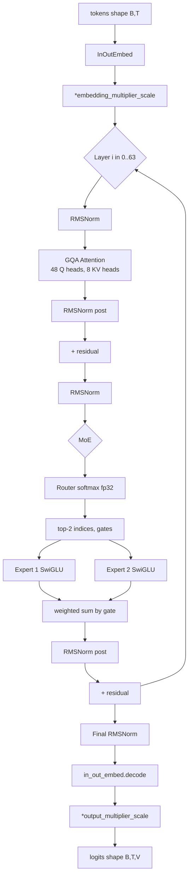

# 第 2 章 总体架构

本章是后续章节的"地图" - 我们先用一张图、一张表、几段叙述，把 Grok-1 的整体形状描绘清楚，让读者在进入逐行精读之前对全模型的拓扑结构有一个完整的印象。如果你已经熟悉同代 MoE 模型的整体形态，这一章可以快速跳过，直接进入第 3 章的配置精读。

## 2.1 一句话先把骨架立起来

Grok-1 是 **64 层 decoder-only transformer**，每一层把 FFN 子层换成 **8 个 SwiGLU 专家中 top-2 路由**的 MoE 块，其余部分（GQA 注意力、RoPE、RMSNorm、残差）与 LLaMA-2 同代设计基本一致。模型整体只接受 token 输入、输出 next-token logits，没有 cross-attention，没有 encoder。

!!! note "decoder-only / encoder-decoder / encoder-only 三派"
    Transformer 在 2017 年原始论文里是 encoder + decoder 的双塔结构，专门为机器翻译设计 - encoder 把源语言句子编码成一组上下文向量，decoder 一边自回归地生成目标语言，一边通过 cross-attention 看 encoder 输出。后续的研究把这套架构按"用一半还是用全部"分成三派：

    - **encoder-only**：只保留 encoder，代表是 BERT。适合做分类、抽取、检索这种"输入完整文本，输出离散标签或向量"的任务。每个位置都能看到上下文（双向 attention），但天然不能做生成。
    - **encoder-decoder**：保留双塔，代表是 T5、BART。适合输入到输出有明显语义差异的任务（翻译、摘要、问答）。
    - **decoder-only**：只保留 decoder，去掉 cross-attention，代表是 GPT、LLaMA、Mistral、Grok。每个位置只能看到自己左边的 token（因果 attention），天然适合自回归生成 - 训练时用 next-token prediction loss，推理时一次吐一个 token。

    2018 年以后的实证经验是：把 decoder-only scale 起来，加足够多数据，效果反超 encoder-decoder，且架构更统一（输入和输出共用一套 attention）。Grok-1 属于这一派。

!!! note "next-token logits / autoregressive generation"
    decoder-only 模型每一步的输出不是"下一个 token"，而是**整个词表上的概率分布**，技术上是一个长度为 $V$（词表大小，Grok-1 是 131072）的向量，叫做 **logits**（未归一化的 log 概率）。把 logits 过 softmax 才得到归一化概率，再用 sampling 策略（greedy、top-k、top-p、temperature）从中选出一个 token id 写回到输入末尾，下一步重复这个过程。这个"每次只产生一个 token、把它加回输入再算下一个"的循环就叫 autoregressive generation。

但"基本一致"里藏着几个少见的设计选择，本章先列出来，后面的精读章节再细看：

1. **GQA：48 Q 头对 8 KV 头**，比例为 6:1。同代的 LLaMA-2 70B 配置是 64 Q 头对 8 KV 头，比例为 8:1。Grok-1 在 GQA 的"压缩比"上比 LLaMA-2 略保守，每组 K/V 服务 6 个 Q 而不是 8 个，理论上保留了更多 attention 表达能力，但 KV cache 体积也相应增大了一点

!!! note "KV cache（自回归推理里那块吃显存的东西）"
    decoder-only 模型自回归生成时，第 $t$ 步算 attention 需要看 0..t-1 步的所有 key 和 value。如果每生成一个新 token 都从头重算一遍前面所有位置的 K/V，时间复杂度是 $O(T^2)$ 的，越生成越慢。

    工程上的优化是把每一步算出的 K/V 缓存下来 - 这个缓存就叫 **KV cache**，shape 大致是 `(batch, num_layers, num_kv_heads, seq_len, head_dim)`。每生成一个新 token 只需要算这个 token 自己的 K/V，追加到 cache 末尾，attention 时 Q 是 1 个 token、K/V 是 cache 里全部历史。这样把生成时的 attention 从 $O(T^2)$ 降到每步 $O(T)$。

    代价是 KV cache 本身要占显存：Grok-1 满 8192 上下文、bf16 精度下，单条序列的 KV cache 约 $2 \cdot 64 \cdot 8 \cdot 8192 \cdot 128 \cdot 2 \,\text{bytes} \approx 1.7\,\text{GB}$（2 是 K 和 V 各一份）。GQA 把 num_kv_heads 从 48（MHA）降到 8，cache 直接小了 6 倍。所以 GQA 主要的工程意义不是省参数，而是省 KV cache 显存 - 这一点在长上下文推理里特别关键。
2. **每个 sub-layer 用了两次 RMSNorm**：进入子层之前做一次 pre-norm、子层输出加回 residual 之前再做一次 post-norm，两次 norm 把子层输入和输出都钳制住。这种布局被称为"sandwich norm"，与 Cohere Command R / Command R+ 的设计一致（`model.py:1056-1060`，下文 2.5 详述）

!!! note "sandwich norm（pre + post 双 norm 布局）"
    早期 transformer 是 post-norm：`y = LayerNorm(x + SubLayer(x))`，深网络梯度反传时常炸。主流后来切到 pre-norm：`y = x + SubLayer(LayerNorm(x))`，深层稳很多但 residual 流的量级会随层数累积上涨。

    sandwich norm 把两者夹在一起：`y = x + LayerNorm(SubLayer(LayerNorm(x)))` - 进子层前 norm 一次（pre）、出子层加回 residual 前再 norm 一次（post）。两次 norm 把 residual 流和子层输出都钳住，深网络训练更稳。代价是每层多一次 RMSNorm 计算（在 314B 里几乎免费）。Grok-1 64 层 + 4 个 RMSNorm/层（attention pre/post + FFN pre/post），共 256 次 norm，是 Cohere Command R 同款选择。
3. **embedding 用 sqrt(d) 量级放大**：token 查表得到 embedding 之后，整体乘以约 $\sqrt{6144} \approx 78.38$ 的常数；输出端 logits 再乘以 $1/\sqrt{3} \approx 0.577$。这一对乘法配合在一起，是 µ-Transfer / DeepNet 风格的"输入/输出 scale 控制"思路，目的是让训练时不同层的激活量级保持稳定
4. **attention logit 用 `30 * tanh(x/30)` 软裁剪**：Q 和 K 点积、再除以 $\sqrt{d_h}$ 之后，attention logit 还要再经过一个 `30 * tanh(x/30)` 的软裁剪函数（`model.py:864-865`）。这个函数对小输入几乎是恒等映射，对大输入则平滑地饱和到 $\pm 30$，目的是防止 attention logit 在 bf16 下溢出导致 softmax 出 NaN

!!! note "bf16 / fp16 / fp32 的取值范围"
    GPU 上训练和推理常用三种浮点格式。**fp32** 是 32 位单精度，1 位符号 + 8 位指数 + 23 位尾数，取值范围约 $\pm 3.4 \times 10^{38}$，是 PyTorch 的默认 dtype。**fp16** 是 16 位半精度，1+5+10，范围只到 $\pm 6.5 \times 10^4$，超过就 inf - 这是早期混合精度训练经常炸的根本原因。**bf16**（Brain Float 16）也是 16 位，但分配是 1+8+7，指数位和 fp32 一样宽，范围同样到 $\pm 3.4 \times 10^{38}$，只是精度（尾数 7 位）比 fp16 还低一点。

    现在大模型几乎都用 bf16 - 范围足够大避免溢出，精度低一点对训练影响不大。但即便是 bf16，softmax 的 $e^x$ 也只能容忍 $x < 88$ 左右；Grok-1 这套 `30 * tanh(x/30)` 软裁剪就是把 attention logit 钳在 30 以内，给 softmax 留足够安全裕量。
5. **MoE 路由没有 auxiliary loss、没有 capacity drop**：路由器只做纯 softmax + top-2 的简单选择，没有 Switch Transformer / GShard 那样的 auxiliary load-balancing loss，也没有"专家容量超限就丢弃部分 token"的 capacity drop 机制。所有 token 一律走两个专家，路由实现因此非常简洁

!!! note "auxiliary loss / capacity drop（MoE 训练里的两个"补丁"）"
    MoE 训练时容易出现 **路由塌缩**：router 把绝大多数 token 都送给某一两个 expert，剩下的 expert 永远拿不到 gradient 因此学不到东西。为了对抗这种塌缩，Switch Transformer 在主任务 loss 之外再加一项 **auxiliary load-balancing loss**，把"router 对每个 expert 的平均分配概率"和"每个 expert 实际接到的 token 比例"两个向量做内积当惩罚项 - 越均匀这一项越小，loss 鼓励路由趋于均衡。

    **capacity drop** 是更暴力的硬约束：先按"完美均衡"算出每个 expert 应该处理的 token 数（叫 capacity），用 capacity_factor 乘个 1.0-1.5 的余量；如果某个 expert 实际被分到的 token 数超过这个余量，多出来的 token 直接 **被丢弃**（这一步就跳过 FFN，hidden 直接走 residual）。

    Grok-1 推理代码这两项都没有 - 推理时本来就不需要 aux loss，capacity drop 又会引入路由的 batch 间耦合（一个 token 走不走 expert 取决于同 batch 其他 token 的选择），增加推理复杂度。所以 Grok-1 推理实现里的所有 token 一律完整地走它被路由到的两个 expert。

下面用一张数据流图把整体串起来。

值得在进入图之前先确认一下"什么是 decoder-only"。Transformer 原始论文（2017）的架构是 encoder + decoder，做翻译时 encoder 编码源语言、decoder 生成目标语言。decoder 里有两种 attention - self-attention（看自己已生成的部分）和 cross-attention（看 encoder 的输出）。

2018-2020 年的研究发现：纯 decoder 训练 language modeling 任务，scale 起来效果更好。GPT 系列从一开始就是 decoder-only，Llama、Mistral、Grok 全部是 decoder-only。decoder-only 的好处：架构统一、可以做 autoregressive 推理、训练效率高。Grok-1 的"decoder-only Transformer"就是这个意思 - 不带 encoder，只有 self-attention 和 FFN 的层堆叠。

## 2.2 数据流总览



几点需要特别注意：

- **InOutEmbed**（`model.py:1110-1143`）输入和输出权重共享 - 输入是 `embed_mat[token_id]`，输出是 `embeddings @ embed_mat.T`
- **每个 sub-layer 后做了两次 RMSNorm** - 一次 pre（在子层输入前），一次 post（在子层输出后再加到 residual 前）
- **MoE 的两个专家输出是按 gate 加权求和后再过 post-RMSNorm**，不是各自单独 norm

### 2.2.1 数据流图的几个细节再说明

图里的关键步骤：

- **InOutEmbed**：输入 token id 通过查表得到 hidden 向量。输出阶段同样的 embedding 矩阵转置后做 logit 投影。这种"输入输出共享 embedding"叫 tied embedding，节省 0.81B 参数

!!! note "tied embedding（输入输出共享 embedding 矩阵）"
    Transformer 输入端有个 embedding 矩阵 `(V, d)`，token id 查表拿到 hidden；输出端做 next-token 预测时需要从 hidden 投回 `(V,)` 维 logits，理论上是另一个 `(d, V)` 矩阵。tied embedding 的做法是让这两个矩阵共享同一份参数 - 输出投影直接用输入 embedding 的转置 `hidden @ embed_mat.T`，省掉一整块大参数。

    Grok-1 词表 131072、d=6144，单独一份就是 0.81B 参数 - tying 之后总参省一份。GPT-2、LLaMA 系列都用 tied embedding，Grok-1 在 `InOutEmbed`（`model.py:1110-1143`）里实现的就是这种共享。
- **\*embedding_multiplier_scale**：embedding 取出之后，整体乘以约 78.38 的放大因子，这个数约等于 $\sqrt{d} = \sqrt{6144}$。这是 Vaswani 2017 原版 Transformer 论文里就有的写法，目的是让 embedding 出来的激活量级与后续层匹配。LLaMA 系列已经放弃这一步，Grok-1 还保留着
- **每层 RMSNorm 共出现 4 次**：分别位于 attention 子层之前（pre-attn）、attention 子层之后（post-attn）、FFN/MoE 子层之前（pre-FFN）、FFN/MoE 子层之后（post-FFN）。这种"每个子层前后各做一次 RMSNorm"的布局就是 Grok-1 的 sandwich norm
- **GQA 48Q vs 8KV**：48 个 query head 被分成 8 组，每组包含 6 个 Q 头；同一组内的 6 个 Q 共享一组 K/V。这样 KV cache 的体积按"头数"维度从 48 降到 8，节省约 6 倍存储
- **Router**：路由器是一个 $(d, E) = (6144, 8)$ 的小线性层，输入是当前 token 的 hidden，输出经过 fp32 softmax 之后取 top-2 个专家
- **MoE 选 2 个专家加权求和**：每个 token 只在被 router 选中的 2 个 expert 上做 FFN 计算，两个 expert 的输出按 router 给出的概率（未做额外归一化）加权求和，剩下 6 个 expert 不参与本 token 的计算
- **Final RMSNorm**：64 层 decoder 全部跑完之后，再对最终的 hidden 做一次 RMSNorm，然后才进入输出投影
- **\*output_multiplier_scale**：输出投影得到的 logits 整体乘以约 0.577 的常数，这个数等于 $1/\sqrt{3}$。它与开头的 embedding_multiplier_scale 配对，共同构成 µ-Transfer 风格的输入/输出量级控制

!!! note "RMSNorm vs LayerNorm（少一项均值的归一化）"
    传统 LayerNorm 的公式是 $\text{LN}(x) = \gamma \cdot \frac{x - \mu}{\sqrt{\sigma^2 + \epsilon}} + \beta$，需要算均值 $\mu$、方差 $\sigma^2$，还有可学习的 scale $\gamma$ 和 bias $\beta$。

    **RMSNorm** 把均值这一步省掉，公式是 $\text{RMSNorm}(x) = \gamma \cdot \frac{x}{\sqrt{\frac{1}{d}\sum x_i^2 + \epsilon}}$。它假设 hidden 的均值大致已经是 0（深层网络里实证基本成立），所以不需要再减一次均值；也常去掉 bias $\beta$。计算量约为 LayerNorm 的 70%，效果几乎一样。

    LLaMA、Mistral、Mixtral、Grok 全部用 RMSNorm。PyTorch 用户对照：HuggingFace transformers 里的 `LlamaRMSNorm` 实现的就是这个公式。

这 8 个步骤是 Grok-1 推理时每个 token 都要走的"宏路径"。第 4-6 章会把每个步骤展开到代码级。

### 2.2.2 从 PyTorch 视角看这条流水

如果你熟悉的是 HuggingFace 风格的 PyTorch 实现，把上面的数据流"翻译"成 PyTorch 伪代码大概是这样：

```python
# PyTorch 风格的等价伪代码
class GrokModel(nn.Module):
    def __init__(self, cfg):
        self.embed = nn.Embedding(cfg.vocab_size, cfg.d)
        self.layers = nn.ModuleList([GrokLayer(cfg) for _ in range(cfg.L)])
        self.final_norm = RMSNorm(cfg.d)

    def forward(self, tokens):
        h = self.embed(tokens)
        h = h * cfg.embedding_multiplier_scale          # sqrt(d) 放大
        for layer in self.layers:
            h = layer(h)
        h = self.final_norm(h)
        logits = h @ self.embed.weight.T                # tied embedding
        logits = logits * cfg.output_multiplier_scale   # 1/sqrt(3)
        return logits

class GrokLayer(nn.Module):
    def forward(self, h):
        # attention 子层，sandwich norm
        attn_in = self.pre_attn_norm(h)
        attn_out = self.attn(attn_in)                   # GQA
        attn_out = self.post_attn_norm(attn_out)        # 关键：第二次 norm
        h = h + attn_out

        # MoE 子层，sandwich norm
        moe_in = self.pre_moe_norm(h)
        moe_out = self.moe(moe_in)                      # top-2 of 8
        moe_out = self.post_moe_norm(moe_out)           # 关键：第二次 norm
        h = h + moe_out
        return h
```

JAX/Haiku 里同样的逻辑因为有 `pjit`、`shard_map`、`with_sharding_constraint` 这些显式 sharding 标注，写起来啰嗦得多。但**计算图本身和 PyTorch 完全一致** - 第 4-6 章把代码逐行展开时，可以随时回头对照这段伪代码确认"这一步对应的是哪个子模块"。

## 2.3 模型规模账：314B 到底从哪里来

精确算一遍。设：

- $d = 6144$（emb_size）
- $L = 64$（num_layers）
- $E = 8$ 专家，$k = 2$ 激活
- $V = 131072$（vocab_size = 128 × 1024）
- $H_q = 48$, $H_{kv} = 8$, $d_h = 128$
- FFN 中间维度由 `ffn_size(d, w)` 计算（`model.py:85-89`）：

```python
# model.py:85-89
def ffn_size(emb_size, widening_factor):
    _ffn_size = int(widening_factor * emb_size) * 2 // 3
    _ffn_size = _ffn_size + (8 - _ffn_size) % 8  # ensure it's a multiple of 8
    return _ffn_size
```

代入 `widening_factor=8`：`int(8 * 6144) * 2 // 3 = 49152 * 2 // 3 = 32768`，已经是 8 的倍数，所以 $d_{\text{ffn}} = 32768$。

### 2.3.1 每层参数

**Attention：**

| 矩阵 | shape | 参数 |
| --- | --- | --- |
| Q 投影 | $(d, H_q d_h) = (6144, 6144)$ | 37.7 M |
| K 投影 | $(d, H_{kv} d_h) = (6144, 1024)$ | 6.3 M |
| V 投影 | $(d, H_{kv} d_h) = (6144, 1024)$ | 6.3 M |
| Output 投影 | $(H_q d_h, d) = (6144, 6144)$ | 37.7 M |
| 合计 | - | **88.1 M** |

每一行的参数量都用"两个维度相乘"算出来的：$(6144 \times 6144) / 10^6 = 37.7\,\text{M}$，$(6144 \times 1024) / 10^6 = 6.3\,\text{M}$。Q 和 K/V 之所以差 6 倍，正是 GQA 让 KV head 数从 48 降到 8 的直接结果。在传统 MHA 下 K/V 投影也是 $(6144, 6144)$，每层注意力的参数会从 88M 涨到约 151M，64 层就多出 4B 参数 - 对 KV cache 的影响则更显著（如本章 2.1 的 note 所述）。

注意：Q/K/V 都有 bias（`with_bias=True` 是 `Linear` 的默认值，但 MHA 调用时显式 `with_bias=False`，见 `model.py:887` 的 `final_projection` 与 `_linear_projection` 中 `Linear(num_heads * head_size, with_bias=False, ...)` 的 `model.py:905`）。所以 attention 内部所有 Linear 都没 bias。

**FFN（每个 expert 是一个 SwiGLU）：**

`DenseBlock` 在 `model.py:963-1007` 定义，三个 Linear 都是 `with_bias=False`：

| 矩阵 | shape | 参数 |
| --- | --- | --- |
| linear_v | $(d, d_{\text{ffn}}) = (6144, 32768)$ | 201.3 M |
| linear (gate) | $(6144, 32768)$ | 201.3 M |
| linear_1 | $(32768, 6144)$ | 201.3 M |
| 单 expert 合计 | - | **603.9 M** |
| 8 个 expert | - | **4.83 B** |

SwiGLU 的三块矩阵分工是：`linear_v` 把 hidden 升到中间维度做"值"分支、`linear (gate)` 同样升维但要过 SiLU 激活后当作"门"、两路按位相乘再用 `linear_1` 降回 hidden。三块矩阵每块的参数量都是 $6144 \times 32768 / 10^6 \approx 201\,\text{M}$。如果换成不带 gate 的传统 GELU FFN，只需要两块（升维 + 降维），但为了保持总参数相当，中间维度要相应放大 50%。这就是 SwiGLU "三块 × 中间维度乘 2/3" 设计的来源。

**LayerNorm（RMSNorm）：** 每层 4 个 RMSNorm（attention pre/post + FFN pre/post，见 `model.py:137-140` partition rules 中的 `rms_norm` ~ `rms_norm_3`），每个 6144 个 scale，共 24576 参数 - 可忽略。

**Router：** $d \times E = 6144 \cdot 8 = 49152$ 参数 - 可忽略。

**每层总计：** $88.1\text{M} + 4830\text{M} \approx 4.92\,\text{B}$

### 2.3.2 整模型

| 组件 | 参数 |
| --- | --- |
| 64 层 × 4.92 B | 314.9 B |
| InOutEmbed (131072 × 6144) | 0.81 B |
| 最终 RMSNorm | 6144 |
| **总计** | **~315.7 B** |

官方说 "314B"，与上面的估算吻合（差额来自 router、norm、对 ffn_size 取整等小项；权重 tying 让 embedding 不重复计算）。

### 2.3.3 激活参数

每个 token 只激活 2 个 expert：

$$
P_{\text{active}} = 64 \cdot (0.088 + 2 \cdot 0.604) + 0.81 \approx 84\,\text{B}
$$

加上 router（每层 49K，可忽略）后约 86B - 与官方"约 86B 激活"对得上。

### 2.3.4 为什么 widening_factor=8 而 SwiGLU 通常是 widening=2.67

这是个看起来奇怪的细节，把推导走一遍就清楚了。

第一步，先把"标准"的中间维度算出来。Vaswani 2017 原始 Transformer 用 ReLU/GELU FFN，惯例是中间维度 = $4 \cdot d$（升维 4 倍再降回来）。

第二步，SwiGLU 比传统 FFN 多一块 gate 矩阵，参数从 2 块变 3 块。要让 SwiGLU 总参数与传统 FFN 保持相当，惯例是把中间维度乘 $\frac{2}{3}$：

$$
d_{\text{ffn}}^{\text{SwiGLU}} = \frac{2}{3} \cdot 4 \cdot d = \frac{8}{3} \cdot d
$$

即等效 widening ≈ 2.67。LLaMA-2 70B 的 hidden = 8192、$d_{\text{ffn}}$ = 28672，比值 28672 / 8192 = 3.5，略高于 8/3 但是同一量级。

第三步，看 Grok-1。`widening_factor` 字段是 8，但 `ffn_size(d, w) = int(w \cdot d) \cdot 2 \,//\, 3`，所以最终 $d_{\text{ffn}}$：

$$
d_{\text{ffn}} = \lfloor 8 \cdot 6144 \rfloor \cdot \frac{2}{3} = 49152 \cdot \frac{2}{3} = 32768
$$

实际比值 = 32768 / 6144 ≈ **5.33**，是 LLaMA 同代标准（2.67-3.5）的 1.5 到 2 倍。

为什么 Grok-1 选这么"胖"的 FFN？可能的解释是：**MoE 里每个 expert 只服务 1/4 的 token**（top-2 of 8 ≈ 25% 概率被选中），如果想让 expert "看到足够多 token 学到稳定特征"，就需要给每个 expert 更大的容量、更多参数，否则容量浪费。胖 expert 路线让模型在同样总参数下分布更集中、单 expert 表达能力更强。

注意横向对比：Mixtral 8x22B 的 hidden 也是 6144，但 $d_{\text{ffn}}$ = 16384，比值 ≈ 2.67，仍然是标准 SwiGLU 配置。所以 Grok-1 比 Mixtral 8x22B 在 FFN 上更胖 - 这又一次印证 "Grok-1 是胖专家派的极端"。

## 2.4 与稠密 70B、Mixtral 8x7B 的参数账对比

| 模型 | 总参 | 激活参 | 激活比 | 路由 | $d$ | $L$ | $H_q$/$H_{kv}$ | $d_{\text{ffn}}$ | 专家数 / top-k |
| --- | --- | --- | --- | --- | --- | --- | --- | --- | --- |
| LLaMA-2 70B (dense) | 70 B | 70 B | 100% | - | 8192 | 80 | 64 / 8 | 28672 | 1 / - |
| Mixtral 8x7B | 46.7 B | 12.9 B | 27.6% | top-2 of 8 | 4096 | 32 | 32 / 8 | 14336 | 8 / 2 |
| Mixtral 8x22B | 141 B | 39 B | 27.7% | top-2 of 8 | 6144 | 56 | 48 / 8 | 16384 | 8 / 2 |
| **Grok-1** | **314 B** | **86 B** | **27.4%** | **top-2 of 8** | **6144** | **64** | **48 / 8** | **32768** | **8 / 2** |
| DeepSeek-V2 | 236 B | 21 B | 8.9% | top-6 of 160 + 2 shared | 5120 | 60 | 128 / 128 (MLA) | 12288 | 160 / 6 |

看到这张表，几个观察立刻浮现：

1. **Grok-1 几乎是 Mixtral 8x22B 的"放大版"**：两个模型在 hidden 维度 $d=6144$、$H_q/H_{kv}=48/8$、top-2 of 8 的路由配置上完全一致，差别仅在 transformer 层数（64 vs 56）和 FFN 中间维度（32768 vs 16384）这两项。换句话说，xAI 选择的整体结构与 Mistral 在 Mixtral 8x22B 上选择的几乎是同一条线，只是规模上更进一步
2. **激活比都在 27% 上下**：top-2 of 8 的路由设计决定了 FFN 部分的激活比例约为 2/8 = 25%，再加上 attention 这部分始终全激活带来的少量额外贡献，总激活参与总参的比值落在 27% 附近。Mixtral 8x7B、Mixtral 8x22B、Grok-1 都符合这条规律
3. **Grok 用"层多 + 专家容量大"的组合**：Grok-1 有 64 层、单个 expert 参数量约 0.6B，是同代 MoE 模型里单专家容量最大的一档。其他 8 选 2 模型要么层数更少（Mixtral 8x7B 只有 32 层）、要么单专家参数更小（Mixtral 8x22B 单专家约 0.3B）
4. **DeepSeek-V2 走了完全不同的路线**：DeepSeek-V2 把专家数从 8 提升到 160，单个 expert 参数量随之大幅缩小，并额外引入 2 个 shared expert 让所有 token 都经过；同时 attention 改用 MLA 压缩 KV，整体激活比因此降到 9%。这是与 Grok-1 完全对立的设计思路

这里"胖专家 vs 细粒度专家"是 MoE 设计的核心 trade-off。胖专家的优势：每个 expert 容量足，对单一任务学得透；缺点：选择空间小（8 选 2 只有 28 种组合），不同 token 之间的"路由分工"较粗。细粒度专家的优势：选择空间大（160 选 6 是天文数字），不同 token 可以分得很细；缺点：每个 expert 容量小，需要更多 expert 协作才能完成单一任务，路由开销高、负载均衡难。

Grok-1 选了胖专家路线，这是 2023 年初到中期最自然的选择 - 当时 Switch Transformer、GShard、GLaM 都用相对小数量的专家（8-64 个）。直到 2024 年下半年 DeepSeek-V2 用 160 个专家做出好效果，业界才开始大规模转向细粒度。

把表展开看更直观。dense 70B 把所有参数都激活，等同于"无专家的胖网络"；Mixtral 8x7B 是"小胖专家"；Mixtral 8x22B 和 Grok-1 是"大胖专家"；DeepSeek-V2 是"很多小专家 + shared expert"的混合策略。这是一条连续的设计谱，Grok-1 站在最靠近 dense 的那一端。

第 10 章会在这个表的基础上展开详细对比。

## 2.5 Sandwich norm：少见的归一化布局

主流的 pre-norm Transformer 写法是：

```
y = x + SubLayer(LayerNorm(x))
```

Grok-1 不这么写。看 `model.py:1048-1061`：

```python
# model.py:1048-1061
attn_output = MHABlock(...)(layer_norm(h), mask, layer_memory)
h_attn = attn_output.embeddings

h_attn = layer_norm(h_attn)       # 注意：再 norm 一次
h += h_attn
h = with_sharding_constraint(h, sharding)
```

即：

```
y = x + LayerNorm(SubLayer(LayerNorm(x)))
```

输入做 pre-norm 进子层，子层的输出**再做一次 post-norm**才加回 residual。两次 norm 把 residual 流和子层流都钳制住了。

这种"sandwich"布局在 Cohere Command R / Command R+ 里也有，被认为能让深层网络（80+ 层）训练更稳。Grok-1 64 层，使用这个 trick 应该是出于稳定性考虑。代价是每层多了 1 次 RMSNorm 计算 - 在 314B 的 FLOPs 占比里可以忽略。

第 6 章会在 DecoderLayer 精读时再展开。

## 2.5.1 双重 norm 的代价与收益

每层多一次 RMSNorm 的成本：

- **参数**：每 RMSNorm 多 6144 个 scale，4 个 norm 每层 24576 个参数。64 层共 1.57M 参数 - 在 314B 里可以忽略
- **计算**：每个 RMSNorm 需要 sum-of-squares + rsqrt + 乘 scale，约 3·d FLOPs。在 d=6144 时约 18K FLOPs，与一次 6144x6144 matmul（约 76M FLOPs）比小 4000 倍 - 几乎免费
- **内存带宽**：RMSNorm 是 memory-bound 算子（需要把 hidden 张量从 HBM 读一次、再写一次），所以相对其总计算量而言带宽占用偏高，但相对于一层中 attention 和 FFN 的带宽消耗，仍然属于不显著的开销

收益：

- **训练稳定性**：64 层的 transformer 在标准 pre-norm 布局下也有相当大的概率能稳定训练，但 sandwich norm 在 pre-norm 基础上又增加了一道 post-norm，相当于多了一层数值保险，对训练过程中偶发的 loss spike 更加耐受
- **量级控制**：residual stream 的量级在深层网络里有累积上涨的倾向，post-RMSNorm 把每一层子层输出的量级显式约束到 RMS = 1 附近，避免激活在 60 多层之后出现爆炸性增长
- **与 unnormalized MoE gating 互补**：第 5 章会看到 Grok-1 的 expert gate 是不归一化的（路由概率直接乘到 expert 输出上，没有再过 softmax 之外的 normalization），expert 输出的量级因此会随路由概率本身的大小变化；post-RMSNorm 紧跟在 MoE 之后，相当于对这个量级波动做了一次重新校准

这是一个典型的"小代价换大稳定性"工程决策。任何训练过较深网络、遇到过 loss spike 的工程师都能体会这种保守做法的价值。

## 2.6 Sharding 策略概览

在进入代码之前先把概念厘清。**Sharding**（分片）就是把一个大张量沿某些维度切成几块，分别放到不同设备上，每个设备只持有自己的那一片。当后续算子（比如 matmul）需要"完整"张量时，框架会自动插入 collective 通信（all-gather、all-reduce、reduce-scatter 等）把数据汇合或重新分发。

JAX 的 sharding 模型有三个基本概念：

- **Mesh**：把物理设备组织成 N 维网格。Grok-1 单机 8 卡用 `(1, 8)` 形状的二维 mesh，第一个轴叫 `"data"`、第二个轴叫 `"model"`。同样 8 卡也可以摆成 `(2, 4)` - 1 行 8 列 vs 2 行 4 列只是 mesh 形状不同。
- **PartitionSpec（缩写 `P`）**：声明一个张量的每一维"沿哪个 mesh 轴切"。`P("data", "model")` 表示张量第 0 维沿 data 轴切、第 1 维沿 model 轴切；`P(None, "model")` 表示第 0 维完整复制到每个 device、第 1 维沿 model 轴切。
- **Sharding rule**：用正则匹配参数名，给每类参数指定 PartitionSpec。这避免了手动给每个权重都标注。

!!! note "PyTorch 对照（torch.distributed.tensor.DTensor）"
    PyTorch 2.0 后引入的 DTensor 和 JAX sharding 是几乎一一对应的：`DeviceMesh` 对应 JAX `Mesh`、`Shard(dim)` 对应 `P("axis_name")` 在某一维切、`Replicate()` 对应 `P(None)` 不切。最大差别是 PyTorch 的 sharding 需要在 `nn.Module` 构造时手动包一层，JAX 是用全局 rule 匹配名字自动应用。另一种 PyTorch 的玩法是 `FairScale` 或 `DeepSpeed` 的 tensor parallel，那些更接近"手写 all_reduce"的层级，没有 JAX 这种声明式抽象。

`model.py:112-160` 的 `TRANSFORMER_PARTITION_RULES` 列出了每个权重的 partition 方案，分两轴 `data` / `model`。

```python
# model.py:112-160 节选
TRANSFORMER_PARTITION_RULES = [
    (("multi_head_attention", "(query|key|value)", "w"), P("data", "model")),
    (("multi_head_attention", "linear", "w"), P("model", "data")),
    ((r"decoder_layer_[0-9]+", "linear", "w"), P("data", "model")),
    ((r"decoder_layer_[0-9]+", "linear_v", "w"), P("data", "model")),
    ((r"decoder_layer_[0-9]+", "linear_1", "w"), P("model", "data")),
    (("router", "w"), P("data")),
    (("moe", "linear", "w"), P(None, "data", "model")),
    (("moe", "linear_v", "w"), P(None, "data", "model")),
    (("moe", "linear_1", "w"), P(None, "model", "data")),
    ...
]
```

读法：

- 元组前两个元素是路径正则，匹配参数名（Haiku 的参数名是层次化的，比如 `language_model/decoder_layer_0/multi_head_attention/query/w`）
- 元组最后是 `PartitionSpec`，指出每个张量维沿哪个 mesh 轴切

举个具体例子：`("multi_head_attention", "(query|key|value)", "w")` 这条匹配的是 attention 子层里 Q/K/V 任一投影的权重（"w" 是 Haiku 给 Linear 层权重的默认名字）；对应的 `P("data", "model")` 表示输入维（第 0 维 = d = 6144）沿 data 轴切、输出维（第 1 维 = $H_q d_h$ 或 $H_{kv} d_h$）沿 model 轴切。在 Grok-1 的 `(1, 8)` mesh 下 data 轴只有 1 个 device，所以输入维其实不切，输出维被切成 8 份 - 每张卡持有 1/8 的 Q/K/V 投影权重。

整体策略可以总结为：

| 类型 | 张量 shape | partition |
| --- | --- | --- |
| Q/K/V 投影 | $(d, d_{\text{out}})$ | (data, model) |
| Attention output | $(d_{\text{model}}, d)$ | (model, data) |
| MoE up | $(E, d, d_{\text{ffn}})$ | (None, data, model) |
| MoE gate | $(E, d, d_{\text{ffn}})$ | (None, data, model) |
| MoE down | $(E, d_{\text{ffn}}, d)$ | (None, model, data) |
| RMSNorm scale | $(d,)$ | None（复制） |
| Embedding | $(V, d)$ | (None, ("data", "model")) - 第二维同时沿两轴切 |

`run.py:60` 给的 `local_mesh_config=(1, 8)`，即 1 × 8 = 8 个 device，全部都给 model 维。`between_hosts_config=(1, 1)` 表示单机。如果是 16 卡分两机，会变成 `local_mesh_config=(1, 8)` + `between_hosts_config=(1, 2)`。

这种"全 model 不切 data"的策略，意味着 Grok-1 在 8 卡上跑的是**纯 tensor parallel** - 一个 batch 在所有卡上共享同一份计算图，但每张卡只保留一部分参数和激活。和 dense 模型在 8 卡上做 tensor parallel 的拓扑几乎一样。

这个选择背后的工程逻辑：314B 总参在 bf16 下约 628GB，在 int8 量化下约 314GB，单卡 H100 80GB 装不下；必须把权重切到多卡。但 8 卡的总和（640GB）只比 int8 后的权重多了一倍 - 把 batch 再切几份做 data parallel 已经没有显存余地。所以 mesh 形状被显存上限锁死成 `(1, 8)`，这是个被硬件而非算法决定的取舍。

!!! note "tensor parallel / data parallel / model parallel"
    单机装不下的模型在多卡上有几种切法。**data parallel** 最简单：每张卡都有完整模型副本，把 batch 切几份让各卡同时算自己那份 micro-batch，最后 all-reduce 梯度 - 显存吃紧时根本用不了。**tensor parallel** 是把单个矩阵沿某一维切到多张卡上，每张卡只持有一部分 weight，forward 时 matmul 拆成多卡协作算，结果 all-gather 拼回来 - 显存压力小但通信频繁，对 NVLink 之类的高带宽互联很依赖。**model parallel** 是更宽的概念，pipeline parallel（按层切，一张卡跑前 16 层、另一张跑后 16 层）也算一种 model parallel。

    Grok-1 默认 mesh = (1, 8) - data 维 1 个 shard、model 维 8 个 shard，相当于纯 tensor parallel 8 卡。MoE 还多一个 expert parallel 维度，但 Grok-1 没单独切 expert，是通过 `shard_map` 在 model 维上把 expert 维度顺手切了。

如果想做 data parallel（让 batch 在多卡之间并行），需要把 mesh 改成 (2, 4) 或 (4, 2) 这一类比例。但 314B 的总参不允许在少于 8 个 device 上做 model 维切分 - 4 个 device 一个 model shard 平均要承担约 78 GB 权重，已经超过单卡 80 GB 的显存上限。所以 mesh 的形状实质上被单卡显存上限固定下来了。

注意 **embedding 的 partition 是 `(None, ("data", "model"))`** - 元组形式表示该维同时沿两条 mesh 轴切（即 device_count = data × model 个分片）。这是 JAX 的"嵌套维度"特性，在 `model.py:166` 体现。

```python
# model.py:162-174
LM_PARTITION_RULES = [
    (("language_model", "positional_embeddings"), P(None, ("data", "model"))),
    (("language_model", "in_out_embed", "embeddings"), P(None, ("data", "model"))),
    (("language_model", "rms_norm"), P(None)),
]
```

第 8 章会详细展开 mesh 和 `pjit` 的用法。第 3 章我们先把 config 字段全部说清楚。

## 延伸阅读

- Cohere [Command R Technical Report](https://docs.cohere.com/docs/command-r) - sandwich norm 的另一个实例
- [DeepSeek-V2 Technical Report](https://arxiv.org/abs/2405.04434) - 细粒度专家与 shared expert 的对比设计
- [Switch Transformer](https://arxiv.org/abs/2101.03961) - MoE 路由的奠基论文，理解 capacity factor、aux loss 的源头
- [GLaM: Efficient Scaling of Language Models with Mixture-of-Experts](https://arxiv.org/abs/2112.06905) - Google 关于 MoE 路由设计的早期工作
