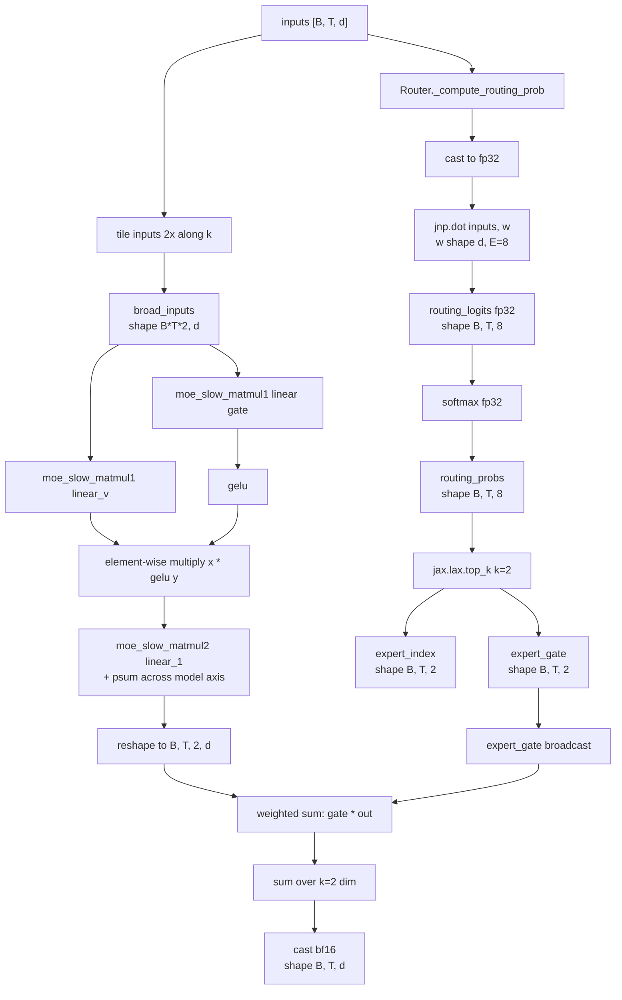

# 第 5 章 model.py 精读·中：MoE 路由与专家

这一章是本书技术密度最高的一章。Grok-1 的 MoE 实现集中在 `model.py:208-400`，约 200 行代码，但它牵涉到：

- 路由器的数值精度选择
- top-2 路由的实现细节
- `hk.experimental.transparent_lift` + `jax.vmap` 把 8 个专家"折叠"成一个 vmap 维度
- `shard_map` 在 expert 维度上的切分
- 推理时两个专家输出按 gate 加权求和

把这 200 行读懂，你对 MoE 的"实现层"理解就到位了。

## 5.1 MoE 路由的总体流程

先放一张图，再逐段精读。



## 5.2 `Router`：路由器

!!! note "top-k routing / Router"
    MoE 选专家这一步叫 routing，做这件事的小网络叫 router。最常见的写法是：router 就是一个 `(d, E)` 的线性层（`E` 是专家数），对当前 token 的 hidden 算出 `E` 个分数，softmax 一下得到每个专家的"路由概率"，挑分数最高的 k 个专家，token 在这 k 个里完成 FFN 计算，输出再按 routing 概率加权求和。

    这套设计的核心约束有两个。一是 router 必须**便宜** - 因为它在每个 MoE 层、每个 token 上都要跑一遍，太重了会把 MoE 的省算力收益吃光，所以基本固定成"一个线性层"，不再加非线性、不再堆参数。二是 router 输出要能驱动一个**离散选择**（挑 top-k），但梯度只能通过被选中那几个 expert 的 gate 概率回流，没被选中的专家这一步拿不到梯度。这个"硬选择"是 MoE 各种工程麻烦（负载塌缩、训练不稳）的源头，后续的 aux loss、z-loss、capacity factor 都在围着它打补丁。

`model.py:208-269`：

```python
# model.py:208-269
class Router(hk.Module):
    def __init__(
        self,
        num_selected_experts: int,
        data_axis: Union[str, Tuple[str, ...]] = "data",
        model_axis: Union[str, Tuple[str, ...]] = "model",
        shard_activations: bool = False,
        mesh: Any = None,
        name: str = "router",
    ):
        super().__init__(name)
        self.shard_activations = shard_activations
        self.data_axis = data_axis
        self.model_axis = model_axis
        self.mesh = mesh
        self.num_selected_experts = num_selected_experts

    def compute_routing_prob(
        self, inputs: jax.Array, padding_mask: Optional[jax.Array], num_experts: int
    ):
        return self._compute_routing_prob(inputs, padding_mask, num_experts)

    @hk.transparent
    def _compute_routing_prob(
        self,
        inputs: jax.Array,
        padding_mask: Optional[jax.Array],
        num_experts: int,
    ):
        # Using fp32 for the routing prob computation.
        inputs = jax.lax.convert_element_type(inputs, jnp.float32)

        # [batch_size, seq_len, num_experts]
        routing_logits = self._router_weights(inputs, num_experts, sharding=P("data"))
        assert routing_logits.dtype == jnp.float32
        routing_probs = jax.nn.softmax(routing_logits)

        if padding_mask is not None:
            routing_probs *= padding_mask

        return routing_probs, routing_logits, 0

    @hk.transparent
    def _router_weights(
        self,
        x: jax.Array,
        num_experts: int,
        sharding: Optional[P] = None,
    ):
        fprop_dtype = x.dtype
        if not x.shape:
            raise ValueError("Input must not be scalar.")

        input_size = self.input_size = x.shape[-1]
        w = hk.get_parameter(
            "w", [input_size, num_experts], jnp.float32, init=hk.initializers.Constant(0)
        )
        if sharding:
            w = with_sharding_constraint(w, sharding)

        out = jnp.dot(x, w.astype(fprop_dtype))
        return out
```

关键观察：

### 5.2.1 路由强制 fp32

`model.py:238`：

```python
inputs = jax.lax.convert_element_type(inputs, jnp.float32)
```

输入 cast 到 fp32。然后整个路由计算（matmul + softmax）都在 fp32。这是 MoE 训练的关键 - bf16 路由会导致同一个 token 在不同 step 被路由到不同 expert，训练发散。

### 5.2.2 没有 noisy gating，没有 z-loss

Switch Transformer 论文里有"noisy top-k gating"：

$$
\text{logit}'_i = \text{logit}_i + \mathcal{N}(0, \sigma)
$$

通过加噪让 expert 选择更分散。Grok-1 **不加噪**。

GShard / GLaM 还有 "z-loss" - 惩罚 logit 的范数避免发散。Grok-1 **没有任何辅助损失**（至少推理代码看不到）。

!!! note "z-loss"
    MoE 训练里 router 的 softmax logit 可以无限增长 - 让 logit 变大能让 routing 决策更"硬"（接近 one-hot），但同时让 softmax 的 `log(sum_i exp(logit_i))` 这一项数值越界，bf16 下 logit 超过 ~88 就 inf。z-loss 是个简单正则项：在主 loss 上加 $\alpha \cdot (\log Z)^2$，其中 $Z = \sum_i \exp(\text{logit}_i)$。它惩罚 partition function 偏离 1，等价于把 logit 整体往 0 拉。

    Switch Transformer / GLaM 论文里 z-loss 系数典型取 1e-4，是防止 MoE 训练后期 logit 爆炸的标准手段。Grok-1 推理代码里没看到 z-loss 痕迹（虽然 8 个 expert 的 314B 训练时几乎肯定用了），训练时具体系数 xAI 没公开。

### 5.2.2.1 fp32 路由是不是必须

实际上 bf16 路由也能跑出可用结果（推理时），但训练时不行。原因：

- **训练时**：路由器 logit 的微小数值差异会让同一个 token 在不同 step 被 route 到不同 expert。这种"flickering routing"让 expert 拿到的 token 分布不稳定，aux loss 信号噪声大，loss curve 出现剧烈波动。fp32 路由能把这种 flickering 降到最小
- **推理时**：模型已经训好，路由器对小扰动不敏感（因为同一 prompt 几乎总是 route 到同一组 expert），bf16 在数值上"够用"

但开源代码里推理路由仍用 fp32 - 是为了和训练完全一致，避免 train/inference 不一致导致的微小退化。

### 5.2.3 softmax 在 top-k 之前还是之后

主流有两派：

**A 派（softmax then top-k）：** Grok-1, GShard 早期, Switch Transformer

```
probs = softmax(logits)          # 全部 8 个 expert 归一化
gate, idx = top_k(probs, k=2)    # 选 top 2，gate 之和 ≠ 1
```

`model.py:295-298` 验证 Grok-1 走这条：

```python
routing_probs, _, _ = self.router.compute_routing_prob(inputs, padding_mask, self.num_experts)
expert_gate, expert_index = jax.lax.top_k(routing_probs, k=self.router.num_selected_experts)
```

**B 派（top-k then softmax）：** Mixtral 8x7B, DeepSeek

```
top_logits, idx = top_k(logits, k=2)
gate = softmax(top_logits)       # 在 top-2 上重新归一化，gate 之和 = 1
```

B 派让两个 expert 的 gate 加起来等于 1，输出在量级上更稳定。A 派让 gate 之和小于 1（因为还有 6 个未选的 expert 也分了概率），输出会被一个 < 1 的因子缩放。

**这是 Grok-1 与 Mixtral 路由的最大差异。** 不是软裁剪、不是 aux loss、不是 capacity - 是这个看似无关紧要的 softmax/top-k 顺序。

Mixtral 论文里明确说他们用 B 派；Grok-1 代码直接告诉你它用 A 派。后果：

- Grok-1 的 expert 输出"自动衰减" - 当所有 expert 概率接近均匀（不确定时）gate 总和接近 0.25 (2/8)，输出被缩到 1/4
- Mixtral 的 expert 输出无论 routing 是否确定，量级都一样

这种"自带温度衰减"的行为可能是 Grok-1 训练时的有意选择，让网络对路由不确定性更鲁棒。

## 5.3 `MoELayer._inference_call`：核心 200 行

`model.py:293-397`。逐段精读。

### 5.3.1 路由 + broadcast inputs

```python
# model.py:293-303
@hk.transparent
def _inference_call(self, inputs: jax.Array, padding_mask: Optional[jax.Array] = None):
    routing_probs, _, _ = self.router.compute_routing_prob(
        inputs, padding_mask, self.num_experts
    )
    expert_gate, expert_index = jax.lax.top_k(routing_probs, k=self.router.num_selected_experts)
    tmp = jnp.reshape(inputs, (inputs.shape[0] * inputs.shape[1], inputs.shape[2]))
    broad_inputs = jnp.tile(tmp[:, jnp.newaxis, :], (1, self.router.num_selected_experts, 1))
    broad_inputs = jnp.reshape(
        broad_inputs, (broad_inputs.shape[0] * broad_inputs.shape[1], broad_inputs.shape[2])
    )
```

逐步：

1. `inputs` 是 `[B, T, d]`
2. `routing_probs`: `[B, T, 8]`
3. `expert_gate`, `expert_index`: 都是 `[B, T, 2]`
4. `tmp = reshape(inputs, [B*T, d])`
5. `tmp[:, newaxis, :]`: `[B*T, 1, d]`
6. `tile(..., (1, 2, 1))`: `[B*T, 2, d]` - **每个 token 复制 2 份**
7. `reshape`: `[B*T*2, d]` - 把 token 和 expert-选择 维度合并

这里有个值得注意的 inefficiency：**每个 token 复制了 2 份**，然后下游所有 token 都走"全部 8 个 expert"的计算，最后用 one-hot index 选出对应 expert 的输出。这不是稀疏计算，是密集计算。所以 README 才说：

> The implementation of the MoE layer in this repository is not efficient. The implementation was chosen to avoid the need for custom kernels to validate the correctness of the model.

真正高效的 MoE（如 Megablocks、tutel）会按 expert 重排 token，每个 expert 只处理被 route 给它的 token。Grok-1 不这么做，因为：

1. 简化 sharding（每个 device 拿到所有 token，只是对部分 expert 维度做计算）
2. 简化代码（不需要写 scatter / gather kernel）
3. 训练用的是同一份实现 - 简单可读

代价是计算成本是真正稀疏 MoE 的 4 倍（8/2 = 4）。

### 5.3.2 专家参数的获取：transparent_lift + vmap

```python
# model.py:304-311
init_fn, _ = hk.transform(self.layer_fn)
vmapped_init_fn = jax.vmap(init_fn, in_axes=0, out_axes=0)
lifted_init_fn = hk.experimental.transparent_lift(vmapped_init_fn)
# Fetch the vmapped params of the DenseBlock.
params = lifted_init_fn(
    jax.random.split(jax.random.PRNGKey(1), self.num_experts),
    jnp.zeros((self.num_experts, 1, 1, inputs.shape[-1])),
)
```

这段是 Grok-1 全代码最 tricky 的一段，要展开讲。

**`self.layer_fn`** 是上层传进来的 `base_dense_block` 函数（`model.py:1063-1072`），它会构造一个 `DenseBlock` 并调用 - 即一个 SwiGLU FFN 的前向计算。

**步骤分解：**

1. `init_fn, _ = hk.transform(self.layer_fn)`：把 `layer_fn` 变成 Haiku transform，得到 init 函数
2. `vmapped_init_fn = jax.vmap(init_fn, in_axes=0, out_axes=0)`：在第 0 维 vmap，意味着如果传入 8 份随机种子和 8 份 dummy 输入，输出是 8 份参数（每份 shape 多一个 leading "8" 维）
3. `lifted_init_fn = hk.experimental.transparent_lift(vmapped_init_fn)`：把 vmapped init 函数"提升"到当前 hk transform 上下文 - 让它产生的参数名注册到当前 module 的 scope（"moe"）下，所以参数名变成 `moe/linear_v/w`，shape 是 `[8, 6144, 32768]`
4. `lifted_init_fn(...)`：实际调用，返回 params。这些 params 的 shape 多了一个 leading expert 维度

!!! note "`hk.experimental.transparent_lift`"
    Haiku 的参数命名靠 `hk.transform` 的上下文：在 transform 内部调 `hk.get_parameter` 会按当前 module 的 name 自动注册参数。但 `MoELayer._inference_call` 里要做一件特殊事 - 先用 `hk.transform(layer_fn)` 把 DenseBlock 的 init 函数提取出来，再用 `jax.vmap` 把它复制成 8 份得到 8 个 expert 的参数。如果直接调用 vmapped 后的 init，新参数会注册到一个新的、独立的 transform 上下文里，和外层 MoELayer 的参数树脱节。

    `hk.experimental.transparent_lift` 就是用来"把内层 transform 的参数提升回外层 transform 上下文"的 API：它让 vmapped init 产生的参数名直接挂到当前 MoELayer 的 scope（`moe/...`）下，于是 8 个 expert 的权重以 `moe/linear_v/w`、shape `[8, 6144, 32768]` 的形式出现 - 这正好是 Grok-1 ckpt 里 expert 参数的存储格式。

得到的 `params` 结构大致：

```python
{
    "linear":   {"w": <shape [8, 6144, 32768]>},
    "linear_v": {"w": <shape [8, 6144, 32768]>},
    "linear_1": {"w": <shape [8, 32768, 6144]>},
}
```

**这就是 Grok-1 表示 8 个 expert 的方式：把每个 FFN 的权重多加一个 leading "8" 维**。从 ckpt 角度看，所有 expert 的权重是连续存储的（一个 tensor），按 expert idx 0~7 顺序排列。

### 5.3.3 `moe_slow_matmul1`：每个 token 过所有 8 个 expert，再 one-hot 选

```python
# model.py:319-337
@functools.partial(
    shard_map,
    mesh=self.mesh,
    in_specs=(
        P(self.data_axis, None),
        P(None, None, self.model_axis),
        P(None, None, self.model_axis),
        P(None),
        P(None),
    ),
    out_specs=P(self.data_axis, self.model_axis),
    check_rep=False,
)
def moe_slow_matmul1(input, weight, scales, index, prob):
    weight = weight * scales
    one_hot_indices = jax.nn.one_hot(index.reshape(-1), 8, axis=0)
    all_expert_output = jnp.einsum("mk,bkn->bmn", input, weight)
    output = jnp.einsum("bm,bmn->mn", one_hot_indices, all_expert_output)
    return output
```

逐步：

- `input`: `[m=B*T*2, k=d]`
- `weight`: `[b=8, k=d, n=d_ffn]`
- `scales`: 与 weight 同 shape，用于 8-bit 反量化
- `index`: `[B, T, 2]` 形状的 expert 选择，reshape 后是 `[B*T*2]`
- `prob`: 这个 shard_map 里没用到 prob！

执行：

1. `weight = weight * scales` - 反量化
2. `one_hot_indices = one_hot(index.reshape(-1), 8, axis=0)`: `[8, B*T*2]`
3. `jnp.einsum("mk,bkn->bmn", input, weight)`: 对**每个 token 都跑所有 8 个 expert**，得到 `[8, B*T*2, d_ffn]`
4. `jnp.einsum("bm,bmn->mn", one_hot_indices, all_expert_output)`: 用 one-hot 选出每个 token 对应 expert 的输出

最后 `output` shape 是 `[m=B*T*2, n=d_ffn]`。

这就是"密集计算 + 事后选"的 inefficiency 来源 - 计算量是 8x，而真正稀疏只需要 1x（因为每个 token 只走 1 个 expert，2 个 expert 选择因为已经 tile 过所以变成 2 次独立调用）。

注意 `prob` 参数没被用 - 这是接口预留，后面 weighted sum 在外面做。

### 5.3.4 `moe_slow_matmul2`：FFN 下投影 + psum

```python
# model.py:339-357
@functools.partial(
    shard_map,
    mesh=self.mesh,
    in_specs=(
        P(self.data_axis, self.model_axis),
        P(None, self.model_axis, None),
        P(None, self.model_axis, None),
        P(None),
        P(None),
    ),
    out_specs=P(self.data_axis, None),
    check_rep=False,
)
def moe_slow_matmul2(input, weight, scales, index, prob):
    weight = weight * scales
    one_hot_indices = jax.nn.one_hot(index.reshape(-1), 8, axis=0)
    all_expert_output = jnp.einsum("mk,bkn->bmn", input, weight)
    output = jnp.einsum("bm,bmn->mn", one_hot_indices, all_expert_output)
    return jax.lax.psum(output, axis_name="model")
```

几乎和 `matmul1` 一样，区别：

1. `weight` shape 是 `[8, d_ffn, d]` - 下投影
2. partition spec 改成 model 在中间维 - 即 d_ffn 沿 model 切，d 不切
3. **结尾有 `jax.lax.psum(output, axis_name="model")`** - 因为 d_ffn 被切，每个 device 算的 `all_expert_output` 是不完整的（只有自己那段 d_ffn 的贡献），需要在 model 轴上做 all-reduce sum

输出 shape: `[m=B*T*2, d]`。

### 5.3.5 SwiGLU 装配 + gate 加权

```python
# model.py:359-394
if hasattr(params["linear"]["w"], "scales"):
    x = moe_slow_matmul1(
        broad_inputs,
        params["linear_v"]["w"].weight,
        params["linear_v"]["w"].scales,
        expert_index,
        expert_gate,
    )
    y = moe_slow_matmul1(
        broad_inputs,
        params["linear"]["w"].weight,
        params["linear"]["w"].scales,
        expert_index,
        expert_gate,
    )
    y = jax.nn.gelu(y)
    out = moe_slow_matmul2(
        x * y,
        params["linear_1"]["w"].weight,
        params["linear_1"]["w"].scales,
        expert_index,
        expert_gate,
    )
    out = jnp.reshape(
        out,
        [
            inputs.shape[0],
            inputs.shape[1],
            self.router.num_selected_experts,
            out.shape[-1],
        ],
    )
    out = expert_gate[:, :, :, None].astype(jnp.bfloat16) * out
    out = jnp.sum(out, axis=2)
    out = out.astype(jnp.bfloat16)
else:
    # This is only here so that we can construct a valid init_fn with this code.
    return inputs
return out
```

最重要的几行：

**SwiGLU 计算：**

- `x = moe_slow_matmul1(..., linear_v, ...)` - 直接的 up projection
- `y = gelu(moe_slow_matmul1(..., linear, ...))` - 注意这里是 **GELU 不是 SiLU**！

这又是 Grok-1 的一个少见选择。SwiGLU 通常用 SiLU/Swish 作激活：

$$
\text{SwiGLU}(x) = \text{SiLU}(W_g x) \odot W_v x
$$

但 Grok-1 用 GELU：

$$
\text{Grok-FFN}(x) = \text{GELU}(W_g x) \odot W_v x
$$

严格来说这是 **GeGLU**，不是 SwiGLU。

| 模型 | FFN 激活 |
| --- | --- |
| LLaMA-2 | SiLU (SwiGLU) |
| Mistral / Mixtral | SiLU (SwiGLU) |
| **Grok-1** | **GELU (GeGLU)** |
| PaLM | SwiGLU |
| Gemma | GeGLU |

Grok-1 与 Gemma 选了 GELU 路线。GELU 和 SiLU 在 [-3, 3] 区间几乎一样，差异在尾部 - SiLU 在大负值仍有微小负输出，GELU 几乎 0。实践上影响很小，但 ckpt 不能互换。

**输出加权：**

```python
out = jnp.reshape(out, [B, T, 2, d])
out = expert_gate[:, :, :, None].astype(jnp.bfloat16) * out
out = jnp.sum(out, axis=2)
```

每个 token 的 2 份输出按 gate 加权求和。`expert_gate` 来自 5.2.3 - 是没经过 top-k 后归一化的 softmax 概率，所以加权和 < 1。

### 5.3.6 `else: return inputs`

```python
else:
    # This is only here so that we can construct a valid init_fn with this code.
    return inputs
```

只有当权重不是 `QuantizedWeight8bit` 时才走这里。换句话说，**没量化的话 MoE 直接 return inputs**？这肯定不是真实的前向逻辑 - 实际推理时 ckpt 总是 quantized。这个分支只是为了 Haiku 的 init 跑得过 - init 阶段权重还没 quantize，需要一条返回路径让 hk.transform 能 trace shape。

这是一个**只在 inference 路径有用的实现**。如果你不用 8-bit ckpt 而是 bf16 ckpt，需要改这段。

### 5.3.5.1 SwiGLU 还是 GeGLU 的一点深入

`jax.nn.gelu` 默认是 **approximate=False**（精确版 GELU，用 erf 计算）。但在大模型实战中，erf 计算开销大，通常用 `tanh` 近似：

$$
\text{GELU}_{\text{tanh}}(x) = 0.5 x (1 + \tanh(\sqrt{2/\pi}(x + 0.044715 x^3)))
$$

Grok-1 没显式指定，所以可能用精确 GELU - 在 GPU 上比 tanh 近似慢约 2-3x（在 FFN 计算里占比可观）。但用精确 GELU 在数值上稳定些。

至于 SiLU vs GELU 的区别，在 [-3, 3] 区间内两个函数几乎重合，差别 < 1%。在大正负值时：

- SiLU: $\text{SiLU}(x) = x \cdot \sigma(x)$，对大 $|x|$ 时 SiLU(x) ≈ x（正）或 0（负）
- GELU: 类似行为，但 GELU 在 |x| ≈ 0 附近的曲率略大

两者的本质差异不大，所以"为什么 Grok-1 用 GELU 而非 SiLU"可能只是 xAI 团队的内部偏好或历史延续。Brian Lester 的 [一个 reddit 评论](https://reddit.com/r/MachineLearning) 提到 DeepMind 内部偏好 GELU（毕竟 BERT 起源），xAI 的核心成员（Igor Babuschkin 等）有 DeepMind 背景。

## 5.4 Top-k 路由的实现细节总结

| 步骤 | Grok-1 | Mixtral 8x7B |
| --- | --- | --- |
| logit 精度 | fp32 | fp32 |
| softmax 与 top-k 顺序 | softmax → top-k | top-k → softmax |
| gate 归一化 | 否（和 < 1） | 是（和 = 1） |
| Noise | 无 | 无 |
| Aux loss | 无（推理） | 无（推理） |
| Capacity factor | 字段存在但代码未用 | 无 |
| Drop token | 否 | 否 |
| 计算方式 | 密集（每 token 过所有 expert） | 稀疏 reorder |

### 5.4.1 路由的"温度"控制

注意 Grok-1 的路由没有显式的"温度"超参（即 softmax 前的缩放）。但因为：

1. router 输出量级 = router weight 量级 × input 量级
2. softmax 对量级敏感（量级大就接近 one-hot，量级小就接近均匀）

所以 router 的有效温度是隐式控制的，靠训练时 router weight 的尺度学习。如果训练中发现某层 expert 路由太"硬"（接近 one-hot，丧失稀疏性），需要让 router weight 的 init 更小、weight decay 更大。

xAI 没有公布这些训练细节。

## 5.5 容量与负载均衡：Grok-1 没有

主流 MoE 训练时会做这些：

1. **Auxiliary loss / load balancing loss**：惩罚 expert 使用不均 - 让所有 expert 的 token 数尽量平均
2. **Capacity factor**：每个 expert 最多接 $C = \alpha \cdot T \cdot k / E$ 个 token（$\alpha$ 是 capacity factor，通常 1.0~1.25），超过的 token 被 drop（在 routing 层把它的 hidden 直接经 residual 过）
3. **Expert-choice routing**：反过来让 expert 选 token，天然均衡

Grok-1 推理代码里：

- 没有 aux loss
- `capacity_factor` 字段定义了但没用
- 没有 drop token 逻辑
- 是 token-choice 不是 expert-choice

这意味着推理时如果某个 expert 被严重过拟合（所有 token 都选它），不会有任何均衡机制。但实际中训练好的 ckpt 已经隐含负载均衡（训练时应该是有 aux loss 的，只是没在推理代码暴露）。

!!! note "auxiliary loss / 负载均衡损失"
    Router 训练里有个老问题：模型很容易学到"把所有 token 都送到同一个专家"这种退化解。反正只要这个专家学得好，主 loss 就能降，其他 7 个专家可以摆烂；而它们一旦摆烂就拿不到梯度，永远学不出来，模型实际只用 1/E 的容量。

    辅助 loss 的标准做法是显式惩罚不均衡：算一遍每个专家拿到的 token 比例 `f_i`、每个专家收到的平均 routing 概率 `p_i`，把这两个量的点积乘以专家数 `E · sum(f_i · p_i)` 加进总 loss。直觉是 - 一旦某个专家既"被分得多"又"被打得高"，这个乘积就大，loss 推着 router 把负载摊平。Switch Transformer 用系数 0.01，是 MoE 训练几乎绕不开的一项。Mixtral 在论文里选择不显式加 aux loss、靠数据本身的多样性让 router 自己分化，这条路能不能走通和训练数据的结构强相关。

### 5.5.1 推理时 token drop 的实际影响

假设训练时用了 aux loss + capacity factor = 1.0，drop 了 5% 的 token。这些 token 在 drop 后直接走 residual（FFN 输出为 0）。模型适应了这种"5% drop"状态。

!!! note "capacity factor / capacity drop"
    aux loss 是个"软"约束 - 它把不均衡推回均衡，但不保证某一 batch 里所有专家都能恰好处理同样多 token。工程上还有个独立问题：如果某一 batch 里恰好很多 token 都想去同一个专家，那个专家算不过来怎么办？训练时所有 expert 的 batch 维度是固定的（静态形状才能 jit / shard），多出来的 token 没地方塞。

    Switch Transformer / GShard 的做法是给每个专家预设一个"容量上限" `capacity = capacity_factor × (tokens / E)`，超过容量的 token 直接丢掉不算（capacity drop），把信号让 residual stream 接住。`capacity_factor` 越大丢得越少但浪费的预留算力越多，1.0 是最紧的设置，1.25 是一种常见的留余地。Mixtral 选择不设 capacity drop，让每个 expert 接所有路由给它的 token，靠 sparse dispatch 处理形状变化；Grok-1 的 `TransformerConfig` 留了字段但代码里没用，推理路径上也属于"无 cap"的同款路线。

推理时如果**不 drop**（Grok-1 的做法），所有 token 都被 expert 处理。这看起来"更完整"，但和训练时的行为不一致 - 训练时 5% 的 token 习惯了走 residual，推理时这部分 token 变成走 expert，分布偏移。

实际影响多大？社区没有量化研究。理论上：

- 训练时 drop 5% 不算严重
- 推理时不 drop，多出 5% 的 expert 计算，模型不会立即崩，但 marginal 质量可能下降一点点

所以 Grok-1 推理代码"不 drop"的选择，是个 inference-side approximation。

## 5.6 Sharding：expert 维度怎么切

回看 partition rules（`model.py:142-149`）：

```python
(("router", "w"), P("data")),
# moe mlp
(("moe", "linear", "w"), P(None, "data", "model")),
(("moe", "linear", "b"), P(None)),
(("moe", "linear_v", "w"), P(None, "data", "model")),
(("moe", "linear_v", "b"), P(None)),
(("moe", "linear_1", "w"), P(None, "model", "data")),
(("moe", "linear_1", "b"), P(None)),
```

- `router.w`: shape `[d, 8]`, partition `("data",)` - 只切第 0 维。8 个 expert 维度不切，全 device 都有完整 routing
- `moe.linear_v.w`: shape `[8, d, d_ffn]`, partition `(None, "data", "model")` - **expert 维度不切（complete on every device）**，d 维沿 data 切，d_ffn 维沿 model 切
- `moe.linear.w`: 同上
- `moe.linear_1.w`: shape `[8, d_ffn, d]`, partition `(None, "model", "data")` - 同上，但中间维 d_ffn 沿 model 切

**关键观察：expert 维度全 device 都有完整副本。** 这又是 Grok-1 简化设计的一面 - 真正的 expert parallel 应该把 8 个 expert 切到 8 个 device（一 device 一 expert），Grok-1 没这么做。

为什么？因为：

1. `run.py:60` 给的 mesh 是 (1, 8) - 8 个 model dim，没有 expert dim
2. 真要 expert parallel 需要专门的 `expert` mesh 轴和 routing communication

所以 Grok-1 的 314B 在 8 卡上加载时：

- 每张卡有所有 8 个 expert 的"自己那 1/8 维度"（沿 d_ffn 切）
- 每张卡都跑 routing，得到一样的 expert_index
- 每张卡都计算自己的 d_ffn 切片，最后通过 `psum` 汇总

这是 **tensor parallel 在 MoE 上的朴素扩展**，不是真正的 expert parallel。

## 5.7 与 Mixtral 8x7B 路由代码的具体对比

Mixtral 的开源实现（Hugging Face `transformers`）里 `MixtralSparseMoeBlock.forward` 的关键步骤：

```python
# 简化版伪代码
router_logits = router(hidden_states)             # [B*T, num_experts]
routing_weights = F.softmax(router_logits, dim=1, dtype=torch.float)
routing_weights, selected_experts = torch.topk(routing_weights, top_k, dim=-1)
routing_weights /= routing_weights.sum(dim=-1, keepdim=True)   # 关键: 归一化

# expert_mask 和 token_indices 实现 token reorder
for expert_idx in range(num_experts):
    expert_layer = experts[expert_idx]
    idx, top_x = torch.where(expert_mask[expert_idx])
    current_hidden = expert_layer(current_state) * routing_weights[top_x, idx, None]
    final_hidden.index_add_(0, top_x, current_hidden)
```

差异点：

1. **Mixtral softmax 在 top-k 之前**（同 Grok），但**之后做了归一化** - `routing_weights /= sum`
2. **Mixtral 按 expert 循环**，每个 expert 只处理被 route 给它的 token（稀疏）
3. Mixtral 用 `torch.where` 和 `index_add_` 做 scatter - 真正的稀疏，没有 8x dense 浪费

Grok-1 的实现是"研究级简化"，Mixtral 的是"工业级 PyTorch"。两者都不是性能最优 - Megablocks / vLLM / TensorRT-LLM 用专用 kernel 重写后，吞吐能再涨 3-5 倍。

## 5.8 推理时两个 expert 输出怎么聚合

回看 5.3.5 的末尾：

```python
out = jnp.reshape(out, [B, T, 2, d])
out = expert_gate[:, :, :, None].astype(jnp.bfloat16) * out
out = jnp.sum(out, axis=2)
```

两份 expert 输出按 gate 加权求和。`expert_gate` 不归一化，所以总和 < 1（路由不确定时甚至接近 0.25）。

这种 unnormalized gating 的另一个 side effect：**post-RMSNorm 会把任何量级再 normalize**。所以即便 expert_gate sum 是 0.25 还是 0.95，过完 post-norm 后输出量级一致 - sandwich norm 在这里又一次起到了"兜底"作用。

可能正是因为有 sandwich norm，Grok-1 才敢用 unnormalized gating。这是两个设计选择互相支撑的例子。

## 5.9 调用约定：`__call__` 转发到 `_inference_call`

```python
# model.py:399-400
def __call__(self, inputs: jax.Array, padding_mask: jax.Array):
    return self._inference_call(inputs)
```

注意 `padding_mask` 接进来但**没传给 `_inference_call`**。`_inference_call` 内部用的 padding_mask 是默认 None。

这意味着 Grok-1 的开源推理代码里，padding 位置的 token 也参与路由 - 但因为它们的 hidden 是 pad（接近 0），路由 logit 也接近 0，影响有限。

## 5.10 总结

Grok-1 的 MoE 是个"研究优先"的实现：

1. **路由：fp32 softmax + top-2（softmax 在前），不归一化 gate**
2. **专家：GeGLU FFN，8 个并列，参数表示为 leading-8 维**
3. **计算：每 token tile 2 份，每份过所有 8 个 expert 后用 one-hot 选 - 计算量是真稀疏的 4 倍**
4. **Sharding：expert 维不切（全 device 副本），d_ffn 维沿 model 切，用 psum 聚合**
5. **没有 aux loss、capacity drop、noise gating - 推理代码里全无负载均衡机制**

这些选择都指向同一个目标：**让 ckpt 加载 100% 不出错**。性能不是重点 - 第 8 章会看到 Grok-1 默认推理吞吐其实很低。

下一章看完 DecoderLayer 装配，第 6 章就把 model.py 收尾。

## 延伸阅读

- [Switch Transformer](https://arxiv.org/abs/2101.03961) - 路由实现的奠基论文，noisy gating 和 capacity factor 都在这里定义
- [Mixtral of Experts](https://arxiv.org/abs/2401.04088) - 同代最直接对照
- [GLaM: Efficient Scaling of Language Models with Mixture-of-Experts](https://arxiv.org/abs/2112.06905) - z-loss 的出处
- [Megablocks: Efficient Sparse Training with Mixture-of-Experts](https://arxiv.org/abs/2211.15841) - 用 block-sparse matmul 实现真稀疏 MoE
- [Expert Choice Routing](https://arxiv.org/abs/2202.09368) - 反向路由
