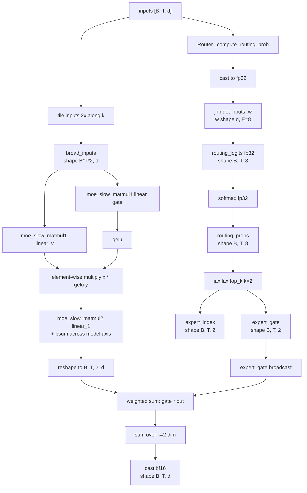

# 第 5 章 model.py 精读·中：MoE 路由与专家

这一章是本书技术密度最高的一章。Grok-1 的 MoE 实现集中在 `model.py:208-400`，约 200 行代码，但它牵涉到：

- 路由器的数值精度选择
- top-2 路由的实现细节
- `hk.experimental.transparent_lift` + `jax.vmap` 把 8 个专家折叠成一个 vmap 维度
- `shard_map` 在 expert 维度上的切分
- 推理时两个专家输出按 gate 加权求和

把这 200 行读懂，对 MoE 实现层的理解就基本完整了：路由器的精度选择、top-k 的实现方式、专家参数怎么组织、计算图怎么和 sharding 配合，这一章里都会落到具体代码上。

## 5.1 MoE 路由的总体流程

先放一张图，再逐段精读。



## 5.2 `Router`：路由器

!!! note "top-k routing / Router"
    MoE 选专家这一步叫 routing，做这件事的小网络叫 router。最常见的写法是：router 就是一个 `(d, E)` 的线性层（`E` 是专家数），对当前 token 的 hidden 算出 `E` 个分数，softmax 一下得到每个专家的"路由概率"，挑分数最高的 k 个专家，token 在这 k 个里完成 FFN 计算，输出再按 routing 概率加权求和。

    这套设计的核心约束有两个。一是 router 必须**便宜** - 因为它在每个 MoE 层、每个 token 上都要执行一次，如果计算过重，MoE 节省的算力会被这部分开销抵消掉，所以 router 基本固定成"一个线性层"，不再叠加非线性、不再增加参数量。二是 router 输出要能驱动一个**离散选择**（选出 top-k），但梯度只能通过被选中那几个 expert 的 gate 概率回流，没被选中的专家在这一步拿不到梯度。这种"硬选择"是 MoE 一系列工程问题（负载塌缩、训练不稳）的根源，后续提出的 aux loss、z-loss、capacity factor 都是围绕这个问题做的补丁。

`model.py:208-269`：

```python
# model.py:208-269
class Router(hk.Module):
    def __init__(
        self,
        num_selected_experts: int,
        data_axis: Union[str, Tuple[str, ...]] = "data",
        model_axis: Union[str, Tuple[str, ...]] = "model",
        shard_activations: bool = False,
        mesh: Any = None,
        name: str = "router",
    ):
        super().__init__(name)
        self.shard_activations = shard_activations
        self.data_axis = data_axis
        self.model_axis = model_axis
        self.mesh = mesh
        self.num_selected_experts = num_selected_experts

    def compute_routing_prob(
        self, inputs: jax.Array, padding_mask: Optional[jax.Array], num_experts: int
    ):
        return self._compute_routing_prob(inputs, padding_mask, num_experts)

    @hk.transparent
    def _compute_routing_prob(
        self,
        inputs: jax.Array,
        padding_mask: Optional[jax.Array],
        num_experts: int,
    ):
        # Using fp32 for the routing prob computation.
        inputs = jax.lax.convert_element_type(inputs, jnp.float32)

        # [batch_size, seq_len, num_experts]
        routing_logits = self._router_weights(inputs, num_experts, sharding=P("data"))
        assert routing_logits.dtype == jnp.float32
        routing_probs = jax.nn.softmax(routing_logits)

        if padding_mask is not None:
            routing_probs *= padding_mask

        return routing_probs, routing_logits, 0

    @hk.transparent
    def _router_weights(
        self,
        x: jax.Array,
        num_experts: int,
        sharding: Optional[P] = None,
    ):
        fprop_dtype = x.dtype
        if not x.shape:
            raise ValueError("Input must not be scalar.")

        input_size = self.input_size = x.shape[-1]
        w = hk.get_parameter(
            "w", [input_size, num_experts], jnp.float32, init=hk.initializers.Constant(0)
        )
        if sharding:
            w = with_sharding_constraint(w, sharding)

        out = jnp.dot(x, w.astype(fprop_dtype))
        return out
```

关键观察：

### 5.2.1 路由强制 fp32

`model.py:238`：

```python
inputs = jax.lax.convert_element_type(inputs, jnp.float32)
```

输入先被 cast 到 fp32，然后整个路由计算（matmul + softmax）都在 fp32 下进行。这一点对 MoE 训练至关重要：如果在 bf16 下做路由，logit 的小数值差异会让同一个 token 在不同 step 被分发到不同 expert，专家拿到的 token 分布持续波动，最终导致训练发散。

### 5.2.2 没有 noisy gating，没有 z-loss

Switch Transformer 论文里有"noisy top-k gating"：

$$
\text{logit}'_i = \text{logit}_i + \mathcal{N}(0, \sigma)
$$

通过加噪让 expert 选择更分散。Grok-1 **不加噪**。

GShard / GLaM 还有 "z-loss" - 惩罚 logit 的范数避免发散。Grok-1 **没有任何辅助损失**（至少推理代码看不到）。

!!! note "z-loss"
    MoE 训练过程中 router 的 softmax logit 可以无限增长 - logit 越大，routing 决策越"硬"（接近 one-hot），但同时让 softmax 中 `log(sum_i exp(logit_i))` 这一项数值越界，bf16 下 logit 超过约 88 就会变成 inf。z-loss 是一个简单的正则项：在主 loss 上加 $\alpha \cdot (\log Z)^2$，其中 $Z = \sum_i \exp(\text{logit}_i)$。它惩罚 partition function 偏离 1，等价于把 logit 整体往 0 收紧。

    Switch Transformer / GLaM 论文里 z-loss 系数典型取 1e-4，是防止 MoE 训练后期 logit 爆炸的标准手段。Grok-1 推理代码里没看到 z-loss 痕迹（虽然 8 个 expert 的 314B 训练时几乎肯定用了），训练时具体系数 xAI 没公开。

### 5.2.2.1 fp32 路由是不是必须

实际上 bf16 路由也能跑出可用结果（推理时），但训练时不行。原因：

- **训练时**：路由器 logit 的微小数值差异会让同一个 token 在不同 step 被 route 到不同 expert。这种"flickering routing"让 expert 拿到的 token 分布不稳定，aux loss 信号噪声大，loss curve 出现剧烈波动。fp32 路由能把这种 flickering 降到最小
- **推理时**：模型已经训练完成，路由器对小扰动不敏感（同一个 prompt 几乎总是会被 route 到同一组 expert），bf16 在数值精度上已经足够

但开源代码里推理路由仍然保留 fp32，目的是让推理和训练完全一致，避免 train/inference 数值差异带来的微小质量退化。

### 5.2.3 softmax 在 top-k 之前还是之后

主流有两派：

**A 派（softmax then top-k）：** Grok-1, GShard 早期, Switch Transformer

```
probs = softmax(logits)          # 全部 8 个 expert 归一化
gate, idx = top_k(probs, k=2)    # 选 top 2，gate 之和 ≠ 1
```

`model.py:295-298` 验证 Grok-1 走这条：

```python
routing_probs, _, _ = self.router.compute_routing_prob(inputs, padding_mask, self.num_experts)
expert_gate, expert_index = jax.lax.top_k(routing_probs, k=self.router.num_selected_experts)
```

**B 派（top-k then softmax）：** Mixtral 8x7B, DeepSeek

```
top_logits, idx = top_k(logits, k=2)
gate = softmax(top_logits)       # 在 top-2 上重新归一化，gate 之和 = 1
```

B 派的做法让两个被选中 expert 的 gate 加和等于 1，输出在量级上更稳定。A 派的 gate 之和则小于 1（因为另外 6 个未被选中的 expert 也占了一部分 softmax 概率），最终输出会被一个小于 1 的因子整体缩小。

**这是 Grok-1 与 Mixtral 在路由实现上的最大差异。** 真正分开两者的不是软裁剪、不是 aux loss、不是 capacity factor，而是 softmax 与 top-k 这两步看似无关紧要的先后顺序。

Mixtral 论文里明确说他们用 B 派；Grok-1 代码直接告诉你它用 A 派。后果：

- Grok-1 的 expert 输出会"自动衰减"：当 8 个 expert 的概率接近均匀（路由不确定）时，gate 总和约为 0.25 (2/8)，输出被压缩到原来的 1/4
- Mixtral 的 expert 输出在数值量级上稳定：无论路由确不确定，两个 gate 之和始终为 1

这种"自带温度衰减"的行为很可能是 Grok-1 训练时的有意选择，让网络在路由不确定的情况下输出自动变小，从而对路由噪声更鲁棒。

## 5.3 `MoELayer._inference_call`：核心 200 行

`model.py:293-397`。逐段精读。

### 5.3.1 路由 + broadcast inputs

```python
# model.py:293-303
@hk.transparent
def _inference_call(self, inputs: jax.Array, padding_mask: Optional[jax.Array] = None):
    routing_probs, _, _ = self.router.compute_routing_prob(
        inputs, padding_mask, self.num_experts
    )
    expert_gate, expert_index = jax.lax.top_k(routing_probs, k=self.router.num_selected_experts)
    tmp = jnp.reshape(inputs, (inputs.shape[0] * inputs.shape[1], inputs.shape[2]))
    broad_inputs = jnp.tile(tmp[:, jnp.newaxis, :], (1, self.router.num_selected_experts, 1))
    broad_inputs = jnp.reshape(
        broad_inputs, (broad_inputs.shape[0] * broad_inputs.shape[1], broad_inputs.shape[2])
    )
```

逐步：

1. `inputs` 是 `[B, T, d]`
2. `routing_probs`: `[B, T, 8]`
3. `expert_gate`, `expert_index`: 都是 `[B, T, 2]`
4. `tmp = reshape(inputs, [B*T, d])`
5. `tmp[:, newaxis, :]`: `[B*T, 1, d]`
6. `tile(..., (1, 2, 1))`: `[B*T, 2, d]` - **每个 token 复制 2 份**
7. `reshape`: `[B*T*2, d]` - 把 token 维度和 expert-选择维度合并到一起

这里有一个值得注意的 inefficiency：**每个 token 被复制了 2 份**，然后下游所有 token 都经过"全部 8 个 expert"的完整计算，最后用 one-hot index 选出该 token 对应 expert 的输出。这不是稀疏计算，而是密集计算。这也是 README 中明确说明的：

> The implementation of the MoE layer in this repository is not efficient. The implementation was chosen to avoid the need for custom kernels to validate the correctness of the model.

真正高效的 MoE 实现（例如 Megablocks、tutel）会按 expert 对 token 做重排，每个 expert 只处理被 route 到它身上的 token。Grok-1 没有采用这种做法，理由有三个：

1. 简化 sharding 设计（每个 device 拿到所有 token，只在部分 expert 维度上做计算）
2. 简化代码（不需要写 scatter / gather 这类自定义 kernel）
3. 训练用的也是同一份实现，便于阅读和调试

代价是计算成本接近真稀疏 MoE 的 4 倍（8 / 2 = 4）。

### 5.3.2 专家参数的获取：transparent_lift + vmap

```python
# model.py:304-311
init_fn, _ = hk.transform(self.layer_fn)
vmapped_init_fn = jax.vmap(init_fn, in_axes=0, out_axes=0)
lifted_init_fn = hk.experimental.transparent_lift(vmapped_init_fn)
# Fetch the vmapped params of the DenseBlock.
params = lifted_init_fn(
    jax.random.split(jax.random.PRNGKey(1), self.num_experts),
    jnp.zeros((self.num_experts, 1, 1, inputs.shape[-1])),
)
```

这一段是 Grok-1 全部代码里最 tricky 的部分，需要逐步拆开讨论。

**`self.layer_fn`** 是由上层传入的 `base_dense_block` 函数（`model.py:1063-1072`），它会构造一个 `DenseBlock` 并执行调用，对应一个 SwiGLU FFN 的前向计算。

**步骤分解：**

1. `init_fn, _ = hk.transform(self.layer_fn)`：把 `layer_fn` 转换成一个 Haiku transform，从中提取 init 函数
2. `vmapped_init_fn = jax.vmap(init_fn, in_axes=0, out_axes=0)`：在第 0 维做 vmap，含义是如果传入 8 份随机种子和 8 份 dummy 输入，输出会是 8 份参数（每个参数 shape 前面多出一个长度为 8 的 leading 维度）
3. `lifted_init_fn = hk.experimental.transparent_lift(vmapped_init_fn)`：把 vmapped init 函数"提升"到当前 hk transform 的上下文中，让它产生的参数名注册到当前 module 的 scope（"moe"）下，结果是参数名变成 `moe/linear_v/w` 这种形式，shape 为 `[8, 6144, 32768]`
4. `lifted_init_fn(...)`：执行实际调用并返回 params，这些 params 的 shape 都比单个 expert 多出一个 leading expert 维度

!!! note "`hk.experimental.transparent_lift`"
    Haiku 的参数命名依赖于 `hk.transform` 的上下文：在 transform 内部调用 `hk.get_parameter` 会根据当前 module 的 name 自动注册参数。但 `MoELayer._inference_call` 内部要做一件特别的事：先用 `hk.transform(layer_fn)` 把 DenseBlock 的 init 函数提取出来，再用 `jax.vmap` 把它复制成 8 份，从而得到 8 个 expert 的参数。如果直接调用 vmapped 后的 init，新参数会被注册到一个新的、独立的 transform 上下文里，与外层 MoELayer 的参数树彻底脱节。

    `hk.experimental.transparent_lift` 就是用来解决这种"把内层 transform 的参数提升回外层 transform 上下文"问题的 API：它让 vmapped init 产生的参数名直接挂到当前 MoELayer 的 scope（`moe/...`）下，最终 8 个 expert 的权重以 `moe/linear_v/w`、shape `[8, 6144, 32768]` 的形式出现，这正好对应 Grok-1 ckpt 中 expert 参数的实际存储格式。

得到的 `params` 结构大致：

```python
{
    "linear":   {"w": <shape [8, 6144, 32768]>},
    "linear_v": {"w": <shape [8, 6144, 32768]>},
    "linear_1": {"w": <shape [8, 32768, 6144]>},
}
```

**这就是 Grok-1 表示 8 个 expert 的方式：在每个 FFN 权重前面多加一个长度为 8 的 leading 维度**。从 ckpt 的存储视角看，所有 expert 的权重是连续保存在同一个 tensor 内的，按 expert idx 0~7 顺序排列。

### 5.3.3 `moe_slow_matmul1`：每个 token 过所有 8 个 expert，再 one-hot 选

```python
# model.py:319-337
@functools.partial(
    shard_map,
    mesh=self.mesh,
    in_specs=(
        P(self.data_axis, None),
        P(None, None, self.model_axis),
        P(None, None, self.model_axis),
        P(None),
        P(None),
    ),
    out_specs=P(self.data_axis, self.model_axis),
    check_rep=False,
)
def moe_slow_matmul1(input, weight, scales, index, prob):
    weight = weight * scales
    one_hot_indices = jax.nn.one_hot(index.reshape(-1), 8, axis=0)
    all_expert_output = jnp.einsum("mk,bkn->bmn", input, weight)
    output = jnp.einsum("bm,bmn->mn", one_hot_indices, all_expert_output)
    return output
```

逐步：

- `input`: `[m=B*T*2, k=d]`
- `weight`: `[b=8, k=d, n=d_ffn]`
- `scales`: 与 weight 同 shape，用于 8-bit 反量化
- `index`: `[B, T, 2]` 形状的 expert 选择，reshape 后是 `[B*T*2]`
- `prob`: 这个 shard_map 里没用到 prob！

执行：

1. `weight = weight * scales` - 反量化
2. `one_hot_indices = one_hot(index.reshape(-1), 8, axis=0)`: `[8, B*T*2]`
3. `jnp.einsum("mk,bkn->bmn", input, weight)`: 让**每个 token 都过完所有 8 个 expert**，得到 `[8, B*T*2, d_ffn]`
4. `jnp.einsum("bm,bmn->mn", one_hot_indices, all_expert_output)`: 用 one-hot 选出每个 token 对应 expert 的输出

最终 `output` shape 为 `[m=B*T*2, n=d_ffn]`。

这就是"先做密集计算、再事后挑选"的 inefficiency 根源：实际计算量是真稀疏实现的 8 倍，而真正稀疏只需要 1 倍（每个 token 实际只用 1 个 expert，由于 top-2 选择前已经 tile 过一次，整体翻倍变成 2 次独立调用）。

注意 `prob` 参数没有被使用，这是接口上的预留，gate 加权是在外层另外完成的。

### 5.3.4 `moe_slow_matmul2`：FFN 下投影 + psum

```python
# model.py:339-357
@functools.partial(
    shard_map,
    mesh=self.mesh,
    in_specs=(
        P(self.data_axis, self.model_axis),
        P(None, self.model_axis, None),
        P(None, self.model_axis, None),
        P(None),
        P(None),
    ),
    out_specs=P(self.data_axis, None),
    check_rep=False,
)
def moe_slow_matmul2(input, weight, scales, index, prob):
    weight = weight * scales
    one_hot_indices = jax.nn.one_hot(index.reshape(-1), 8, axis=0)
    all_expert_output = jnp.einsum("mk,bkn->bmn", input, weight)
    output = jnp.einsum("bm,bmn->mn", one_hot_indices, all_expert_output)
    return jax.lax.psum(output, axis_name="model")
```

这一段几乎和 `matmul1` 完全一样，差异点有三个：

1. `weight` 的 shape 是 `[8, d_ffn, d]`，对应 FFN 的下投影
2. partition spec 调整为让 model 轴落在中间维度，即 d_ffn 沿 model 切分，d 维不切
3. **结尾增加了 `jax.lax.psum(output, axis_name="model")`**，原因是 d_ffn 被切分到多卡后，每个 device 计算出的 `all_expert_output` 只包含自己负责那段 d_ffn 的部分贡献，需要在 model 轴上做一次 all-reduce sum 把各 device 的部分结果加起来

输出 shape 为 `[m=B*T*2, d]`。

### 5.3.5 SwiGLU 装配 + gate 加权

```python
# model.py:359-394
if hasattr(params["linear"]["w"], "scales"):
    x = moe_slow_matmul1(
        broad_inputs,
        params["linear_v"]["w"].weight,
        params["linear_v"]["w"].scales,
        expert_index,
        expert_gate,
    )
    y = moe_slow_matmul1(
        broad_inputs,
        params["linear"]["w"].weight,
        params["linear"]["w"].scales,
        expert_index,
        expert_gate,
    )
    y = jax.nn.gelu(y)
    out = moe_slow_matmul2(
        x * y,
        params["linear_1"]["w"].weight,
        params["linear_1"]["w"].scales,
        expert_index,
        expert_gate,
    )
    out = jnp.reshape(
        out,
        [
            inputs.shape[0],
            inputs.shape[1],
            self.router.num_selected_experts,
            out.shape[-1],
        ],
    )
    out = expert_gate[:, :, :, None].astype(jnp.bfloat16) * out
    out = jnp.sum(out, axis=2)
    out = out.astype(jnp.bfloat16)
else:
    # This is only here so that we can construct a valid init_fn with this code.
    return inputs
return out
```

最重要的几行：

**SwiGLU 计算：**

- `x = moe_slow_matmul1(..., linear_v, ...)`：value 分支的 up projection，没有激活函数
- `y = gelu(moe_slow_matmul1(..., linear, ...))`：gate 分支的 up projection，但激活函数是 **GELU 而不是 SiLU**

这又是 Grok-1 的一个不太常见的选择。主流 SwiGLU 通常使用 SiLU / Swish 作为激活函数：

$$
\text{SwiGLU}(x) = \text{SiLU}(W_g x) \odot W_v x
$$

但 Grok-1 用 GELU：

$$
\text{Grok-FFN}(x) = \text{GELU}(W_g x) \odot W_v x
$$

从命名习惯上严格来说，这种结构属于 **GeGLU**，不属于 SwiGLU。

| 模型 | FFN 激活 |
| --- | --- |
| LLaMA-2 | SiLU (SwiGLU) |
| Mistral / Mixtral | SiLU (SwiGLU) |
| **Grok-1** | **GELU (GeGLU)** |
| PaLM | SwiGLU |
| Gemma | GeGLU |

Grok-1 与 Gemma 都选择了 GELU 路线。GELU 与 SiLU 在 [-3, 3] 区间内的函数值几乎完全相同，差异出现在尾部：SiLU 在大负值处仍然保留微小的负输出，GELU 在同一区间则接近 0。实际训练效果上两者差异很小，但训练完成后两种激活对应的 ckpt 不能互相替换。

**输出加权：**

```python
out = jnp.reshape(out, [B, T, 2, d])
out = expert_gate[:, :, :, None].astype(jnp.bfloat16) * out
out = jnp.sum(out, axis=2)
```

每个 token 的两份 expert 输出按 gate 加权求和。这里的 `expert_gate` 来自 5.2.3 中讨论的 A 派实现：它是直接从 8 个 expert 的 softmax 概率里取出的 top-2 值，没有在 top-k 之后做归一化，所以两份 gate 的加权之和小于 1。

### 5.3.6 `else: return inputs`

```python
else:
    # This is only here so that we can construct a valid init_fn with this code.
    return inputs
```

只有在权重不属于 `QuantizedWeight8bit` 类型时才会进入这条分支。也就是说，**未量化的情况下 MoE 直接 return inputs**。这显然不是真正的前向逻辑，实际推理时 ckpt 中的权重始终是 quantized 的。这个分支只是为了让 Haiku 的 init 流程能正常通过：在 init 阶段权重还没有完成量化，需要这样一条返回路径让 hk.transform 能够 trace 出张量 shape。

这是一种**只在 inference 路径上有意义的实现**。如果使用者用的是 bf16 ckpt 而不是 8-bit ckpt，这一段需要相应修改。

### 5.3.5.1 SwiGLU 还是 GeGLU 的一点深入

`jax.nn.gelu` 默认参数为 **approximate=False**（即精确版 GELU，使用 erf 计算）。但在大模型实战部署中，erf 的计算开销较大，通常会选择更便宜的 `tanh` 近似公式：

$$
\text{GELU}_{\text{tanh}}(x) = 0.5 x (1 + \tanh(\sqrt{2/\pi}(x + 0.044715 x^3)))
$$

Grok-1 在代码中没有显式指定 approximate 参数，因此实际使用的是精确版 GELU，它在 GPU 上的执行速度大约比 tanh 近似慢 2-3 倍，在 FFN 总计算中所占比例不可忽视。代价的另一面是精确 GELU 在数值上更稳定。

至于 SiLU 与 GELU 的具体区别，两个函数在 [-3, 3] 区间内的曲线几乎完全重合，差别小于 1%。在大正负值区域，两者的行为是：

- SiLU: $\text{SiLU}(x) = x \cdot \sigma(x)$，对于 $|x|$ 很大的情况，SiLU(x) 趋近 x（正方向）或 0（负方向）
- GELU: 渐近行为与 SiLU 类似，但 GELU 在 |x| ≈ 0 附近的曲率略大一些

两者在网络行为上的本质差异并不大，因此"为什么 Grok-1 选 GELU 而非 SiLU"很可能只是 xAI 团队的内部偏好或者历史代码延续。Brian Lester 在 [一个 reddit 评论](https://reddit.com/r/MachineLearning) 中提到，DeepMind 内部一直偏好 GELU（毕竟 BERT 起源于 Google），而 xAI 的核心成员（如 Igor Babuschkin 等）都有 DeepMind 工作背景。

## 5.4 Top-k 路由的实现细节总结

| 步骤 | Grok-1 | Mixtral 8x7B |
| --- | --- | --- |
| logit 精度 | fp32 | fp32 |
| softmax 与 top-k 顺序 | softmax → top-k | top-k → softmax |
| gate 归一化 | 否（和 < 1） | 是（和 = 1） |
| Noise | 无 | 无 |
| Aux loss | 无（推理） | 无（推理） |
| Capacity factor | 字段存在但代码未用 | 无 |
| Drop token | 否 | 否 |
| 计算方式 | 密集（每 token 过所有 expert） | 稀疏 reorder |

### 5.4.1 路由的"温度"控制

注意 Grok-1 的路由没有显式的"温度"超参（即 softmax 前的缩放）。但因为：

1. router 输出量级 = router weight 量级 × input 量级
2. softmax 对量级敏感（量级大就接近 one-hot，量级小就接近均匀）

所以 router 的有效温度是隐式控制的，依靠训练过程中 router weight 自身尺度的学习。如果训练时发现某一层的 expert 路由过"硬"（接近 one-hot，失去稀疏选择的多样性），就需要将该层 router weight 的初始化幅度调小、weight decay 调大。

xAI 没有公开这些训练细节。

## 5.5 容量与负载均衡：Grok-1 没有

主流 MoE 训练时会做这些：

1. **Auxiliary loss / load balancing loss**：惩罚 expert 使用不均 - 让所有 expert 的 token 数尽量平均
2. **Capacity factor**：每个 expert 最多接 $C = \alpha \cdot T \cdot k / E$ 个 token（$\alpha$ 是 capacity factor，通常 1.0~1.25），超过的 token 被 drop（在 routing 层把它的 hidden 直接经 residual 过）
3. **Expert-choice routing**：反过来让 expert 选 token，天然均衡

Grok-1 推理代码里：

- 没有 aux loss
- `capacity_factor` 字段定义了但没用
- 没有 drop token 逻辑
- 是 token-choice 不是 expert-choice

这意味着在推理过程中，如果某个 expert 出现严重过拟合（所有 token 都选择它），代码不会触发任何均衡机制。但在实际部署中，训练好的 ckpt 本身已经隐含了负载均衡的结果（训练阶段大概率使用了 aux loss，只是没有在开源的推理代码中暴露出来）。

!!! note "auxiliary loss / 负载均衡损失"
    Router 训练里有一个长期存在的问题：模型很容易收敛到一种退化解，即把所有 token 都发往同一个专家。只要这个专家学习得足够好，主 loss 就能持续下降，剩下的 7 个专家不再被分到 token，也就拿不到梯度，永远没有机会被训练出来，最终模型实际只使用了 1/E 的容量。

    辅助 loss 的标准做法是显式惩罚这种不均衡：先计算每个专家拿到的 token 比例 `f_i`、以及每个专家平均收到的 routing 概率 `p_i`，再把这两个量的点积乘以专家数 `E · sum(f_i · p_i)` 加到总 loss 中。直觉是：一旦某个专家既"被分到的 token 多"又"被打分高"，这个乘积就会变大，loss 推动 router 把负载重新摊平。Switch Transformer 使用的系数是 0.01，这是 MoE 训练里几乎无法回避的一项。Mixtral 在论文中选择不显式增加 aux loss，靠训练数据本身的多样性让 router 自动分化出专长，这条路径能不能走通与训练数据的结构紧密相关。

### 5.5.1 推理时 token drop 的实际影响

假设训练阶段使用了 aux loss 配合 capacity factor = 1.0，导致大约 5% 的 token 被 drop。这些被 drop 的 token 在该 MoE 层不经过 FFN，而是直接通过 residual 通路传递下去（相当于 FFN 输出为 0）。整个训练过程中，模型逐渐适应了这种"5% drop"的状态。

!!! note "capacity factor / capacity drop"
    aux loss 是一种"软"约束：它把不均衡的状态推回到均衡，但并不能保证某一 batch 内所有专家都恰好处理相同数量的 token。在工程上还存在一个独立问题：如果某一 batch 里恰好有大量 token 都想去同一个专家，那个专家算力不够时该如何处理？训练时所有 expert 的 batch 维度是固定的（必须是静态形状才能进行 jit 编译和 shard 切分），多出来的 token 没有位置容纳。

    Switch Transformer 与 GShard 的处理方式是为每个专家预设一个"容量上限" `capacity = capacity_factor × (tokens / E)`，超过该容量的 token 直接被丢弃，不参与 expert 计算（capacity drop），它们的信号交给 residual stream 承接。`capacity_factor` 设得越大，丢弃的 token 越少，但浪费的预留算力也越多，1.0 是最紧凑的设置，1.25 是一种常见的留余量做法。Mixtral 选择不设 capacity drop，让每个 expert 接收所有路由给它的 token，依靠 sparse dispatch 来处理形状的动态变化；Grok-1 的 `TransformerConfig` 中虽然保留了相关字段，但代码里没有实际使用，推理路径上也属于这种"无 cap"的同款路线。

如果在推理阶段**完全不进行 drop**（这正是 Grok-1 的做法），所有 token 都会被 expert 实际处理。这种做法表面看起来"更完整"，但与训练时的行为并不一致：训练阶段有 5% 的 token 习惯了走 residual 通路，到推理阶段这部分 token 变成全部经过 expert 计算，出现了输入分布上的偏移。

这种偏移对最终生成质量的影响到底有多大？社区目前没有公开的量化研究。从理论上看：

- 训练阶段 drop 5% 的 token 并不算严重的扰动
- 推理阶段不 drop，相当于多出了 5% 的 expert 计算，模型不会立即出现明显崩坏，但 marginal 的输出质量可能会有轻微下降

所以 Grok-1 推理代码中"不 drop"的选择，可以理解为一种 inference-side 的近似处理。

## 5.6 Sharding：expert 维度怎么切

回看 partition rules（`model.py:142-149`）：

```python
(("router", "w"), P("data")),
# moe mlp
(("moe", "linear", "w"), P(None, "data", "model")),
(("moe", "linear", "b"), P(None)),
(("moe", "linear_v", "w"), P(None, "data", "model")),
(("moe", "linear_v", "b"), P(None)),
(("moe", "linear_1", "w"), P(None, "model", "data")),
(("moe", "linear_1", "b"), P(None)),
```

- `router.w`: shape `[d, 8]`, partition `("data",)` - 只切分第 0 维（即 d 维），8 个 expert 这一维度不切，每张 device 上都保留完整的 routing 权重
- `moe.linear_v.w`: shape `[8, d, d_ffn]`, partition `(None, "data", "model")` - **expert 维度不切（每张 device 都有完整副本）**，d 维沿 data 轴切分，d_ffn 维沿 model 轴切分
- `moe.linear.w`: 切分方式同上
- `moe.linear_1.w`: shape `[8, d_ffn, d]`, partition `(None, "model", "data")` - 与上面相同的思路，但中间维度 d_ffn 沿 model 轴切分

**关键观察：每张 device 上都保留了完整的 expert 维度副本。** 这又是 Grok-1 简化设计的一个体现：真正的 expert parallel 应该把 8 个 expert 切分到 8 张 device 上，每张 device 只承担一个 expert 的计算，而 Grok-1 并没有采用这种切法。

原因有两点：

1. `run.py:60` 中给出的 mesh 形状是 (1, 8)，只有一个长度为 8 的 model 维度，并没有专门的 expert 维度
2. 实现真正的 expert parallel 需要新增一个独立的 `expert` mesh 轴，并配套一套跨 device 的 routing 通信逻辑

所以 Grok-1 的 314B 模型在 8 卡上加载时：

- 每张卡上都持有全部 8 个 expert 在 d_ffn 维上属于自己的那 1/8 切片
- 每张卡都独立执行一次 routing，得到完全相同的 expert_index
- 每张卡分别计算自己负责的 d_ffn 切片，最后通过 `psum` 在 model 轴上做 all-reduce 完成结果汇总

这本质上是 **tensor parallel 在 MoE 场景下的朴素扩展**，并不是真正意义上的 expert parallel。

## 5.7 与 Mixtral 8x7B 路由代码的具体对比

Mixtral 的开源实现（Hugging Face `transformers`）里 `MixtralSparseMoeBlock.forward` 的关键步骤：

```python
# 简化版伪代码
router_logits = router(hidden_states)             # [B*T, num_experts]
routing_weights = F.softmax(router_logits, dim=1, dtype=torch.float)
routing_weights, selected_experts = torch.topk(routing_weights, top_k, dim=-1)
routing_weights /= routing_weights.sum(dim=-1, keepdim=True)   # 关键: 归一化

# expert_mask 和 token_indices 实现 token reorder
for expert_idx in range(num_experts):
    expert_layer = experts[expert_idx]
    idx, top_x = torch.where(expert_mask[expert_idx])
    current_hidden = expert_layer(current_state) * routing_weights[top_x, idx, None]
    final_hidden.index_add_(0, top_x, current_hidden)
```

两者的主要差异：

1. **Mixtral 的 softmax 同样发生在 top-k 之前**（与 Grok-1 相同），但**在 top-k 之后增加了一次归一化** - `routing_weights /= sum`
2. **Mixtral 按 expert 维度进行循环**，每个 expert 只处理被 route 到它身上的 token，是稀疏计算
3. Mixtral 使用 `torch.where` 与 `index_add_` 完成 scatter 操作，整个流程是真正的稀疏实现，没有 Grok-1 那种 8 倍密集计算的浪费

Grok-1 的实现属于"研究级简化"，Mixtral 的实现则是"工业级 PyTorch"。但两者都不是性能上的最优解：Megablocks、vLLM、TensorRT-LLM 等项目用专门优化的 kernel 重写后，推理吞吐还能再提升 3-5 倍。

## 5.8 推理时两个 expert 输出怎么聚合

回看 5.3.5 的末尾：

```python
out = jnp.reshape(out, [B, T, 2, d])
out = expert_gate[:, :, :, None].astype(jnp.bfloat16) * out
out = jnp.sum(out, axis=2)
```

两份 expert 输出按 gate 加权后求和。这里的 `expert_gate` 没有经过归一化，所以两份 gate 的总和小于 1，在路由不确定的情况下甚至会接近 0.25。

这种 unnormalized gating 还带来另一个 side effect：**后续的 post-RMSNorm 会对任意量级再做一次 normalize**。无论 expert_gate 的加权之和是 0.25 还是 0.95，经过 post-norm 之后输出的量级都会被拉回到一致水平，sandwich norm 在这里再次承担了量级稳定的兜底角色。

很可能正是因为有 sandwich norm 作为保障，Grok-1 才能够放心地采用 unnormalized gating，这是两种设计选择互相支撑的一个具体例子。

## 5.9 调用约定：`__call__` 转发到 `_inference_call`

```python
# model.py:399-400
def __call__(self, inputs: jax.Array, padding_mask: jax.Array):
    return self._inference_call(inputs)
```

注意 `padding_mask` 虽然作为参数被接收，但**没有被传递给 `_inference_call`**。`_inference_call` 内部使用的 padding_mask 始终是默认的 None。

这意味着在 Grok-1 的开源推理代码中，padding 位置上的 token 同样会参与路由计算。所幸这些位置上 hidden 本身就是 pad（数值接近 0），路由 logit 也接近 0，对实际生成结果的影响有限。

## 5.10 总结

Grok-1 的 MoE 是个"研究优先"的实现：

1. **路由：fp32 softmax + top-2（softmax 在前），不归一化 gate**
2. **专家：GeGLU FFN，8 个并列，参数表示为 leading-8 维**
3. **计算：每 token tile 2 份，每份过所有 8 个 expert 后用 one-hot 选 - 计算量是真稀疏的 4 倍**
4. **Sharding：expert 维不切（全 device 副本），d_ffn 维沿 model 切，用 psum 聚合**
5. **没有 aux loss、capacity drop、noise gating - 推理代码里全无负载均衡机制**

这些选择共同指向同一个目标：**保证 ckpt 加载过程 100% 不出错**。性能并不是设计的优先考虑，第 8 章会展示 Grok-1 默认推理吞吐其实非常低。

下一章在完成 DecoderLayer 的装配讨论之后，第 6 章就会把 model.py 的整体结构讲完。

## 延伸阅读

- [Switch Transformer](https://arxiv.org/abs/2101.03961) - 路由实现的奠基论文，noisy gating 和 capacity factor 都在这里定义
- [Mixtral of Experts](https://arxiv.org/abs/2401.04088) - 同代最直接对照
- [GLaM: Efficient Scaling of Language Models with Mixture-of-Experts](https://arxiv.org/abs/2112.06905) - z-loss 的出处
- [Megablocks: Efficient Sparse Training with Mixture-of-Experts](https://arxiv.org/abs/2211.15841) - 用 block-sparse matmul 实现真稀疏 MoE
- [Expert Choice Routing](https://arxiv.org/abs/2202.09368) - 反向路由
