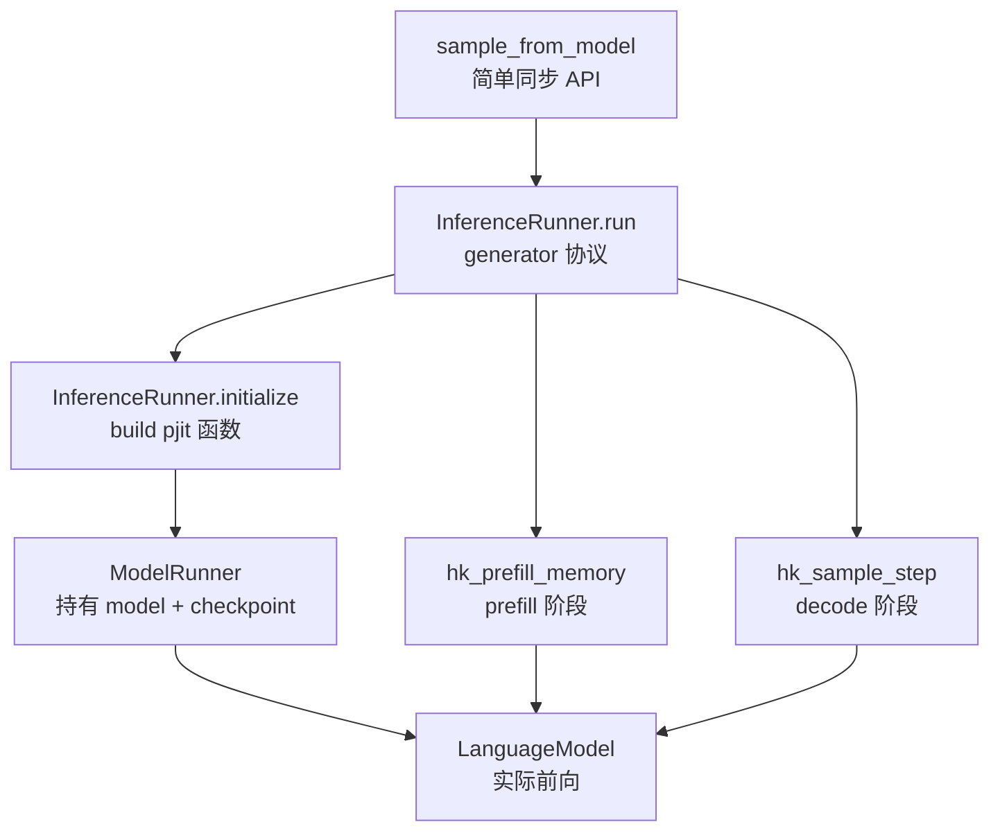
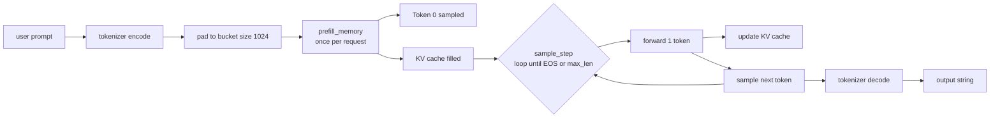

# 第 8 章 runners.py 推理引擎

`runners.py` 把 model 和 checkpoint 缝合成一个可用的 inference server。它是个 generator，通过 yield/send 协议接收 request，前两阶段 prefill / decode 都在这里实现。

## 8.1 三层抽象：sample_from_model / InferenceRunner / ModelRunner



### 8.1.1 `sample_from_model`：最薄的同步包装

`runners.py:596-605`：

```python
# runners.py:596-605
def sample_from_model(server, prompt, max_len, temperature):
    next(server)
    inp = Request(
        prompt=prompt,
        temperature=temperature,
        nucleus_p=1.0,
        rng_seed=42,
        max_len=max_len,
    )
    return server.send(inp)
```

`server` 是 `InferenceRunner.run()` 返回的 generator。

`next(server)` 把 generator 推到第一个 `yield`（等待 request）。`server.send(inp)` 把 inp 注入，generator 继续跑到下一个 `yield`（产出结果）并返回。这是 Python coroutine 标准模式。

`run.py:67` 调用 `sample_from_model(gen, inp, max_len=100, temperature=0.01)` - temperature 0.01 接近贪心采样。

### 8.1.2 `Request` 与 `Settings`

```python
# runners.py:252-258
@dataclass
class Request:
    prompt: str
    temperature: float
    nucleus_p: float
    rng_seed: int
    max_len: int
```

Request 是 user-facing 的接口。生命周期短，每次 sample_from_model 创建一个。

```python
# runners.py:50-55
class SampleSettings(NamedTuple):
    temperature: ArrayLike
    nucleus_p: ArrayLike
    mask: ArrayLike
    # Whether a given batch element is actively used. [B]
    active: ArrayLike
```

SampleSettings 是 batch 级别的、设备上的张量。`active` 字段控制哪些 batch slot 在用 - continuous batching 的关键。

## 8.2 推理两阶段：prefill 与 decode

!!! note "prefill / decode"
    自回归语言模型推理天然分两段。第一段叫 prefill：用户的 prompt（比如 50 个 token）一次性进 attention，得到每个位置的 K/V 写进 KV cache，最后一个位置的 logits 用来采第一个输出 token。这一段每张卡都满载算 attention 和 FFN，是 compute-bound 的。

    第二段叫 decode：从这之后每步只塞 1 个新 token 进模型，attention 里的 K/V 大部分从 cache 读，只更新当前位置一行。FFN 也只算 1 个 token，所以单 step 计算量极小，瓶颈变成"为了算这 1 个 token，要把 86 B 激活参从 HBM 读一遍"，是 memory-bound 的。

    Grok-1 把这两条路径分别编译成 `hk_prefill_memory` 和 `hk_sample_step`，KV cache 在两者间 share - prefill 写好 cache，decode 一步步增量更新。一次完整生成 = 1 次 prefill + N 次 decode。



### 8.2.1 Prefill 阶段

`hk_prefill_memory`（`runners.py:333-393`）：

```python
# runners.py:333-393
def hk_prefill_memory(
    rngs, memory, settings, last_output, prompt,
    length, rng_seed, new_settings, i,
):
    rng = jax.random.PRNGKey(seed=rng_seed)
    rng, rng_ = jax.random.split(rng)

    # Allocate new memory for this sample.
    slice = hk_new_memory(1, prompt.shape[0])

    # Move settings into the joint settings tensor.
    settings = jax.tree_map(
        lambda o, v: jax.lax.dynamic_update_index_in_dim(o, v, i, axis=0),
        settings, new_settings,
    )
    settings_slice = jax.tree_map(lambda t: jnp.expand_dims(t[i], axis=0), settings)

    # Process the first n-1 tokens of the prompt.
    lm_outputs = hk_forward(
        jnp.expand_dims(prompt, 0),
        memory=slice,
        length=jnp.expand_dims(length, 0),
        active=settings_slice.active,
    )

    # The forward pass doesn't correctly set the `step` counter inside the memory.
    slice = lm_outputs.model_state
    slice = slice._replace(
        layers=[l._replace(step=jnp.array([length])) for l in slice.layers]
    )

    # Sample the actual output token.
    rng_ = jnp.expand_dims(rng_, 0)
    new_output = sample_token(rng_, lm_outputs, settings_slice)

    # Update the KV cache/memory.
    slice = jax.tree_map(pad_to_max_len, slice)
    memory = insert_slice(memory, slice, length, i)

    rng = jnp.expand_dims(rng, 0)
    rngs = jax.lax.dynamic_update_index_in_dim(rngs, rng, i, axis=0)

    last_output = jax.tree_util.tree_map(
        lambda last, new: jax.lax.dynamic_update_index_in_dim(last, new, i, axis=0),
        last_output, new_output,
    )
    return rngs, last_output, memory, settings
```

逐步：

1. **为新 request 分配独立的 KV cache**（`hk_new_memory(1, prompt.shape[0])`），shape 是 `[1, prompt_len, 8, 128]` × 64 层
2. **把这个 request 的 settings 写到 batch slot `i`**
3. **forward**：跑 prompt（一次性 forward 整个 prompt），同时填充 cache
4. **手动修正 step 计数器**：因为 forward 出来的 cache step 可能不对（注释里说"forward pass doesn't correctly set the step counter"，这是个奇怪的实现细节，可能是因为多次 reshape/shard 让 step 信息丢失）
5. **sample 第一个输出 token**（基于 prompt 最后一个位置的 logits）
6. **把临时 cache pad 到 max_len（8192）**，然后写入全局 memory 的 slot i
7. **更新 rng、output、settings**

注意 `pad_to_max_len`（定义在 `runners.py:297-302`）把临时 cache 从 `[1, prompt_len, ...]` pad 到 `[1, max_len, ...]`，因为全局 memory 是 max_len 长度的预分配。

### 8.2.2 `pad_sizes` bucket

`runners.py:269` 的 `pad_sizes: tuple[int] = (1024,)`。run.py 实参也是 `(1024,)`。

`get_pad_bucket`（`runners.py:271-273`）：

```python
def get_pad_bucket(self, size):
    i = bisect.bisect_left(self.pad_sizes, size)
    return self.pad_sizes[min(i, len(self.pad_sizes) - 1)]
```

把任意长度的 prompt pad 到 bucket 大小，目的是**让 prefill JIT compile 复用**。否则每个不同长度的 prompt 都要重新编译，几分钟到几十分钟。

实际中 prompt 长度多变，1024 一个 bucket 不够 - 如果 prompt 是 50 token 也 pad 到 1024，浪费 95% 计算。产品级 server 一般有多个 bucket（[256, 512, 1024, 2048, 4096, 8192]）。Grok-1 示例只有 1 个 1024 bucket，是研究用最简版。

### 8.2.2.1 prefill 与 decode 的本质区别

很多人混淆这两阶段。简单总结：

| 项 | prefill | decode |
| --- | --- | --- |
| 输入 token 数 | 1 ~ prompt_len（一般 100-2000） | 1 |
| 计算瓶颈 | compute-bound（FLOPs 大） | memory-bound（参数读取慢） |
| KV cache | 从空到满 | 一直读，每步增 1 |
| 时延 | 较长（与 prompt 长度成正比） | 较短（每 step 几十 ms） |
| GPU 利用率 | 高（80-90%） | 低（10-30%） |
| 优化方向 | FlashAttention、chunked prefill | KV cache 优化、speculative decoding |

Grok-1 的 prefill 用 `hk_prefill_memory`，decode 用 `hk_sample_step`，两个函数都被 `pjit` 编译成不同的 SPMD 程序。

### 8.2.3 Decode 阶段

`hk_sample_step`（`runners.py:324-328`）：

```python
def hk_sample_step(rngs, last_output: SampleOutput, memory, settings):
    rngs, rngs_ = jax.vmap(jax.random.split, out_axes=1)(rngs)
    lm_outputs = hk_forward(last_output.token_id, memory=memory, active=settings.active)
    sample_result = sample_token(rngs_, lm_outputs, settings)
    return rngs, sample_result, lm_outputs.model_state
```

每次只跑 1 个 token：

1. split rng（每个 batch 元素一份）
2. forward 1 个 token，复用 memory 里的 KV cache
3. sample 下一个 token

这是标准的 autoregressive decode。

`hk_forward`（`runners.py:308-322`）有个小处理：

```python
def hk_forward(tokens, memory=None, length=None, active=None):
    if memory is not None:
        assert active is not None
        layers = []
        for l in memory.layers:
            # Reset steps to 0 for inactive requests to avoid unnecessary computations.
            step = jnp.where(active, l.step, jnp.zeros_like(l.step))
            layers.append(l._replace(step=step))
        memory = memory._replace(layers=layers)
    return lm()(tokens, memory, length=length)
```

对 inactive batch slot 把 step 重置为 0 - 因为 step 决定了 memory_mask 的范围，inactive 的 slot 仍然在计算图里跑，把 step 设 0 让它们不 attend 任何 K/V（avoid unnecessary computations 的注释有点误导，因为计算仍发生，只是结果无意义）。

## 8.3 采样实现

!!! note "采样：greedy / temperature / top-k / top-p（nucleus）"
    模型 forward 完每个位置输出一组 logits，长度等于词表大小（Grok-1 是 131072）。要从中挑下一个 token，最朴素的做法是直接取 argmax，叫 greedy（贪心）采样，输出是确定性的，但容易循环复读。

    temperature 采样在 softmax 之前把 logits 除以一个温度 T。T < 1 让分布更尖、接近 greedy；T > 1 让分布更平、随机性增加；T → 0 等价 greedy。Grok-1 默认 T = 0.01，几乎是 greedy。

    top-k 采样在采之前只保留 logits 最大的 k 个，其余设成 -inf。top-p（也叫 nucleus）改成"按概率从大到小累加，累计到 p 为止的那批 token 保留，其余丢掉"。p = 0.9 表示只在"前 90% 概率质量"里随机挑。Grok-1 的 `top_p_filter` 实现的就是这个，默认 `nucleus_p = 1.0` 等于不过滤。

    Grok-1 同一个 `sample_token` 函数把这几步串起来：先 `logits / T`，再 top-p 过滤，再 `jax.random.categorical` 按概率采。另外它每步顺手返回 top-8 候选用于 debug，那个 `TOP_K = 8` 跟 MoE 路由的 top-k 不是同一个 k，别混淆。

`sample_token`（`runners.py:100-133`）：

```python
def sample_token(rngs, lm_outputs, settings) -> SampleOutput:
    settings = SampleSettings(
        temperature=jnp.expand_dims(settings.temperature, (1, 2)),
        nucleus_p=jnp.expand_dims(settings.nucleus_p, (1, 2)),
        mask=jnp.expand_dims(settings.mask, 1),
        active=settings.active,
    )
    logits = lm_outputs.logits / settings.temperature.astype(lm_outputs.logits.dtype)
    logits = jnp.where(settings.mask, logits, -1e10)
    logits = top_p_filter(logits, settings.nucleus_p.astype(logits.dtype))

    new_token = jax.vmap(jax.random.categorical)(rngs, logits)

    probabilities = jax.nn.softmax(logits)
    token_prob = jnp.take_along_axis(probabilities, jnp.expand_dims(new_token, 1), axis=2)
    token_prob = jnp.squeeze(token_prob, 1)

    top_k_probs, top_k_token_ids = jax.lax.top_k(probabilities, TOP_K)
    ...
```

步骤：

1. **temperature scaling**：`logits / T`
2. **mask 屏蔽**：设禁止 token 为 -1e10
3. **top_p filter**：nucleus sampling
4. **categorical sampling**：基于 rng

`TOP_K = 8`（`runners.py:47`）- 这是输出的 top-k 信息，不是路由的 top-k。每次返回 top 8 个候选的 prob 和 id，给上层 debug 用。

### 8.3.1 `top_p_filter`：nucleus 实现

`runners.py:84-97`：

```python
def top_p_filter(logits, top_p):
    sorted_logits = jax.lax.sort(logits, is_stable=False)
    sorted_probs = jax.nn.softmax(sorted_logits)
    threshold_idx = jnp.argmax(jnp.cumsum(sorted_probs, -1) >= 1 - top_p, axis=-1)
    threshold_largest_logits = jnp.take_along_axis(
        sorted_logits, threshold_idx[..., jnp.newaxis], axis=-1
    )
    mask = logits >= threshold_largest_logits
    logits = jnp.where(mask, logits, -1e10)
    return logits
```

实现细节：

- `jax.lax.sort` 默认升序，所以 `sorted_logits` 从小到大
- `cumsum(sorted_probs) >= 1 - top_p` 找到 cumulative prob 达到 `1 - top_p` 的位置（升序看尾部）
- 把这个位置对应的 logit 作为阈值，所有 ≥ 阈值的 logit 保留

注意是 `>= 1 - top_p`，而非 `>= top_p`。因为是升序排序，所以从底向上累加。等价于"从高到低排序后取前 top_p 累计"，但实现上少一次 reverse。

### 8.3.1.1 Temperature 与 top-p 的组合策略

Grok-1 的采样支持 temperature scaling + nucleus (top-p) filtering 同时启用。两者作用：

- **temperature**：让概率分布"软化"或"硬化"。T < 1 让高概率 token 更高，分布更尖；T > 1 让分布更平
- **nucleus**：把累积概率排在前 p% 之外的 token 全设为 0

实际默认调用（`run.py:67`）：

```python
sample_from_model(gen, inp, max_len=100, temperature=0.01)
```

T = 0.01 几乎是贪心采样（argmax），让输出 deterministic。`sample_from_model` 里硬编码 `nucleus_p=1.0`，即不过滤任何 token。

如果想做创意性生成，常用 T=0.7-1.0、top_p=0.9-0.95 组合。

### 8.3.2 Top-K（runners.py 中的 `TOP_K` 与 `tokens` top）

不要混淆：

- `TOP_K = 8`（`runners.py:47`）：sample 时返回 top 8 个候选 token 用于 debug
- `num_selected_experts = 2`（model 中）：MoE 路由的 top-k

## 8.4 mesh、pjit 与 sharding：怎么把 314B 切到 8 卡

`make_mesh`（`runners.py:580-593`）：

```python
def make_mesh(local_mesh_config, between_hosts_config) -> jax.sharding.Mesh:
    device_mesh = mesh_utils.create_hybrid_device_mesh(
        local_mesh_config,
        between_hosts_config,
        devices=jax.devices(),
        process_is_granule=True,
    )
    return jax.sharding.Mesh(device_mesh, ("data", "model"))
```

`create_hybrid_device_mesh` 接收两个 shape：

- `local_mesh_config`：单 host 内的 mesh，比如 (1, 8)
- `between_hosts_config`：跨 host 的 mesh，比如 (1, 1) 或 (1, 2)

最终 mesh 形状是 `local × between_hosts`。run.py 默认 `(1, 8) × (1, 1) = (1, 8)`，8 device 全部给 model 轴。

`process_is_granule=True` 表示同一 host 上的 device 在 mesh 中相邻 - 这影响通信拓扑，NVLink 内通信 vs PCIe 跨 host 通信。

### 8.4.1 `pjit` 的核心调用

`initialize` 末尾（`runners.py:411-435`）：

```python
ds = P("data")
ms = runner.model.model.get_memory_sharding()
self.sample_step = pjit.pjit(
    sample_step_.apply,
    in_shardings=(self.params_sharding, None, ds, ms, None),
    out_shardings=(None, ds, ms),
    donate_argnums=3,
)
self.prefill_memory = pjit.pjit(
    functools.partial(prefill_memory_.apply),
    in_shardings=(
        self.params_sharding, None, ms, None, ds, None, None, None, None, None,
    ),
    out_shardings=(None, ds, ms, None),
    donate_argnums=(2,),
)
self.new_memory = pjit.pjit(
    new_memory_.apply,
    static_argnums=(1, 2),
    out_shardings=ms,
)
```

`pjit` 把 Haiku 的 apply 函数包装成"分布式 jit"。in_shardings / out_shardings 指定每个 arg / output 的 PartitionSpec。

`donate_argnums=3` / `=(2,)`：把第 3 个 / 第 2 个参数标记为可 donate（XLA 可以复用其 buffer），减少内存峰值。typically 用于 KV cache - 旧 cache 不再需要，新 cache 写入同一块显存。

### 8.4.2 `params_sharding`：770 个 partition spec

`runners.py:406-409`：

```python
self.params_sharding = jax.tree_util.tree_map_with_path(
    apply_rules(runner.model.partition_rules()),
    shapes,
)
```

`apply_rules` 把 `TRANSFORMER_PARTITION_RULES` + `LM_PARTITION_RULES`（见 `model.py:112-174`）应用到每个参数路径，得到对应的 PartitionSpec。

最终 `params_sharding` 是和 params 同结构的 pytree，叶子是 PartitionSpec 而不是 tensor。`pjit` 用它告诉 XLA 怎么把参数布到 device 上。

## 8.5 KV cache 形状与更新

回顾第 6 章：

- 每层 KVMemory: `k = [B, T=8192, num_kv_heads=8, key_size=128]`, `v` 同
- 64 层 × 2 (k+v) × 8192 × 8 × 128 × 2 bytes/elem = **2.05 GB / batch**

`run.py` 默认 `bs_per_device=0.125`（`run.py:54`），8 卡 × 0.125 = 1 batch 总大小。即 batch_size = 1。

KV cache 总大小：2 GB。

`new_memory`、`insert_slice`、`update_into_shmap` 三个 op 协作管理：

1. `new_memory(batch_size, max_len)`：在 mesh 上分配 KV cache
2. `prefill_memory` 时，单独 allocate `slice = new_memory(1, prompt_len)`，跑 forward 填充，然后 `pad_to_max_len` 把它扩到 max_len，再 `insert_slice` 到全局 memory 的 slot i
3. decode 时，`update_into_shmap` 在 attention 内部更新 cache（见第 4 章 4.4）

### 8.5.1 KV cache 的"max_len 预分配"代价

Grok-1 的 KV cache 在初始化时就 allocate 满 max_len = 8192：

```python
k=jnp.zeros((batch_size, sequence_len, num_kv_heads, key_size), dtype=dtype)
```

如果 prompt 只有 50 token、output 100 token，实际使用 150 token 的 cache 空间，剩 8042 个位置是无用的 zeros。

**浪费的 cache 显存：**

$$
S_{\text{waste}} = \frac{8192 - 150}{8192} \approx 98\%
$$

对 1 个 batch 来说浪费 2 GB × 98% ≈ 2 GB 显存。

**Paged attention** 是 vLLM 引入的解决方案 - 把 KV cache 按页（block，typically 16 个 token）分配，只在需要时才 alloc 新 page。Grok-1 没用 paged attention，所以 KV cache 利用率低。

如果 Grok-1 在 8 卡上 serving，每卡显存 80 GB - 78 GB 参数 - 2 GB KV cache = 留给激活的只有 ~0 GB（极限），所以**Grok-1 默认 serving 几乎不能加大 batch**。这是它推理吞吐天花板的根本原因。

## 8.6 Continuous batching 雏形

`InferenceRunner.run` 主循环（`runners.py:500-577`）：

```python
all_tokens = []
free_slots = list(range(batch_size))
requests = [None] * batch_size
...
while True:
    while free_slots:
        request: Optional[Request] = yield
        ...
        i = free_slots.pop()
        ...
        # do prefill, write to slot i
        ...

    rngs, last_output, memory = self.sample_step(...)
    ...
    for i in range(batch_size):
        if requests[i] is not None:
            ...
            all_tokens.append(int(prev_token.token_id[i][0]))
            cont = len(all_tokens) < requests[i].max_len

            if not cont:
                output_str = self.tokenizer.decode(all_tokens)
                requests[i] = None
                free_slots.append(i)
                all_tokens = []
                settings = settings._replace(active=settings.active.at[i].set(0))
                yield output_str
```

逻辑：

- 维护一个 `free_slots` 列表，初始是所有 batch index
- 外层 yield 接 request，分配一个 slot i 给它，跑 prefill
- 内层每次 sample_step 跑一步 decode，所有 active slot 共享这一次 forward
- 某个 slot 完成时（len(tokens) >= max_len），释放 slot 并 yield 结果

这是 **continuous batching** 的雏形 - 不同 request 可以同时在不同 stage（一个刚 prefill 完，另一个 decode 到 50 步）。但 `run.py` 默认只 batch_size=1，所以演示不出多并发。

实际生产 batching（vLLM、SGLang）还要处理：

- 不同 prompt 长度的 prefill 共享
- prefill 与 decode 混合 batch
- Paged attention 节省 KV cache 内存
- Chunked prefill 把长 prompt 分块

Grok-1 这些都没有，是研究示例。

## 8.7 性能：tokens/sec 的瓶颈

Grok-1 在 8 × H100 80GB 上的实测吞吐（社区报告）：

- **prefill**：~50-100 tokens/sec/batch（compute-bound）
- **decode**：~5-10 tokens/sec/batch（memory-bound）

decode 这么慢，是因为：

1. **MoE 计算 4x 浪费**：见第 5 章，每个 token 跑所有 8 个 expert，实际只用 2 个
2. **没有 kernel fusion**：每个 op 单独 launch
3. **没有 paged attention**：KV cache 必须连续
4. **8 device 上的 314B HBM bandwidth 严重限速**：每 step 要从 HBM 读 86GB（激活参数），H100 HBM 带宽 3.35 TB/s，理论上限 ~39 step/s = 39 token/s。实测远低于这个，因为还有通信和 op launch 开销

对比 vLLM 跑 Mixtral 8x7B 在同样 8 H100 上：~50-100 token/sec decode。

**Grok-1 默认推理代码的吞吐是工业部署的 1/5 到 1/10**。这印证了 README 的免责声明：

> The implementation of the MoE layer in this repository is not efficient.

如果要做生产部署，需要：

1. 把 MoE 用 Megablocks / tutel 重写
2. 用 FlashAttention-3 替换原生 attention
3. 加 paged attention / continuous batching（vLLM-style）
4. 用 TensorRT-LLM 或 SGLang 重新部署

社区目前**没有**广泛使用的 Grok-1 vLLM 集成，原因之一是硬件门槛太高（8 × H100 服务器很少有人有），原因之二是 base 模型用处不大。这是第 11 章会展开的话题。

## 8.8 整体推理时间线（B=1, prompt=50 tok, output=100 tok）

| 阶段 | 操作 | 估计时间（8×H100） |
| --- | --- | --- |
| Load | 加载 ckpt | 5-10 min |
| Initialize | JIT compile prefill + decode | 5-15 min |
| Prefill | 1 次 forward 1024 token (bucket) | 10-20 sec |
| Decode | 100 step | 10-30 sec |

注意 JIT compile 一次后会缓存，下次启动可能快一些（但 JAX 默认不持久化 cache，需要手动用 `jax.config.update("jax_compilation_cache_dir", ...)`）。

Grok-1 第一次推理总耗时约 **15-30 分钟**（包括 load + compile + 一次生成）。这就是为什么 README 说"建议用作研究而非产品"。

## 8.9 总结

`runners.py` 是一份示例级推理引擎：

1. **三层抽象**：sample_from_model → InferenceRunner → ModelRunner
2. **generator 协议**：用 yield/send 实现 continuous batching 雏形
3. **prefill bucket**：固定 1024，简单但浪费
4. **pjit + mesh**：用 (1, 8) 默认配置把 314B 切到 8 卡
5. **采样**：temperature + nucleus + top-k debug
6. **KV cache**：max_len 预分配，按 mesh sharding
7. **吞吐：~5-10 tok/s**，比专业 MoE 推理框架慢 5-10 倍

下一章看 tokenizer。

## 延伸阅读

- [vLLM: Easy, Fast, and Cheap LLM Serving](https://arxiv.org/abs/2309.06180) - PagedAttention 与 continuous batching 的工业级实现
- [Efficient Memory Management for Large Language Model Serving with PagedAttention](https://arxiv.org/abs/2309.06180) - 同上
- [Orca: A Distributed Serving System for Transformer-Based Generative Models](https://www.usenix.org/conference/osdi22/presentation/yu) - continuous batching 的最早提出
- [Pjit programming model](https://jax.readthedocs.io/en/latest/notebooks/Distributed_arrays_and_automatic_parallelization.html) - JAX 官方文档
