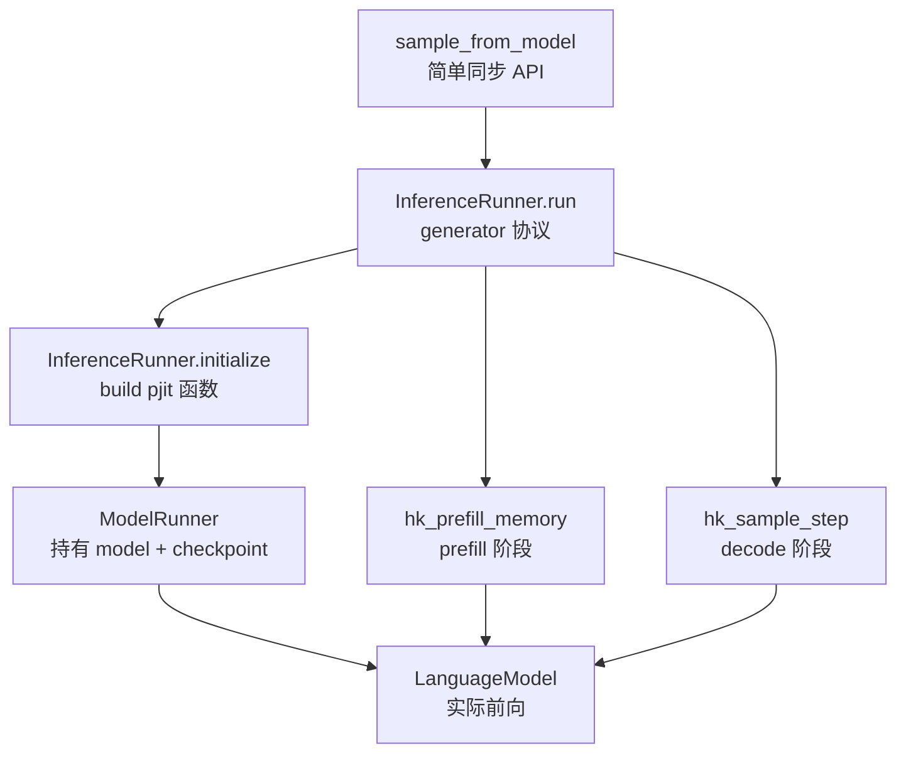
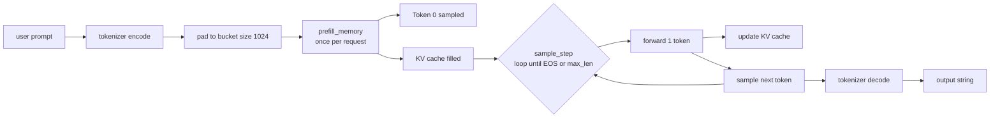

# 第 8 章 runners.py 推理引擎

`runners.py` 把 model 与 checkpoint 两部分缝合成一个可以对外提供服务的 inference server。它的入口是一个 Python generator，通过 yield 与 send 这套协程协议接收外部 request，推理过程的两个核心阶段 prefill 与 decode 都在这一文件中完成实现。

## 8.1 三层抽象：sample_from_model / InferenceRunner / ModelRunner



### 8.1.1 `sample_from_model`：最薄的同步包装

`runners.py:596-605`：

```python
# runners.py:596-605
def sample_from_model(server, prompt, max_len, temperature):
    next(server)
    inp = Request(
        prompt=prompt,
        temperature=temperature,
        nucleus_p=1.0,
        rng_seed=42,
        max_len=max_len,
    )
    return server.send(inp)
```

这里的 `server` 是由 `InferenceRunner.run()` 返回的 generator 对象。

`next(server)` 将 generator 推进到它的第一个 `yield` 处，对应代码中"等待 request"的位置。`server.send(inp)` 把外部输入 inp 注入到 generator 内部，generator 继续执行直至下一个 `yield`（即产出结果的位置）并把结果返回给调用方。这是 Python 协程协议的标准用法。

`run.py:67` 处调用形式为 `sample_from_model(gen, inp, max_len=100, temperature=0.01)`，其中 temperature 设为 0.01，已经非常接近贪心采样。

### 8.1.2 `Request` 与 `Settings`

```python
# runners.py:252-258
@dataclass
class Request:
    prompt: str
    temperature: float
    nucleus_p: float
    rng_seed: int
    max_len: int
```

Request 是面向调用方的请求接口，生命周期较短，每次调用 sample_from_model 时都会创建一个新的实例。

```python
# runners.py:50-55
class SampleSettings(NamedTuple):
    temperature: ArrayLike
    nucleus_p: ArrayLike
    mask: ArrayLike
    # Whether a given batch element is actively used. [B]
    active: ArrayLike
```

SampleSettings 是位于 device 上的 batch 级张量结构，与 Request 在抽象层级上不同。其中 `active` 字段用于控制 batch 中哪些 slot 当前处于使用状态，是实现 continuous batching 的关键所在。

## 8.2 推理两阶段：prefill 与 decode

!!! note "prefill / decode"
    自回归语言模型的推理过程天然分为两个阶段。第一阶段称为 prefill：用户输入的 prompt（例如 50 个 token）一次性进入 attention 模块，对每个位置都计算出对应的 K/V 并写入 KV cache，最后取最后一个位置的 logits 用于采样得到第一个输出 token。在这一阶段，每张 GPU 都满载执行 attention 与 FFN 计算，整个过程属于 compute-bound 的工作负载。

    第二阶段称为 decode：从生成第一个 token 之后开始，每一步只把 1 个新 token 输入模型，attention 中的 K/V 绝大部分直接从 cache 中读取，仅需要更新当前这个位置对应的一行。FFN 也只需要为 1 个 token 计算输出，因此单 step 的计算量极小，性能瓶颈转移到"为了计算这 1 个 token，需要把整张卡上约 86 GB 的激活参数从 HBM 全部读一遍"，属于 memory-bound 的工作负载。

    Grok-1 把这两条不同的执行路径分别编译为 `hk_prefill_memory` 与 `hk_sample_step` 两个函数，二者之间通过共享 KV cache 来传递状态：prefill 阶段负责写入 cache，decode 阶段在 cache 基础上做逐步增量更新。一次完整的生成等价于一次 prefill 加上 N 次 decode。



### 8.2.1 Prefill 阶段

`hk_prefill_memory`（`runners.py:333-393`）：

```python
# runners.py:333-393
def hk_prefill_memory(
    rngs, memory, settings, last_output, prompt,
    length, rng_seed, new_settings, i,
):
    rng = jax.random.PRNGKey(seed=rng_seed)
    rng, rng_ = jax.random.split(rng)

    # Allocate new memory for this sample.
    slice = hk_new_memory(1, prompt.shape[0])

    # Move settings into the joint settings tensor.
    settings = jax.tree_map(
        lambda o, v: jax.lax.dynamic_update_index_in_dim(o, v, i, axis=0),
        settings, new_settings,
    )
    settings_slice = jax.tree_map(lambda t: jnp.expand_dims(t[i], axis=0), settings)

    # Process the first n-1 tokens of the prompt.
    lm_outputs = hk_forward(
        jnp.expand_dims(prompt, 0),
        memory=slice,
        length=jnp.expand_dims(length, 0),
        active=settings_slice.active,
    )

    # The forward pass doesn't correctly set the `step` counter inside the memory.
    slice = lm_outputs.model_state
    slice = slice._replace(
        layers=[l._replace(step=jnp.array([length])) for l in slice.layers]
    )

    # Sample the actual output token.
    rng_ = jnp.expand_dims(rng_, 0)
    new_output = sample_token(rng_, lm_outputs, settings_slice)

    # Update the KV cache/memory.
    slice = jax.tree_map(pad_to_max_len, slice)
    memory = insert_slice(memory, slice, length, i)

    rng = jnp.expand_dims(rng, 0)
    rngs = jax.lax.dynamic_update_index_in_dim(rngs, rng, i, axis=0)

    last_output = jax.tree_util.tree_map(
        lambda last, new: jax.lax.dynamic_update_index_in_dim(last, new, i, axis=0),
        last_output, new_output,
    )
    return rngs, last_output, memory, settings
```

逐步说明：

1. **为新到达的 request 分配独立的临时 KV cache**（调用 `hk_new_memory(1, prompt.shape[0])`），其 shape 为 `[1, prompt_len, 8, 128]`，每层都有一份，共 64 层
2. **把当前 request 的采样 settings 写入 batch 中编号为 `i` 的 slot**
3. **执行 forward**：把 prompt 一次性输入模型完成 forward，同时将 K/V 写入临时 cache
4. **手动修正 step 计数器**：forward 计算出的 cache 中 step 值可能不准确，源码注释中明确指出"forward pass doesn't correctly set the step counter"。这是一个略显奇怪的实现细节，可能是因为多次 reshape 与 sharding 操作让 step 信息在传递过程中丢失
5. **采样得到第一个输出 token**，使用的是 prompt 最后一个位置对应的 logits
6. **将临时 cache pad 到 max_len（8192）长度**，然后写入全局 memory 中对应 slot `i` 的位置
7. **更新 rng、上一次输出 token、settings 这几项状态**

注意 `pad_to_max_len` 函数（定义在 `runners.py:297-302`）的作用是把临时 cache 的 shape 从 `[1, prompt_len, ...]` pad 到 `[1, max_len, ...]`，原因是全局 memory 在初始化时就按 max_len 完整预分配好了。

### 8.2.2 `pad_sizes` bucket

`runners.py:269` 的 `pad_sizes: tuple[int] = (1024,)`。run.py 实参也是 `(1024,)`。

`get_pad_bucket`（`runners.py:271-273`）：

```python
def get_pad_bucket(self, size):
    i = bisect.bisect_left(self.pad_sizes, size)
    return self.pad_sizes[min(i, len(self.pad_sizes) - 1)]
```

把任意长度的 prompt pad 到固定 bucket 大小的目的，是**让 prefill 阶段的 JIT 编译产物可以被复用**。否则每出现一个不同长度的 prompt 都需要重新触发一轮 JIT 编译，单次编译耗时可能在几分钟到几十分钟。

实际服务场景中 prompt 的长度差异很大，使用单一的 1024 bucket 并不足够：如果实际 prompt 只有 50 个 token 也被 pad 到 1024，将浪费约 95% 的计算量。产品级别的推理服务通常会配置多个 bucket（例如 [256, 512, 1024, 2048, 4096, 8192]）。Grok-1 的示例代码只配置了 1 个 1024 大小的 bucket，属于研究目的下最简化的实现。

### 8.2.2.1 prefill 与 decode 的本质区别

很多人会把 prefill 与 decode 这两个阶段混为一谈。下面做一个简要的对比总结：

| 项 | prefill | decode |
| --- | --- | --- |
| 输入 token 数 | 1 ~ prompt_len（一般 100-2000） | 1 |
| 计算瓶颈 | compute-bound（FLOPs 大） | memory-bound（参数读取慢） |
| KV cache | 从空到满 | 一直读，每步增 1 |
| 时延 | 较长（与 prompt 长度成正比） | 较短（每 step 几十 ms） |
| GPU 利用率 | 高（80-90%） | 低（10-30%） |
| 优化方向 | FlashAttention、chunked prefill | KV cache 优化、speculative decoding |

Grok-1 中 prefill 阶段通过 `hk_prefill_memory` 完成，decode 阶段通过 `hk_sample_step` 完成，两个函数分别被 `pjit` 编译成两个独立的 SPMD 程序。

### 8.2.3 Decode 阶段

`hk_sample_step`（`runners.py:324-328`）：

```python
def hk_sample_step(rngs, last_output: SampleOutput, memory, settings):
    rngs, rngs_ = jax.vmap(jax.random.split, out_axes=1)(rngs)
    lm_outputs = hk_forward(last_output.token_id, memory=memory, active=settings.active)
    sample_result = sample_token(rngs_, lm_outputs, settings)
    return rngs, sample_result, lm_outputs.model_state
```

每一次调用只处理 1 个 token：

1. 对随机数生成器 rng 进行 split，为 batch 中每个元素生成一份独立的 rng
2. 对当前的 1 个 token 执行 forward 计算，过程中复用 memory 中已有的 KV cache
3. 基于 forward 得到的 logits 采样出下一个 token

这就是标准的 autoregressive decode 流程。

`hk_forward`（`runners.py:308-322`）有个小处理：

```python
def hk_forward(tokens, memory=None, length=None, active=None):
    if memory is not None:
        assert active is not None
        layers = []
        for l in memory.layers:
            # Reset steps to 0 for inactive requests to avoid unnecessary computations.
            step = jnp.where(active, l.step, jnp.zeros_like(l.step))
            layers.append(l._replace(step=step))
        memory = memory._replace(layers=layers)
    return lm()(tokens, memory, length=length)
```

对于状态为 inactive 的 batch slot，把它们对应的 step 重置为 0。因为 step 直接决定 memory_mask 的有效范围，inactive 的 slot 仍然要参与计算图的执行，将 step 设为 0 会让它们在 attention 中不 attend 任何 K/V，结果不会被使用。源码注释中写的 "avoid unnecessary computations" 略有误导性，实际上计算并没有真正被避免，只是结果没有意义。

## 8.3 采样实现

!!! note "采样：greedy / temperature / top-k / top-p（nucleus）"
    模型 forward 完成后，对每个位置都会输出一组长度等于词表大小的 logits（Grok-1 的词表大小为 131072）。要从中选出下一个 token，最朴素的做法是直接取 argmax，这种方式称为 greedy（贪心）采样：输出确定且可复现，但容易陷入循环式的复读。

    temperature 采样的做法是在 softmax 之前先把 logits 除以一个温度系数 T。T < 1 会让概率分布变得更尖、更接近 greedy；T > 1 会让分布变得更平、随机性增加；T → 0 在极限上等价于 greedy。Grok-1 在示例中默认 T = 0.01，几乎已经等同于 greedy。

    top-k 采样的做法是在采样前只保留 logits 数值最大的 k 个 token，其余 token 的 logits 被设为 -inf。top-p（也称为 nucleus）则改为"按概率从大到小累加，累计到 p 为止的那一批 token 保留，其余 token 全部丢弃"。例如 p = 0.9 表示只在"累计概率质量前 90%"的 token 集合中进行随机选择。Grok-1 中的 `top_p_filter` 实现的正是这种逻辑，默认 `nucleus_p = 1.0` 表示完全不做过滤。

    Grok-1 用同一个 `sample_token` 函数把上述几步串联起来：先执行 `logits / T`，再做 top-p 过滤，最后调用 `jax.random.categorical` 按概率分布采样。另外该函数在每一步还会顺带返回 top-8 候选 token 用于 debug，需要注意的是这里的 `TOP_K = 8` 与 MoE 路由中的 top-k 并不是同一个 k，两者不要混淆。

`sample_token`（`runners.py:100-133`）：

```python
def sample_token(rngs, lm_outputs, settings) -> SampleOutput:
    settings = SampleSettings(
        temperature=jnp.expand_dims(settings.temperature, (1, 2)),
        nucleus_p=jnp.expand_dims(settings.nucleus_p, (1, 2)),
        mask=jnp.expand_dims(settings.mask, 1),
        active=settings.active,
    )
    logits = lm_outputs.logits / settings.temperature.astype(lm_outputs.logits.dtype)
    logits = jnp.where(settings.mask, logits, -1e10)
    logits = top_p_filter(logits, settings.nucleus_p.astype(logits.dtype))

    new_token = jax.vmap(jax.random.categorical)(rngs, logits)

    probabilities = jax.nn.softmax(logits)
    token_prob = jnp.take_along_axis(probabilities, jnp.expand_dims(new_token, 1), axis=2)
    token_prob = jnp.squeeze(token_prob, 1)

    top_k_probs, top_k_token_ids = jax.lax.top_k(probabilities, TOP_K)
    ...
```

具体步骤：

1. **temperature scaling**：执行 `logits / T`，对 logits 做温度缩放
2. **mask 屏蔽**：将被禁止采样的 token 对应的 logits 设为 -1e10
3. **top_p filter**：执行 nucleus sampling 的过滤逻辑
4. **categorical sampling**：基于 rng 按概率采样得到下一个 token

`TOP_K = 8`（位于 `runners.py:47`）指的是输出阶段的 top-k 信息，与 MoE 路由阶段的 top-k 完全无关。每次采样会额外返回 top 8 个候选 token 的概率和 id，提供给上层做 debug 使用。

### 8.3.1 `top_p_filter`：nucleus 实现

`runners.py:84-97`：

```python
def top_p_filter(logits, top_p):
    sorted_logits = jax.lax.sort(logits, is_stable=False)
    sorted_probs = jax.nn.softmax(sorted_logits)
    threshold_idx = jnp.argmax(jnp.cumsum(sorted_probs, -1) >= 1 - top_p, axis=-1)
    threshold_largest_logits = jnp.take_along_axis(
        sorted_logits, threshold_idx[..., jnp.newaxis], axis=-1
    )
    mask = logits >= threshold_largest_logits
    logits = jnp.where(mask, logits, -1e10)
    return logits
```

实现上的几个关键细节：

- `jax.lax.sort` 默认按升序排序，因此 `sorted_logits` 是从小到大排列的
- `cumsum(sorted_probs) >= 1 - top_p` 找出累积概率第一次达到 `1 - top_p` 的位置，由于是升序排列，对应"分布尾部"
- 把这个位置上的 logit 取作阈值，所有 ≥ 该阈值的 logit 都保留下来

注意这里的判断条件是 `>= 1 - top_p`，而不是 `>= top_p`。由于排序方向是升序，累加是从最小概率开始往上累，等价于"按降序排列后取累积概率前 top_p 的那批 token"，但实现上省去了一次 reverse 操作。

### 8.3.1.1 Temperature 与 top-p 的组合策略

Grok-1 的采样实现支持 temperature scaling 与 nucleus（top-p）filtering 同时启用。两者的作用分别是：

- **temperature**：让概率分布"软化"或"硬化"。T < 1 会让高概率 token 变得更高，整个分布更尖；T > 1 则让分布更平
- **nucleus**：把累积概率排在前 p% 之外的所有 token 概率直接设为 0

实际默认调用（`run.py:67`）：

```python
sample_from_model(gen, inp, max_len=100, temperature=0.01)
```

T = 0.01 已经几乎等同于贪心采样（argmax），目的是让输出保持 deterministic。`sample_from_model` 中将 `nucleus_p=1.0` 硬编码，表示不对任何 token 做过滤。

如果希望进行更具创意性的文本生成，常见做法是采用 T=0.7-1.0、top_p=0.9-0.95 的组合。

### 8.3.2 Top-K（runners.py 中的 `TOP_K` 与 `tokens` top）

这里需要避免混淆两个同名但语义不同的 top-k：

- `TOP_K = 8`（位于 `runners.py:47`）：采样阶段每步返回 top 8 个候选 token，仅用于 debug 信息输出
- `num_selected_experts = 2`（位于 model 配置中）：MoE 路由阶段每个 token 选择的专家数量

## 8.4 mesh、pjit 与 sharding：怎么把 314B 切到 8 卡

`make_mesh`（`runners.py:580-593`）：

```python
def make_mesh(local_mesh_config, between_hosts_config) -> jax.sharding.Mesh:
    device_mesh = mesh_utils.create_hybrid_device_mesh(
        local_mesh_config,
        between_hosts_config,
        devices=jax.devices(),
        process_is_granule=True,
    )
    return jax.sharding.Mesh(device_mesh, ("data", "model"))
```

`create_hybrid_device_mesh` 接收两个不同层级的 shape：

- `local_mesh_config`：表示单 host 内部的 mesh 形状，例如 (1, 8)
- `between_hosts_config`：表示跨 host 的 mesh 形状，例如 (1, 1) 或 (1, 2)

最终的 mesh 形状是这两者的乘积 `local × between_hosts`。run.py 默认采用 `(1, 8) × (1, 1) = (1, 8)`，把 8 张 device 全部分配给 model 轴。

参数 `process_is_granule=True` 表示同一个 host 上的多张 device 在 mesh 中保持相邻，这一点会影响实际的通信拓扑：相邻位置的 device 之间走 NVLink，跨 host 的位置则走 PCIe 或其他网络通信。

### 8.4.1 `pjit` 的核心调用

`initialize` 末尾（`runners.py:411-435`）：

```python
ds = P("data")
ms = runner.model.model.get_memory_sharding()
self.sample_step = pjit.pjit(
    sample_step_.apply,
    in_shardings=(self.params_sharding, None, ds, ms, None),
    out_shardings=(None, ds, ms),
    donate_argnums=3,
)
self.prefill_memory = pjit.pjit(
    functools.partial(prefill_memory_.apply),
    in_shardings=(
        self.params_sharding, None, ms, None, ds, None, None, None, None, None,
    ),
    out_shardings=(None, ds, ms, None),
    donate_argnums=(2,),
)
self.new_memory = pjit.pjit(
    new_memory_.apply,
    static_argnums=(1, 2),
    out_shardings=ms,
)
```

`pjit` 的作用是把 Haiku 的 apply 函数包装成一个"分布式 jit"程序。其中 in_shardings 与 out_shardings 用于指定每个输入参数和输出结果的 PartitionSpec。

`donate_argnums=3`（或 `=(2,)`）的语义是：将第 3 个（或第 2 个）参数标记为可 donate，意味着 XLA 编译器可以复用该参数所占用的 buffer，从而降低显存使用的峰值。这种标记通常用于 KV cache：旧的 cache 已经不再被需要，新的 cache 可以直接写入同一块显存区域。

### 8.4.2 `params_sharding`：770 个 partition spec

`runners.py:406-409`：

```python
self.params_sharding = jax.tree_util.tree_map_with_path(
    apply_rules(runner.model.partition_rules()),
    shapes,
)
```

`apply_rules` 会将 `TRANSFORMER_PARTITION_RULES` 加上 `LM_PARTITION_RULES`（参见 `model.py:112-174`）应用到每一个参数路径上，从中得到对应的 PartitionSpec。

最终得到的 `params_sharding` 是一棵与 params 结构完全一致的 pytree，唯一的区别是叶子节点存放的不是 tensor，而是 PartitionSpec。`pjit` 借助这棵 pytree 告知 XLA 编译器具体应当如何把参数布置到各个 device 上。

## 8.5 KV cache 形状与更新

回顾第 6 章：

- 每层 KVMemory: `k = [B, T=8192, num_kv_heads=8, key_size=128]`, `v` 同
- 64 层 × 2 (k+v) × 8192 × 8 × 128 × 2 bytes/elem = **2.05 GB / batch**

`run.py` 默认 `bs_per_device=0.125`（`run.py:54`），8 卡 × 0.125 = 1 batch 总大小。即 batch_size = 1。

KV cache 总大小：2 GB。

KV cache 的管理由 `new_memory`、`insert_slice`、`update_into_shmap` 三个操作协作完成：

1. `new_memory(batch_size, max_len)`：在 mesh 上为 KV cache 分配显存
2. `prefill_memory` 阶段：单独分配 `slice = new_memory(1, prompt_len)`，运行 forward 把 cache 填充满，再通过 `pad_to_max_len` 扩展到 max_len 长度，最后用 `insert_slice` 将该 slice 写入全局 memory 中对应 slot `i` 的位置
3. decode 阶段：通过 `update_into_shmap` 在 attention 模块内部以增量方式更新 KV cache（具体细节参见第 4 章 4.4 节）

### 8.5.1 KV cache 的"max_len 预分配"代价

Grok-1 的 KV cache 在初始化时就 allocate 满 max_len = 8192：

```python
k=jnp.zeros((batch_size, sequence_len, num_kv_heads, key_size), dtype=dtype)
```

如果实际请求中 prompt 只有 50 个 token、output 长度也仅为 100 个 token，那么实际使用的 cache 空间仅为 150 个 token 位置，剩余的 8042 个位置都保留着无用的零值。

**浪费的 cache 显存：**

$$
S_{\text{waste}} = \frac{8192 - 150}{8192} \approx 98\%
$$

对单个 batch 而言，浪费的显存大约是 2 GB × 98% ≈ 2 GB。

**Paged attention** 是 vLLM 提出的解决方案：将 KV cache 按"页"（block，通常是 16 个 token 为一页）的粒度进行分配，只有在实际需要时才分配新页。Grok-1 没有采用 paged attention，因此 KV cache 的显存利用率较低。

如果在 8 卡上部署 Grok-1 进行 serving，每张卡 80 GB 显存中扣除 78 GB 参数和 2 GB KV cache 之后，留给激活值的空间几乎为 0 GB，处于极限边缘。也正因为如此，**Grok-1 默认的 serving 实现几乎不能进一步加大 batch**，这是其推理吞吐天花板的根本原因。

## 8.6 Continuous batching 雏形

`InferenceRunner.run` 主循环（`runners.py:500-577`）：

```python
all_tokens = []
free_slots = list(range(batch_size))
requests = [None] * batch_size
...
while True:
    while free_slots:
        request: Optional[Request] = yield
        ...
        i = free_slots.pop()
        ...
        # do prefill, write to slot i
        ...

    rngs, last_output, memory = self.sample_step(...)
    ...
    for i in range(batch_size):
        if requests[i] is not None:
            ...
            all_tokens.append(int(prev_token.token_id[i][0]))
            cont = len(all_tokens) < requests[i].max_len

            if not cont:
                output_str = self.tokenizer.decode(all_tokens)
                requests[i] = None
                free_slots.append(i)
                all_tokens = []
                settings = settings._replace(active=settings.active.at[i].set(0))
                yield output_str
```

主循环的逻辑：

- 维护一个 `free_slots` 列表，初始时包含所有 batch index
- 外层循环通过 yield 接收新的 request，从 `free_slots` 中分配一个 slot i 给它，并完成 prefill
- 内层循环每次 sample_step 执行一步 decode，所有 active slot 共享这一次 forward 计算
- 当某个 slot 完成生成（满足 `len(tokens) >= max_len` 条件）时，释放该 slot 并通过 yield 返回最终生成结果

这是 **continuous batching** 的雏形实现：不同 request 可以同时处于不同阶段（例如一个刚完成 prefill，另一个已 decode 到第 50 步）。但由于 `run.py` 默认配置 batch_size=1，这种多请求并发的能力在示例运行中无法被直接观察到。

工业级生产环境下的 batching 实现（例如 vLLM、SGLang）通常还需要处理更多机制：

- 不同 prompt 长度的 prefill 之间的共享与复用
- prefill 与 decode 在同一个 batch 中的混合调度
- 使用 Paged attention 来降低 KV cache 的显存占用
- Chunked prefill：将超长 prompt 切成多块分批处理

Grok-1 的实现没有包含上述任何一项功能，仅为研究目的的示例代码。

## 8.7 性能：tokens/sec 的瓶颈

根据社区的实测报告，Grok-1 在 8 × H100 80GB 配置下的推理吞吐大约为：

- **prefill**：约 50-100 tokens/sec/batch（受 compute-bound 限制）
- **decode**：约 5-10 tokens/sec/batch（受 memory-bound 限制）

decode 阶段如此缓慢，主要源于以下几个因素：

1. **MoE 计算上有 4 倍浪费**：参见第 5 章的分析，每个 token 实际经过所有 8 个 expert 的完整计算，但只采纳 2 个 expert 的结果
2. **没有 kernel fusion 优化**：每个算子都单独 launch，调度开销大
3. **没有 paged attention**：KV cache 必须连续存储，限制了显存利用率
4. **8 张卡承载 314B 模型时受 HBM 带宽严重限速**：每个 decode step 都需要从 HBM 中读取约 86 GB 的激活参数，H100 单卡 HBM 带宽是 3.35 TB/s，理论吞吐上限约 39 step/s（也即 39 token/s）。实测吞吐远低于这个理论值，原因还包括跨卡通信开销与算子 launch 开销

作为对比，使用 vLLM 在同样的 8 × H100 上推理 Mixtral 8x7B，可以达到约 50-100 token/sec 的 decode 吞吐。

**Grok-1 默认推理代码的实际吞吐只达到工业部署级别的 1/5 到 1/10**。这一点也呼应了 README 中的免责声明：

> The implementation of the MoE layer in this repository is not efficient.

如果希望将 Grok-1 真正用于生产部署，需要进行以下改造：

1. 使用 Megablocks 或 tutel 等专门的稀疏 MoE kernel 重写 MoE 层
2. 用 FlashAttention-3 替换 Grok-1 原生的 attention 实现
3. 引入 paged attention 与 continuous batching 这种 vLLM 风格的内存管理
4. 通过 TensorRT-LLM 或 SGLang 等推理框架重新完成部署

目前社区中**并不存在**被广泛采用的 Grok-1 vLLM 集成方案。原因一是硬件门槛过高（拥有 8 × H100 服务器的用户群极少），原因二是 base 模型本身在下游任务上的应用价值有限。这一话题会在第 11 章进一步展开讨论。

## 8.8 整体推理时间线（B=1, prompt=50 tok, output=100 tok）

| 阶段 | 操作 | 估计时间（8×H100） |
| --- | --- | --- |
| Load | 加载 ckpt | 5-10 min |
| Initialize | JIT compile prefill + decode | 5-15 min |
| Prefill | 1 次 forward 1024 token (bucket) | 10-20 sec |
| Decode | 100 step | 10-30 sec |

注意 JIT 编译一次之后会被 JAX 内部缓存起来，下一次启动时可能会更快一些。但 JAX 默认并不会将编译产物持久化到磁盘，需要用户手动通过 `jax.config.update("jax_compilation_cache_dir", ...)` 显式开启编译缓存目录。

Grok-1 第一次完成一次完整推理的总耗时大约为 **15-30 分钟**（包括加载 ckpt、JIT 编译、以及完成一次生成）。这也是 README 中明确说明"建议作为研究用途、不适合用作产品"的根本原因。

## 8.9 总结

`runners.py` 是一份示例级别的推理引擎实现，其主要特征可以归纳为：

1. **三层抽象结构**：sample_from_model → InferenceRunner → ModelRunner
2. **Python generator 协议**：通过 yield/send 实现 continuous batching 的雏形版本
3. **prefill bucket**：固定为 1024，实现简单但容易出现计算浪费
4. **pjit + mesh**：默认使用 (1, 8) 配置，将 314B 参数切分到 8 张卡上
5. **采样实现**：组合 temperature、nucleus 过滤以及用于 debug 的 top-k 输出
6. **KV cache**：按 max_len 一次性预分配，并按 mesh 进行 sharding
7. **吞吐表现：约 5-10 token/s**，约为专业 MoE 推理框架的 1/5 到 1/10

下一章看 tokenizer 的相关实现。

## 延伸阅读

- [vLLM: Easy, Fast, and Cheap LLM Serving](https://arxiv.org/abs/2309.06180) - PagedAttention 与 continuous batching 的工业级实现
- [Efficient Memory Management for Large Language Model Serving with PagedAttention](https://arxiv.org/abs/2309.06180) - 同上
- [Orca: A Distributed Serving System for Transformer-Based Generative Models](https://www.usenix.org/conference/osdi22/presentation/yu) - continuous batching 的最早提出
- [Pjit programming model](https://jax.readthedocs.io/en/latest/notebooks/Distributed_arrays_and_automatic_parallelization.html) - JAX 官方文档
