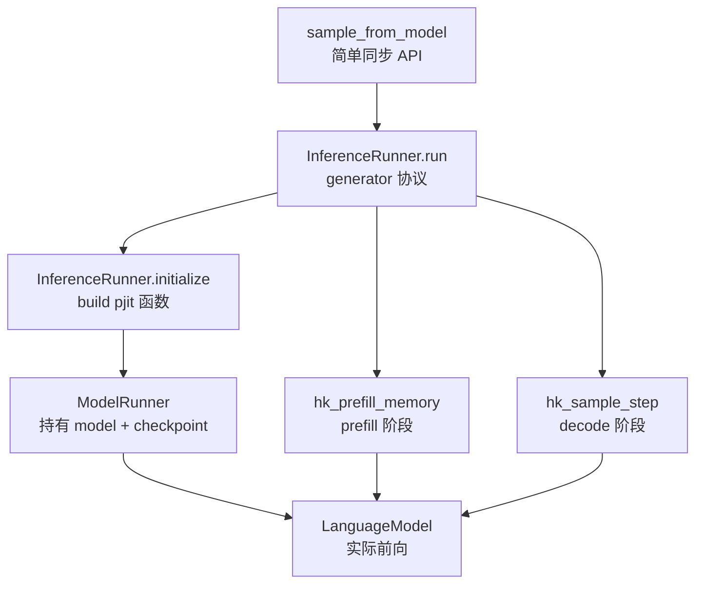
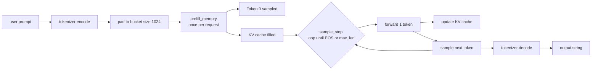

# 第 8 章 runners.py 推理引擎

`runners.py` 把 model 与 checkpoint 两部分缝合成一个可以对外提供服务的 inference server（推理服务器）。它的入口是一个 Python generator（生成器），通过 yield 与 send 这套协程协议接收外部 request，推理过程的两个核心阶段 prefill 与 decode 都在这一文件中完成实现。

在进入逐节阅读之前，先把这一章会反复出现的几个术语提前点清，避免后续行文反复打断。

!!! note "Inference server（推理服务器）"
    与训练过程不同，inference server 是把已经训好的模型权重加载到显存之后，**长期常驻、按请求逐次响应**的运行形态。一个典型的推理服务器需要做四件事：（1）维护好已加载的模型权重和分片信息；（2）接收用户的 prompt（提示词），把它转成 token id；（3）跑前向计算、采样出下一个 token；（4）把生成的 token 再解码回字符串返回。Grok-1 的 `runners.py` 给的是这套流程最最朴素的一份实现，它能力上还远远谈不上"产品级"，但麻雀虽小五脏俱全，是理解推理工程的好入口。

!!! note "Python generator（生成器）"
    Python 里带 `yield` 关键字的函数叫 generator function（生成器函数），调用它不会立即执行函数体，而是返回一个 generator object（生成器对象）。每次对这个对象调用 `next()` 或 `.send(value)`，函数体才会从上次 yield 的位置继续运行，到下一个 yield 处暂停并把值返回出来。这种"函数可以暂停、可以被外部喂值"的协程（coroutine）特性，恰好适合用来描述"等请求 - 算一段 - 出结果 - 再等下一个请求"这种循环结构。Grok-1 用 generator 实现 server 主要不是为了异步，而是为了把"长生命周期的服务循环"和"调用方按需取结果"这两件事用同一份代码自然表达出来。如果你来自 PyTorch 世界，更熟悉的可能是用一个 class 加一个 `def step(...)` 方法来包装；那种写法当然也行，但 generator 写法的好处是**所有局部变量（KV cache、free slots、settings）都活在函数闭包里**，不用挂到 self 上，写起来反而更紧凑。

## 8.1 三层抽象：sample_from_model / InferenceRunner / ModelRunner



这三层之间的关系可以更通俗地理解为：`ModelRunner` 拥有"权重和模型定义"（相当于把 model + checkpoint 包成可用对象），`InferenceRunner` 在它之上拼出"具体的推理流程"（prefill、decode、采样、tokenizer），`sample_from_model` 又在 InferenceRunner 之上提供"一行调用的同步 API"。设计上每一层都比下一层更靠近用户、更简化，但能力上也更受限。如果你以后想做扩展（比如 batch、流式输出、stop sequence、log probs 返回等），合理的扩展点几乎都在 `InferenceRunner.run` 里，而不在最外层的 `sample_from_model`。

### 8.1.1 `sample_from_model`：最薄的同步包装

`runners.py:596-605`：

```python
# runners.py:596-605
def sample_from_model(server, prompt, max_len, temperature):
    next(server)
    inp = Request(
        prompt=prompt,
        temperature=temperature,
        nucleus_p=1.0,
        rng_seed=42,
        max_len=max_len,
    )
    return server.send(inp)
```

这里的 `server` 是由 `InferenceRunner.run()` 返回的 generator 对象。

`next(server)` 将 generator 推进到它的第一个 `yield` 处，对应代码中"等待 request"的位置。`server.send(inp)` 把外部输入 inp 注入到 generator 内部，generator 继续执行直至下一个 `yield`（即产出结果的位置）并把结果返回给调用方。这是 Python 协程协议的标准用法。

值得稍微展开一下 `next` 与 `send` 的配合时序，因为这是后面理解 continuous batching（连续批处理）主循环的前提。一个 generator 在第一次被使用时，必须先有一次 `next` 把它"启动"到第一个 `yield`，之后才能开始 `send` 注入数据。后续的每次 `send(value)` 都对应一次"等到 yield、注入 value、继续运行到下一个 yield"的完整往返。如果调用方一次塞了多个 request 但 generator 还没消耗完上一个，`send` 不会被缓冲、不会排队，调用方必须自己控制节奏。`sample_from_model` 把这套时序压缩到三行：`next` 启动一次、`send` 注入 prompt、generator 在执行完整个生成循环后从 yield 返回字符串。

`run.py:67` 处调用形式为 `sample_from_model(gen, inp, max_len=100, temperature=0.01)`，其中 temperature 设为 0.01，已经非常接近贪心采样。

!!! note "Greedy / temperature / top-k / top-p（采样策略小词典）"
    从模型输出的 logits 到下一个 token，中间这一步称为 sampling（采样）。最直接的策略是 greedy（贪心）：直接取概率最大的那个 token。它的优点是确定、可复现，缺点是模型容易陷入循环（同一段话反复输出）。
    
    更普遍的策略是 sampling，在 softmax 之后按概率分布随机抽。为了控制随机性强度，常加一个 temperature（温度）系数 T：在 softmax 前先 `logits / T`。T 越大分布越平、越随机；T 越小分布越尖、越接近 greedy；T → 0 极限上等价于 greedy。
    
    sampling 本身没法防止模型"低概率长尾"里抽出 garbage token，于是有两种过滤策略：top-k 只在概率最大的 k 个 token 中抽（k 是固定数量）；top-p（也叫 nucleus，"核"采样）按概率从大到小累加，直到累计概率达到 p 为止的那一批 token 才参与抽样（k 是动态变化的数量）。两者经常组合使用，比如 GPT 默认的 `temperature=1.0, top_p=0.95`。
    
    Grok-1 在 `sample_from_model` 中把 `temperature=0.01`、`nucleus_p=1.0` 写死，意思是几乎走 greedy、不做任何 top-p 过滤。这是为了让示例输出**完全 deterministic（确定性的）**，方便用户验证模型加载是否正确。

### 8.1.2 `Request` 与 `Settings`

```python
# runners.py:252-258
@dataclass
class Request:
    prompt: str
    temperature: float
    nucleus_p: float
    rng_seed: int
    max_len: int
```

Request 是面向调用方的请求接口，生命周期较短，每次调用 sample_from_model 时都会创建一个新的实例。

```python
# runners.py:50-55
class SampleSettings(NamedTuple):
    temperature: ArrayLike
    nucleus_p: ArrayLike
    mask: ArrayLike
    # Whether a given batch element is actively used. [B]
    active: ArrayLike
```

SampleSettings 是位于 device 上的 batch 级张量结构，与 Request 在抽象层级上不同。其中 `active` 字段用于控制 batch 中哪些 slot 当前处于使用状态，是实现 continuous batching 的关键所在。

把 Request 与 SampleSettings 放在一起对比，可以看到一组很经典的"用户 API 与底层张量分离"的设计：用户层用 Python `@dataclass`、字段是 `str`/`float`/`int`，便于人类构造与调试；底层张量层用 `NamedTuple`、字段是 `ArrayLike`（具体是 `jnp.ndarray`，每个字段都有 shape `[B]` 或 `[B, vocab]` 这种 batch 维），便于直接送进 jit 编译过的函数。两者之间的转换发生在 `InferenceRunner.run` 的 prefill 入口处，每收到一个 Request 就把它对应的 settings 写到 SampleSettings 中编号为 `i` 的那一格里。这个"用户对象 vs device 张量"的划分在工业级推理框架里很常见，vLLM 的 `SamplingParams` vs `SamplingMetadata`、SGLang 的 `SamplingParams` vs `BatchedSamplingMetadata` 都是同一套思想。

## 8.2 推理两阶段：prefill 与 decode

!!! note "prefill / decode"
    自回归语言模型的推理过程天然分为两个阶段。第一阶段称为 prefill：用户输入的 prompt（例如 50 个 token）一次性进入 attention 模块，对每个位置都计算出对应的 K/V 并写入 KV cache，最后取最后一个位置的 logits 用于采样得到第一个输出 token。在这一阶段，每张 GPU 都满载执行 attention 与 FFN 计算，整个过程属于 compute-bound 的工作负载。

    第二阶段称为 decode：从生成第一个 token 之后开始，每一步只把 1 个新 token 输入模型，attention 中的 K/V 绝大部分直接从 cache 中读取，仅需要更新当前这个位置对应的一行。FFN 也只需要为 1 个 token 计算输出，因此单 step 的计算量极小，性能瓶颈转移到"为了计算这 1 个 token，需要把整张卡上约 86 GB 的激活参数从 HBM 全部读一遍"，属于 memory-bound 的工作负载。

    Grok-1 把这两条不同的执行路径分别编译为 `hk_prefill_memory` 与 `hk_sample_step` 两个函数，二者之间通过共享 KV cache 来传递状态：prefill 阶段负责写入 cache，decode 阶段在 cache 基础上做逐步增量更新。一次完整的生成等价于一次 prefill 加上 N 次 decode。

!!! note "KV cache（键值缓存）"
    标准 Transformer 的 self-attention 中，每个位置 $i$ 在算 attention 时都要用到所有 $j \le i$ 位置的 key（K）与 value（V）。如果朴素实现，每生成一个 token 都得把过去 $T$ 个位置的 K/V 重新算一遍，复杂度是 $O(T^2)$。
    
    KV cache 把这件事做了缓存：每个位置算完 K、V 之后把它们存下来，下一次 attention 直接读出已存的 K/V、只新算当前这个位置的一行。复杂度从 $O(T^2)$ 降为 $O(T)$，代价是要额外的显存来存这些张量。
    
    Grok-1 的 KV cache 每张卡上大约是 2 GB（详见 8.5 节），并且按 max_len 一次性预分配。这是"用空间换时间"的经典案例 - 没有 KV cache，decode 阶段单步延迟会乘以序列长度倍。
    
    PyTorch 实现里通常用 `past_key_values` 这个名字（HuggingFace transformers 的约定），形状是 `[num_layers, 2 (k/v), batch, num_heads, seq_len, head_dim]`。Grok-1 的 JAX 实现用 `KVMemory` 这个 NamedTuple，结构等价。



### 8.2.1 Prefill 阶段

`hk_prefill_memory`（`runners.py:333-393`）：

```python
# runners.py:333-393
def hk_prefill_memory(
    rngs, memory, settings, last_output, prompt,
    length, rng_seed, new_settings, i,
):
    rng = jax.random.PRNGKey(seed=rng_seed)
    rng, rng_ = jax.random.split(rng)

    # Allocate new memory for this sample.
    slice = hk_new_memory(1, prompt.shape[0])

    # Move settings into the joint settings tensor.
    settings = jax.tree_map(
        lambda o, v: jax.lax.dynamic_update_index_in_dim(o, v, i, axis=0),
        settings, new_settings,
    )
    settings_slice = jax.tree_map(lambda t: jnp.expand_dims(t[i], axis=0), settings)

    # Process the first n-1 tokens of the prompt.
    lm_outputs = hk_forward(
        jnp.expand_dims(prompt, 0),
        memory=slice,
        length=jnp.expand_dims(length, 0),
        active=settings_slice.active,
    )

    # The forward pass doesn't correctly set the `step` counter inside the memory.
    slice = lm_outputs.model_state
    slice = slice._replace(
        layers=[l._replace(step=jnp.array([length])) for l in slice.layers]
    )

    # Sample the actual output token.
    rng_ = jnp.expand_dims(rng_, 0)
    new_output = sample_token(rng_, lm_outputs, settings_slice)

    # Update the KV cache/memory.
    slice = jax.tree_map(pad_to_max_len, slice)
    memory = insert_slice(memory, slice, length, i)

    rng = jnp.expand_dims(rng, 0)
    rngs = jax.lax.dynamic_update_index_in_dim(rngs, rng, i, axis=0)

    last_output = jax.tree_util.tree_map(
        lambda last, new: jax.lax.dynamic_update_index_in_dim(last, new, i, axis=0),
        last_output, new_output,
    )
    return rngs, last_output, memory, settings
```

逐步说明：

1. **为新到达的 request 分配独立的临时 KV cache**（调用 `hk_new_memory(1, prompt.shape[0])`），其 shape 为 `[1, prompt_len, 8, 128]`，每层都有一份，共 64 层
2. **把当前 request 的采样 settings 写入 batch 中编号为 `i` 的 slot**
3. **执行 forward**：把 prompt 一次性输入模型完成 forward，同时将 K/V 写入临时 cache
4. **手动修正 step 计数器**：forward 计算出的 cache 中 step 值可能不准确，源码注释中明确指出"forward pass doesn't correctly set the step counter"。这是一个略显奇怪的实现细节，可能是因为多次 reshape 与 sharding 操作让 step 信息在传递过程中丢失
5. **采样得到第一个输出 token**，使用的是 prompt 最后一个位置对应的 logits
6. **将临时 cache pad 到 max_len（8192）长度**，然后写入全局 memory 中对应 slot `i` 的位置
7. **更新 rng、上一次输出 token、settings 这几项状态**

第 5 步的"用 prompt 最后一个位置的 logits 采样"是一个 prefill 阶段容易被忽略的细节。Transformer 的 forward 会对 prompt 中每个位置都算 logits，但 prefill 阶段只关心最后一个位置 - 因为前面 N - 1 个位置的"目标 token"早就是 prompt 的下一个 token、不需要重新采样。只有最后一个位置代表"现在该输出什么了"，所以只取它的 logits 作为第一个生成 token 的概率分布。从这个角度看，prefill 的本质就是"用 N 个 token 喂模型 + 取最后一个位置的输出"，前 N - 1 个位置的 logits 在采样意义上是浪费的，但它们的 K/V 必须算出来留在 cache 里供后续 decode 用。

注意 `pad_to_max_len` 函数（定义在 `runners.py:297-302`）的作用是把临时 cache 的 shape 从 `[1, prompt_len, ...]` pad 到 `[1, max_len, ...]`，原因是全局 memory 在初始化时就按 max_len 完整预分配好了。

这里有个细节值得多说一句：prefill 用的临时 cache 形状是 `[1, prompt_len, ...]`，而全局 memory 是 `[B, max_len, ...]`。两者 shape 不一样、不能直接拼接，所以才需要先 `pad_to_max_len` 把临时 cache 的 seq 维补齐到 max_len（用 0 填充），然后再用 `insert_slice` 把这段补齐后的 cache 写到 batch 维的 slot `i`。这样的"先 pad 再 insert"路径之所以必要，本质是因为 JAX 在 jit 之后**张量形状必须静态可知**，不能让全局 memory 的 seq 长度随着实际请求而动态变化。

之所以要把 prefill 写成一个独立的函数而不是和 decode 共用一份 forward，原因正是上文提到的"prefill 一次输入 N 个 token，decode 每步只输入 1 个 token"。这两条路径输入的张量形状不同，jit 编译后的 SPMD 程序就是两份。如果硬要用同一份代码、靠 padding 让两者都看起来像 N 个 token，prefill 阶段不会出问题但 decode 每一步都会在那 N - 1 个无效位置上空算一遍，单 step 时延会涨数十倍。所以分两份函数是必要的工程取舍，不是冗余。

### 8.2.2 `pad_sizes` bucket

`runners.py:269` 的 `pad_sizes: tuple[int] = (1024,)`。run.py 实参也是 `(1024,)`。

`get_pad_bucket`（`runners.py:271-273`）：

```python
def get_pad_bucket(self, size):
    i = bisect.bisect_left(self.pad_sizes, size)
    return self.pad_sizes[min(i, len(self.pad_sizes) - 1)]
```

把任意长度的 prompt pad 到固定 bucket 大小的目的，是**让 prefill 阶段的 JIT 编译产物可以被复用**。否则每出现一个不同长度的 prompt 都需要重新触发一轮 JIT 编译，单次编译耗时可能在几分钟到几十分钟。

!!! note "JIT 编译与张量形状"
    JAX 的 `jit` 编译机制是按"输入张量形状的元组"做缓存键的：同一个 Python 函数，输入 shape `(1, 1024)` 编译一次、shape `(1, 2048)` 又编译一次。这意味着如果 prompt 长度任意变化，每个新长度都会触发一次几分钟到几十分钟的 XLA 编译。把所有 prompt 都 pad 到固定 bucket 之后，编译产物只需要做一次、所有后续请求复用。
    
    PyTorch 的 `torch.compile` 也有类似行为，但 PyTorch 提供 `dynamic=True` 让形状变成动态维度，JAX 默认不开。Grok-1 这里走的是"静态形状 + 显式 bucket"路线。

实际服务场景中 prompt 的长度差异很大，使用单一的 1024 bucket 并不足够：如果实际 prompt 只有 50 个 token 也被 pad 到 1024，将浪费约 95% 的计算量。产品级别的推理服务通常会配置多个 bucket（例如 [256, 512, 1024, 2048, 4096, 8192]）。Grok-1 的示例代码只配置了 1 个 1024 大小的 bucket，属于研究目的下最简化的实现。

### 8.2.2.1 prefill 与 decode 的本质区别

很多人会把 prefill 与 decode 这两个阶段混为一谈。下面做一个简要的对比总结：

| 项 | prefill | decode |
| --- | --- | --- |
| 输入 token 数 | 1 ~ prompt_len（一般 100-2000） | 1 |
| 计算瓶颈 | compute-bound（FLOPs 大） | memory-bound（参数读取慢） |
| KV cache | 从空到满 | 一直读，每步增 1 |
| 时延 | 较长（与 prompt 长度成正比） | 较短（每 step 几十 ms） |
| GPU 利用率 | 高（80-90%） | 低（10-30%） |
| 优化方向 | FlashAttention、chunked prefill | KV cache 优化、speculative decoding |

把"为什么 prefill 是 compute-bound 而 decode 是 memory-bound"的算术展开一下。

prefill 阶段假设 prompt_len = 1024，每一层 FFN 的计算量大约是 `2 × 1024 × 86B (激活参) / 64 (层数) ≈ 2.75 TFLOPs`，整模型 64 层加起来约 176 TFLOPs。H100 在 bf16 下峰值算力约 989 TFLOPs，所以这一步耗时约 178 ms - 真正在算。带宽方面，参数读 86 GB / 卡（每张卡持有 1/8 的激活参 ≈ 10.7 GB），H100 HBM 带宽 3.35 TB/s，理论上读完只需要 3.2 ms。**计算时间远大于带宽时间，所以是 compute-bound**。

decode 阶段输入只有 1 个 token，每一层 FFN 计算量缩到 `2 × 1 × 86B / 64 ≈ 2.7 GFLOPs`，整模型约 0.17 TFLOPs，理论 0.17 ms 就能算完。但参数还是要把 10.7 GB 全部读一遍（HBM 不缓存权重，每个 step 都重读），3.2 ms。**带宽时间远大于计算时间，所以是 memory-bound**。

这个 0.17 ms vs 3.2 ms 的比例就是为什么 decode 阶段 GPU 计算单元的利用率只有 10-30% - 大部分时间在等数据从 HBM 搬到 SM 寄存器。LLM 推理优化的核心战场基本都在这里：FlashAttention 减少 attention 期间的 HBM 访问、speculative decoding 让一次 forward 验证多个候选 token、KV cache 量化把 cache 数据搬运量减半。这些手段共同的指向都是"提高每次 HBM 读取带回来的有效计算量"。

Grok-1 中 prefill 阶段通过 `hk_prefill_memory` 完成，decode 阶段通过 `hk_sample_step` 完成，两个函数分别被 `pjit` 编译成两个独立的 SPMD 程序。

### 8.2.3 Decode 阶段

`hk_sample_step`（`runners.py:324-328`）：

```python
def hk_sample_step(rngs, last_output: SampleOutput, memory, settings):
    rngs, rngs_ = jax.vmap(jax.random.split, out_axes=1)(rngs)
    lm_outputs = hk_forward(last_output.token_id, memory=memory, active=settings.active)
    sample_result = sample_token(rngs_, lm_outputs, settings)
    return rngs, sample_result, lm_outputs.model_state
```

每一次调用只处理 1 个 token：

1. 对随机数生成器 rng 进行 split，为 batch 中每个元素生成一份独立的 rng
2. 对当前的 1 个 token 执行 forward 计算，过程中复用 memory 中已有的 KV cache
3. 基于 forward 得到的 logits 采样出下一个 token

这就是标准的 autoregressive decode（自回归解码）流程。所谓"自回归"是说**生成第 $t$ 个 token 时把前 $t-1$ 个 token（包括上一步刚生成的那个）都当作输入**。在带 KV cache 的实现里，前 $t-1$ 个 token 的 K/V 已经在 cache 里，所以模型每步只需要看 1 个新 token，但 attention 阶段会去读 cache 里所有 $t-1$ 个历史位置的 K/V。

把它和 PyTorch 的 `generate()` 函数做一下对照可能更直观。HuggingFace transformers 里 `model.generate(input_ids, max_new_tokens=N)` 内部就是这个 prefill + decode 循环：第一次 forward 把全部 input_ids 喂进去并存下 `past_key_values`，之后每步只把最新的 1 个 token + `past_key_values` 喂进去拿下一个 token。Grok-1 的 `hk_sample_step` 等价于 HF 那一层"每步只 forward 1 个 token"的循环体；区别只在于 Grok-1 这一份是 JAX/Haiku 写的、并且显式经过了 pjit 编译。

`hk_forward`（`runners.py:308-322`）有个小处理：

```python
def hk_forward(tokens, memory=None, length=None, active=None):
    if memory is not None:
        assert active is not None
        layers = []
        for l in memory.layers:
            # Reset steps to 0 for inactive requests to avoid unnecessary computations.
            step = jnp.where(active, l.step, jnp.zeros_like(l.step))
            layers.append(l._replace(step=step))
        memory = memory._replace(layers=layers)
    return lm()(tokens, memory, length=length)
```

对于状态为 inactive 的 batch slot，把它们对应的 step 重置为 0。因为 step 直接决定 memory_mask 的有效范围，inactive 的 slot 仍然要参与计算图的执行，将 step 设为 0 会让它们在 attention 中不 attend 任何 K/V，结果不会被使用。源码注释中写的 "avoid unnecessary computations" 略有误导性，实际上计算并没有真正被避免，只是结果没有意义。

更准确地说，inactive slot 节省的是"对历史 K/V 做完整 attention 的算力" - 当 step = 0 时 attention 的 softmax 范围是空集，attention output 直接是零向量，省下若干 FLOPs。但其他部分（projection、FFN、router）该算的还是要算。这是 SPMD（Single Program Multiple Data）模型的固有约束 - batch 内所有 slot 必须走同一条代码路径，节省只能体现在"局部短路"上，不能动态跳过整个 slot。

## 8.3 采样实现

!!! note "Sampler（采样器）：greedy / temperature / top-k / top-p（nucleus）"
    模型 forward 完成后，对每个位置都会输出一组长度等于词表大小的 logits（Grok-1 的词表大小为 131072）。所谓"采样器"，就是把这组 logits 转换成一个具体 token id 的那一段逻辑。
    
    要从中选出下一个 token，最朴素的做法是直接取 argmax，这种方式称为 greedy（贪心）采样：输出确定且可复现，但容易陷入循环式的复读，例如反复输出 "the the the" 或 "好的好的好的"。出现这种情况的根本原因是 greedy 是局部最优而非全局最优 - 每一步都贪心选最大概率，长程上可能掉进低 entropy 的吸引子。
    
    temperature 采样的做法是在 softmax 之前先把 logits 除以一个温度系数 T。T < 1 会让概率分布变得更尖、更接近 greedy；T > 1 会让分布变得更平、随机性增加；T → 0 在极限上等价于 greedy；T → ∞ 在极限上等价于完全均匀采样。Grok-1 在示例中默认 T = 0.01，几乎已经等同于 greedy，是为了示例的可复现性。
    
    top-k 采样的做法是在采样前只保留 logits 数值最大的 k 个 token，其余 token 的 logits 被设为 -inf（softmax 后概率为 0）。这能截掉长尾里那些低概率的"奇怪" token。例如 k = 50 表示每步只在前 50 个候选里挑。问题是 k 固定不变，但分布有时很尖（top 1 概率就 0.95，k = 50 反而引入噪声）、有时很平（top 50 加起来才到 0.4，k = 50 切得太狠）。
    
    top-p（也称为 nucleus，"核"采样）改为"按概率从大到小累加，累计到 p 为止的那一批 token 保留，其余 token 全部丢弃"。例如 p = 0.9 表示只在"累计概率质量前 90%"的 token 集合中进行随机选择。当分布尖时 nucleus 集合可能只有 1-2 个 token；当分布平时 nucleus 集合可能有几百个。它是 top-k 的"自适应版本"，在大模型时代基本取代了固定 k。Grok-1 中的 `top_p_filter` 实现的正是这种逻辑，默认 `nucleus_p = 1.0` 表示完全不做过滤。
    
    Grok-1 用同一个 `sample_token` 函数把上述几步串联起来：先执行 `logits / T`，再做 top-p 过滤，最后调用 `jax.random.categorical` 按概率分布采样。`categorical` 接受一组 logits（不需要先 softmax，函数内部自己做），按概率分布抽出一个 id。另外该函数在每一步还会顺带返回 top-8 候选 token 用于 debug，需要注意的是这里的 `TOP_K = 8` 与 MoE 路由中的 top-k 并不是同一个 k，两者不要混淆。

这里再补充一点关于 sampler 实现位置的工程取舍。Grok-1 把 sampler 放在 `sample_token` 函数里、和 forward 一起在 device 上跑（被 pjit 编译），意味着 logits 不会被搬回 host、只把最终的 token id 搬回来。这避免了一次 `[B, vocab]` 张量（131072 × 4 bytes = 512 KB / token）的 device-host 拷贝。如果 sampler 放在 host 端（Python 里手写 argmax），每步 decode 都要做这次拷贝，PCIe 走个 100 微秒级，对吞吐影响明显。

`sample_token`（`runners.py:100-133`）：

```python
def sample_token(rngs, lm_outputs, settings) -> SampleOutput:
    settings = SampleSettings(
        temperature=jnp.expand_dims(settings.temperature, (1, 2)),
        nucleus_p=jnp.expand_dims(settings.nucleus_p, (1, 2)),
        mask=jnp.expand_dims(settings.mask, 1),
        active=settings.active,
    )
    logits = lm_outputs.logits / settings.temperature.astype(lm_outputs.logits.dtype)
    logits = jnp.where(settings.mask, logits, -1e10)
    logits = top_p_filter(logits, settings.nucleus_p.astype(logits.dtype))

    new_token = jax.vmap(jax.random.categorical)(rngs, logits)

    probabilities = jax.nn.softmax(logits)
    token_prob = jnp.take_along_axis(probabilities, jnp.expand_dims(new_token, 1), axis=2)
    token_prob = jnp.squeeze(token_prob, 1)

    top_k_probs, top_k_token_ids = jax.lax.top_k(probabilities, TOP_K)
    ...
```

具体步骤：

1. **temperature scaling**：执行 `logits / T`，对 logits 做温度缩放
2. **mask 屏蔽**：将被禁止采样的 token 对应的 logits 设为 -1e10
3. **top_p filter**：执行 nucleus sampling 的过滤逻辑
4. **categorical sampling**：基于 rng 按概率采样得到下一个 token

`TOP_K = 8`（位于 `runners.py:47`）指的是输出阶段的 top-k 信息，与 MoE 路由阶段的 top-k 完全无关。每次采样会额外返回 top 8 个候选 token 的概率和 id，提供给上层做 debug 使用。

### 8.3.1 `top_p_filter`：nucleus 实现

`runners.py:84-97`：

```python
def top_p_filter(logits, top_p):
    sorted_logits = jax.lax.sort(logits, is_stable=False)
    sorted_probs = jax.nn.softmax(sorted_logits)
    threshold_idx = jnp.argmax(jnp.cumsum(sorted_probs, -1) >= 1 - top_p, axis=-1)
    threshold_largest_logits = jnp.take_along_axis(
        sorted_logits, threshold_idx[..., jnp.newaxis], axis=-1
    )
    mask = logits >= threshold_largest_logits
    logits = jnp.where(mask, logits, -1e10)
    return logits
```

实现上的几个关键细节：

- `jax.lax.sort` 默认按升序排序，因此 `sorted_logits` 是从小到大排列的
- `cumsum(sorted_probs) >= 1 - top_p` 找出累积概率第一次达到 `1 - top_p` 的位置，由于是升序排列，对应"分布尾部"
- 把这个位置上的 logit 取作阈值，所有 ≥ 该阈值的 logit 都保留下来

注意这里的判断条件是 `>= 1 - top_p`，而不是 `>= top_p`。由于排序方向是升序，累加是从最小概率开始往上累，等价于"按降序排列后取累积概率前 top_p 的那批 token"，但实现上省去了一次 reverse 操作。

这种"省一次 reverse"的写法在 jit 编译过的代码里值不少：reverse 本身是个 memory-bound 操作，词表大小 131072 时对一个 `[B, V]` 张量做 reverse 会带来可观的带宽消耗。XLA 编译器通常不会自动把这种数据相关的 reordering 消掉，所以宁可写法上稍微绕一点也要规避。这也是 Grok-1 代码风格的一个共性 - 大量 helper 函数都按"对 jit/XLA 友好"的方式来写，可读性会稍微让位于编译效率。

### 8.3.1.1 Temperature 与 top-p 的组合策略

Grok-1 的采样实现支持 temperature scaling 与 nucleus（top-p）filtering 同时启用。两者的作用分别是：

- **temperature**：让概率分布"软化"或"硬化"。T < 1 会让高概率 token 变得更高，整个分布更尖；T > 1 则让分布更平
- **nucleus**：把累积概率排在前 p% 之外的所有 token 概率直接设为 0

注意两者的应用次序很关键。`sample_token` 函数里是**先除 temperature 再做 top-p**：

```python
logits = lm_outputs.logits / settings.temperature
logits = top_p_filter(logits, settings.nucleus_p)
```

这种顺序意味着 nucleus 是基于"温度缩放后的分布"挑选 token。等价的另一种顺序是先 top-p 再 temperature，行为会略有差别但通常影响不大。HuggingFace transformers 默认也是这个顺序，是事实标准。

实际默认调用（`run.py:67`）：

```python
sample_from_model(gen, inp, max_len=100, temperature=0.01)
```

T = 0.01 已经几乎等同于贪心采样（argmax），目的是让输出保持 deterministic。`sample_from_model` 中将 `nucleus_p=1.0` 硬编码，表示不对任何 token 做过滤。

如果希望进行更具创意性的文本生成，常见做法是采用 T=0.7-1.0、top_p=0.9-0.95 的组合。再高一些的温度（T=1.5+）会让模型开始输出"创造性但偶尔语法错乱"的文本，适合诗歌、创意写作场景。temperature=0.3-0.5 适合需要稍微多样化但仍然偏严谨的应用，比如代码补全。这些数字都是社区在多个模型上反复试出来的"经验区间"，没有理论上的最优解。

### 8.3.2 Top-K（runners.py 中的 `TOP_K` 与 `tokens` top）

这里需要避免混淆两个同名但语义不同的 top-k：

- `TOP_K = 8`（位于 `runners.py:47`）：采样阶段每步返回 top 8 个候选 token，仅用于 debug 信息输出
- `num_selected_experts = 2`（位于 model 配置中）：MoE 路由阶段每个 token 选择的专家数量

两者完全无关。前者发生在最后一层 hidden -> vocab 投影之后，是对**整个词表**做 top-8；后者发生在每一层 FFN 之前，是 router 在 **8 个专家**里挑 2 个。词表的 top-k 在主流 LLM 框架里都默认作为 debug 信息一并输出，方便人观察"模型当时除了真正选中的 token，第二、第三高概率分别是什么、概率多少"。这对调试 hallucination（幻觉）或者评估模型不确定性都很有用。

## 8.4 mesh、pjit 与 sharding：怎么把 314B 切到 8 卡

在进入 mesh 与 pjit 的代码细节之前，先把"为什么 314 B 模型必须切到多卡"这件事补一下账。

Grok-1 的 ckpt 是 int8 量化的，权重总共大约 314 GB。单张 H100 80 GB 装不下，所以必然要把权重切到多张卡上协同运行。常见的张量切分有两条主轴：**data parallel**（按 batch 维切，每张卡持有完整模型权重，处理 batch 的一部分），以及 **model parallel**（按权重的某一维切，每张卡只持有部分权重）。

Grok-1 只能走 model parallel 路线 - data parallel 要求每张卡都装得下整份权重，单卡 80 GB 装不下 314 GB。具体来说 Grok-1 用的是 model parallel 里的一种子模式叫 **tensor parallel**（张量并行）：把每个权重矩阵按某一维（行或列）切成 N 份，分散到 N 张卡，每次 forward 时用 all-gather / reduce-scatter 这类集合通信操作把结果拼回来。这正是 8 卡 H100 上 mesh shape 是 `(1, 8)` 的来源 - 1 个 data shard、8 个 model shard。

如果未来要把 Grok-1 部署到 16 卡甚至 32 卡集群，常见做法是再叠加 **pipeline parallel**（流水线并行，把 64 层分成多组、每组放在不同的 device group 上、按层维度串起来）。Grok-1 默认配置里没启用 pipeline parallel，对一台 8 卡服务器是合理的。

!!! note "Mesh、pjit、shard_map（这三个 JAX 并行原语的分工）"
    Mesh 是把物理 device（比如 8 张 GPU）组织成一个 N 维网格的抽象，Grok-1 用 `(data=1, model=8)` 二维网格。
    
    pjit 是"声明式"的并行：你告诉编译器每个张量怎么沿 mesh 的哪个轴切（用 PartitionSpec 描述），编译器自动生成必要的集合通信（all-gather、reduce-scatter、all-reduce 等）。
    
    shard_map 是"命令式"的并行：你直接写"每个 shard 看到的局部张量"的代码，自己控制何时做通信、做什么通信。比 pjit 更底层但更灵活。
    
    Grok-1 的 attention 和 FFN 主要用 pjit（声明式更简洁），MoE 的 expert 分发用 shard_map（因为 expert 路由是数据相关的、pjit 的静态分析处理不好这种动态稀疏模式）。这种"主路径声明式 + 特殊路径命令式"的混搭是大模型 JAX 代码的常见结构。

`make_mesh`（`runners.py:580-593`）：

```python
def make_mesh(local_mesh_config, between_hosts_config) -> jax.sharding.Mesh:
    device_mesh = mesh_utils.create_hybrid_device_mesh(
        local_mesh_config,
        between_hosts_config,
        devices=jax.devices(),
        process_is_granule=True,
    )
    return jax.sharding.Mesh(device_mesh, ("data", "model"))
```

`create_hybrid_device_mesh` 接收两个不同层级的 shape：

- `local_mesh_config`：表示单 host 内部的 mesh 形状，例如 (1, 8)
- `between_hosts_config`：表示跨 host 的 mesh 形状，例如 (1, 1) 或 (1, 2)

最终的 mesh 形状是这两者的乘积 `local × between_hosts`。run.py 默认采用 `(1, 8) × (1, 1) = (1, 8)`，把 8 张 device 全部分配给 model 轴。

参数 `process_is_granule=True` 表示同一个 host 上的多张 device 在 mesh 中保持相邻，这一点会影响实际的通信拓扑：相邻位置的 device 之间走 NVLink，跨 host 的位置则走 PCIe 或其他网络通信。

### 8.4.1 `pjit` 的核心调用

`initialize` 末尾（`runners.py:411-435`）：

```python
ds = P("data")
ms = runner.model.model.get_memory_sharding()
self.sample_step = pjit.pjit(
    sample_step_.apply,
    in_shardings=(self.params_sharding, None, ds, ms, None),
    out_shardings=(None, ds, ms),
    donate_argnums=3,
)
self.prefill_memory = pjit.pjit(
    functools.partial(prefill_memory_.apply),
    in_shardings=(
        self.params_sharding, None, ms, None, ds, None, None, None, None, None,
    ),
    out_shardings=(None, ds, ms, None),
    donate_argnums=(2,),
)
self.new_memory = pjit.pjit(
    new_memory_.apply,
    static_argnums=(1, 2),
    out_shardings=ms,
)
```

`pjit` 的作用是把 Haiku 的 apply 函数包装成一个"分布式 jit"程序。其中 in_shardings 与 out_shardings 用于指定每个输入参数和输出结果的 PartitionSpec。

`donate_argnums=3`（或 `=(2,)`）的语义是：将第 3 个（或第 2 个）参数标记为可 donate，意味着 XLA 编译器可以复用该参数所占用的 buffer，从而降低显存使用的峰值。这种标记通常用于 KV cache：旧的 cache 已经不再被需要，新的 cache 可以直接写入同一块显存区域。

JAX 的"函数式不可变"语义在这里其实是一个微妙的取舍。理论上每次 sample_step 都"返回一个新 memory"，意味着旧 memory 仍然占着 2 GB 显存、新 memory 又申请 2 GB 显存，瞬间峰值翻倍。`donate_argnums` 是 JAX 提供的"破例口"：明确告诉编译器"我接下来不会再用这个参数了，你可以把它的显存当作输出 buffer 复用"。在 KV cache 这种"每步只增量更新一行"的场景下，donate 后实际行为等价于 PyTorch 的 in-place 写入。

### 8.4.2 `params_sharding`：770 个 partition spec

`runners.py:406-409`：

```python
self.params_sharding = jax.tree_util.tree_map_with_path(
    apply_rules(runner.model.partition_rules()),
    shapes,
)
```

`apply_rules` 会将 `TRANSFORMER_PARTITION_RULES` 加上 `LM_PARTITION_RULES`（参见 `model.py:112-174`）应用到每一个参数路径上，从中得到对应的 PartitionSpec。

最终得到的 `params_sharding` 是一棵与 params 结构完全一致的 pytree，唯一的区别是叶子节点存放的不是 tensor，而是 PartitionSpec。`pjit` 借助这棵 pytree 告知 XLA 编译器具体应当如何把参数布置到各个 device 上。

!!! note "Pytree"
    JAX 里的 pytree 是"嵌套容器结构"的统一抽象：dict、list、tuple、NamedTuple、@dataclass 都算 pytree 容器，**叶子节点**通常是张量。`jax.tree_util.tree_map(fn, pytree)` 会对每个叶子调用 `fn`、保持结构不变。
    
    Grok-1 的模型参数大致结构是 `{"transformer/layer_0": {"attn/q_proj": tensor, "attn/k_proj": tensor, ...}, "transformer/layer_1": {...}, ...}` 这种嵌套 dict，pytree 让"对所有叶子做同样操作"这件事可以一行写完，不用手写嵌套 for。
    
    Grok-1 里大量出现的 `jax.tree_map(lambda t: ..., obj)` 用法都是在用 pytree 做"批量结构化变换"，例如把所有参数按规则做 sharding、把所有 KV cache 按 batch 维 update、把所有 settings 按 slot 维 expand 等。

770 这个数字怎么来的？Grok-1 总共 64 层 Transformer，每层大约 12 个独立张量（Q/K/V/O 投影 4 个 + 8 个专家 × 3 个矩阵 + RMSNorm 2 个，量级估算），加上 embedding、最后的 norm 与 lm head，总数大致落在 770 左右。每一个张量都需要一个 PartitionSpec 告诉 XLA 编译器怎么切。这棵 770 节点的 pytree 在 `initialize` 阶段构造一次，之后被 pjit 编译时反复查阅。

## 8.5 KV cache 形状与更新

回顾第 6 章：

- 每层 KVMemory: `k = [B, T=8192, num_kv_heads=8, key_size=128]`, `v` 同
- 64 层 × 2 (k+v) × 8192 × 8 × 128 × 2 bytes/elem = **2.05 GB / batch**

`run.py` 默认 `bs_per_device=0.125`（`run.py:54`），8 卡 × 0.125 = 1 batch 总大小。即 batch_size = 1。

KV cache 总大小：2 GB。

把数字按 GQA（Grouped Query Attention）的影响拆开看会更清楚。Grok-1 的 Q 头有 48 个、KV 头只有 8 个（GQA 比 6:1）。如果不用 GQA 而是传统 MHA（Multi-Head Attention），KV cache 中 `num_kv_heads` 会从 8 变成 48，整体 cache 大小直接乘 6 倍，单卡 2 GB 会变成 12 GB - 这个数量级下推理体验会显著恶化（更多 HBM 占用、更多带宽消耗、留给 batch 的余量更小）。所以 GQA 不仅是训练时减少 KV 头来省参数，到了推理阶段它对 KV cache 大小的影响才是最实际的。Grok-1 在 8 卡 H100 上勉强能跑，很大程度上要感谢 GQA 把 KV cache 从 12 GB 压到了 2 GB。

KV cache 的管理由 `new_memory`、`insert_slice`、`update_into_shmap` 三个操作协作完成：

1. `new_memory(batch_size, max_len)`：在 mesh 上为 KV cache 分配显存
2. `prefill_memory` 阶段：单独分配 `slice = new_memory(1, prompt_len)`，运行 forward 把 cache 填充满，再通过 `pad_to_max_len` 扩展到 max_len 长度，最后用 `insert_slice` 将该 slice 写入全局 memory 中对应 slot `i` 的位置
3. decode 阶段：通过 `update_into_shmap` 在 attention 模块内部以增量方式更新 KV cache（具体细节参见第 4 章 4.4 节）

### 8.5.1 KV cache 的"max_len 预分配"代价

Grok-1 的 KV cache 在初始化时就 allocate 满 max_len = 8192：

```python
k=jnp.zeros((batch_size, sequence_len, num_kv_heads, key_size), dtype=dtype)
```

如果实际请求中 prompt 只有 50 个 token、output 长度也仅为 100 个 token，那么实际使用的 cache 空间仅为 150 个 token 位置，剩余的 8042 个位置都保留着无用的零值。

**浪费的 cache 显存：**

$$
S_{\text{waste}} = \frac{8192 - 150}{8192} \approx 98\%
$$

对单个 batch 而言，浪费的显存大约是 2 GB × 98% ≈ 2 GB。

**Paged attention** 是 vLLM 提出的解决方案：将 KV cache 按"页"（block，通常是 16 个 token 为一页）的粒度进行分配，只有在实际需要时才分配新页。Grok-1 没有采用 paged attention，因此 KV cache 的显存利用率较低。

如果在 8 卡上部署 Grok-1 进行 serving，每张卡 80 GB 显存中扣除 78 GB 参数和 2 GB KV cache 之后，留给激活值的空间几乎为 0 GB，处于极限边缘。也正因为如此，**Grok-1 默认的 serving 实现几乎不能进一步加大 batch**，这是其推理吞吐天花板的根本原因。

### 8.5.2 为什么不在 prefill 期间就只分配 prompt_len 长度的 cache

读到这里可能会有一个直觉性的反问：既然 prefill 阶段先分配了 `[1, prompt_len, ...]` 的临时 cache、再 pad 到 max_len，那为什么不干脆从头到尾只用 prompt_len 长度的 cache、随着 decode 一边走一边追加？

答案还是 JAX 的"静态形状"约束。decode 阶段的 `hk_sample_step` 是被 pjit 编译过的，编译时 KV cache 的 shape 必须是固定的常量。如果让 cache 长度随着 decode step 增长（比如第 1 步 prompt_len + 1、第 2 步 prompt_len + 2 ...），每一步都会触发一次 JIT 重新编译，单步几分钟编译时间，根本不能用。

PyTorch 2.0 之前用 eager mode 时是没有这个问题的 - 张量形状可以随便变，每步都重新算 K/V 然后 `torch.cat` 到 cache 末尾。但代价是 cat 操作本身需要重新分配显存并拷贝数据，对大 cache 也是很可观的开销。vLLM 提出的 paged attention 是更精巧的解决方案：用页表把"逻辑上连续的 cache"映射到"物理上分散的 page block"，shape 上看 cache 总是固定大小、底层 block 按需分配。

Grok-1 既不走"动态 reshape"也不走"paged attention"，直接选最朴素的 max_len 预分配，工程上最简、显存利用率最差。

## 8.6 Continuous batching 雏形

`InferenceRunner.run` 主循环（`runners.py:500-577`）：

```python
all_tokens = []
free_slots = list(range(batch_size))
requests = [None] * batch_size
...
while True:
    while free_slots:
        request: Optional[Request] = yield
        ...
        i = free_slots.pop()
        ...
        # do prefill, write to slot i
        ...

    rngs, last_output, memory = self.sample_step(...)
    ...
    for i in range(batch_size):
        if requests[i] is not None:
            ...
            all_tokens.append(int(prev_token.token_id[i][0]))
            cont = len(all_tokens) < requests[i].max_len

            if not cont:
                output_str = self.tokenizer.decode(all_tokens)
                requests[i] = None
                free_slots.append(i)
                all_tokens = []
                settings = settings._replace(active=settings.active.at[i].set(0))
                yield output_str
```

主循环的逻辑：

- 维护一个 `free_slots` 列表，初始时包含所有 batch index
- 外层循环通过 yield 接收新的 request，从 `free_slots` 中分配一个 slot i 给它，并完成 prefill
- 内层循环每次 sample_step 执行一步 decode，所有 active slot 共享这一次 forward 计算
- 当某个 slot 完成生成（满足 `len(tokens) >= max_len` 条件）时，释放该 slot 并通过 yield 返回最终生成结果

这是 **continuous batching** 的雏形实现：不同 request 可以同时处于不同阶段（例如一个刚完成 prefill，另一个已 decode 到第 50 步）。但由于 `run.py` 默认配置 batch_size=1，这种多请求并发的能力在示例运行中无法被直接观察到。

!!! note "Continuous batching（连续批处理）"
    传统的 batch 推理是"静态 batching"：把 N 个请求凑齐成一个 batch，一起 prefill、一起 decode、所有请求都生成完才返回。问题是不同请求的输出长度差异很大（有的输出 10 token、有的输出 500 token），整个 batch 必须等最长的那个结束才能交付，期间短请求生成的 GPU 时间都被浪费在等。
    
    Continuous batching 把"batch 内必须步调一致"这个约束去掉：一旦某个请求生成完，立刻把它的 slot 腾出来给一个新请求做 prefill，下一步 decode 时这个新请求已经加入 batch 一起 forward。这样 GPU 永远在满载、短请求不被长请求拖累，吞吐通常能比静态 batching 高 3-10 倍。
    
    Grok-1 的 `free_slots` 调度结构是 continuous batching 的最小实现：维护一个 slot 空闲表、prefill 时占用、生成完毕时释放。Orca、vLLM、SGLang 都是在这个思路上扩展出来的。

工业级生产环境下的 batching 实现（例如 vLLM、SGLang）通常还需要处理更多机制：

- 不同 prompt 长度的 prefill 之间的共享与复用
- prefill 与 decode 在同一个 batch 中的混合调度
- 使用 Paged attention 来降低 KV cache 的显存占用
- Chunked prefill：将超长 prompt 切成多块分批处理

Grok-1 的实现没有包含上述任何一项功能，仅为研究目的的示例代码。

## 8.7 性能：tokens/sec 的瓶颈

根据社区的实测报告，Grok-1 在 8 × H100 80GB 配置下的推理吞吐大约为：

- **prefill**：约 50-100 tokens/sec/batch（受 compute-bound 限制）
- **decode**：约 5-10 tokens/sec/batch（受 memory-bound 限制）

decode 阶段如此缓慢，主要源于以下几个因素：

1. **MoE 计算上有 4 倍浪费**：参见第 5 章的分析，每个 token 实际经过所有 8 个 expert 的完整计算，但只采纳 2 个 expert 的结果
2. **没有 kernel fusion 优化**：每个算子都单独 launch，调度开销大
3. **没有 paged attention**：KV cache 必须连续存储，限制了显存利用率
4. **8 张卡承载 314B 模型时受 HBM 带宽严重限速**：每个 decode step 都需要从 HBM 中读取约 86 GB 的激活参数，H100 单卡 HBM 带宽是 3.35 TB/s，理论吞吐上限约 39 step/s（也即 39 token/s）。实测吞吐远低于这个理论值，原因还包括跨卡通信开销与算子 launch 开销

作为对比，使用 vLLM 在同样的 8 × H100 上推理 Mixtral 8x7B，可以达到约 50-100 token/sec 的 decode 吞吐。

不过对比时要注意 Mixtral 8x7B 总参 47 B、激活参 13 B，比 Grok-1 的 314 B / 86 B 小一个量级。即便把模型规模差异纳入考虑，Grok-1 默认推理代码也仍然慢得很 - 大致是"按规模等比折算后"还要再慢 2-3 倍。这部分差距主要来自 vLLM 的 fused MoE kernel、paged attention 和 continuous batching 等优化，而不是 Grok-1 模型本身的固有缺陷。

**Grok-1 默认推理代码的实际吞吐只达到工业部署级别的 1/5 到 1/10**。这一点也呼应了 README 中的免责声明：

> The implementation of the MoE layer in this repository is not efficient.

如果希望将 Grok-1 真正用于生产部署，需要进行以下改造：

1. 使用 Megablocks 或 tutel 等专门的稀疏 MoE kernel 重写 MoE 层
2. 用 FlashAttention-3 替换 Grok-1 原生的 attention 实现
3. 引入 paged attention 与 continuous batching 这种 vLLM 风格的内存管理
4. 通过 TensorRT-LLM 或 SGLang 等推理框架重新完成部署

目前社区中**并不存在**被广泛采用的 Grok-1 vLLM 集成方案。原因一是硬件门槛过高（拥有 8 × H100 服务器的用户群极少），原因二是 base 模型本身在下游任务上的应用价值有限。这一话题会在第 11 章进一步展开讨论。

## 8.8 整体推理时间线（B=1, prompt=50 tok, output=100 tok）

| 阶段 | 操作 | 估计时间（8×H100） |
| --- | --- | --- |
| Load | 加载 ckpt | 5-10 min |
| Initialize | JIT compile prefill + decode | 5-15 min |
| Prefill | 1 次 forward 1024 token (bucket) | 10-20 sec |
| Decode | 100 step | 10-30 sec |

注意 JIT 编译一次之后会被 JAX 内部缓存起来，下一次启动时可能会更快一些。但 JAX 默认并不会将编译产物持久化到磁盘，需要用户手动通过 `jax.config.update("jax_compilation_cache_dir", ...)` 显式开启编译缓存目录。

Grok-1 第一次完成一次完整推理的总耗时大约为 **15-30 分钟**（包括加载 ckpt、JIT 编译、以及完成一次生成）。这也是 README 中明确说明"建议作为研究用途、不适合用作产品"的根本原因。

需要强调，这 15-30 分钟里真正"在算"的部分只有最后 10-30 秒（decode 100 个 token）。其余 14-29 分钟全部花在 I/O、编译、初始化上。一旦 server 启动并完成首次编译，后续每个请求就只需要 10-50 秒（prefill + decode 合计），形态上更接近正常推理服务。所以**Grok-1 的"难用"很大程度是冷启动的难用，热路径其实并不那么夸张**。如果有团队真的想长期 host Grok-1，把它跑成一个常驻服务、把 JAX 编译缓存开启、避免反复重启，使用体验会改善不少。但即便如此，5-10 token/s 的 decode 吞吐对绝大多数应用场景仍然偏慢。

## 8.8.1 为什么用 generator 写 inference loop

回到本章开头那个"为什么 Grok-1 用 generator 而不是 class"的问题。把整个主循环结构看完之后，generator 的几个独特优势就比较清楚了。

第一，**主循环的所有状态都活在闭包里**。`free_slots`、`requests`、`memory`、`settings`、`rngs`、`all_tokens` 这些变量都是 `run()` 函数的局部变量，generator 一直没退出，它们就一直存在。如果改写成 class，这些状态都要变成 self 上的成员，代码量会涨一截、还得手动维护"当前在哪一步、哪些 slot 占用"。

第二，**控制流自然对应"等输入 - 处理 - 出结果"的语义**。`yield` 在内层既扮演"产出生成结果"的角色，也扮演"等待下一个 request"的暂停点。Python 把这个暂停做得很轻：generator 不是新建线程也不是协程调度，只是函数栈帧的挂起。

第三，**调用方可以同步使用、也可以塞进 asyncio**。如果以后想把这个 server 接到一个真正的 HTTP 框架（FastAPI / Tornado），只要在外层包一层 async runner 即可，generator 本体不动。Grok-1 的研究示例选择最简的同步路径（`sample_from_model`），但底层 generator 协议为更复杂的部署预留了空间。

第四，**多请求 batching 在 generator 里写起来很自然**。看 `run()` 的主循环：外层 while 不断 yield 等待请求、内层 while 在所有 slot 都被占满时退出去做 decode。如果用 class 实现，需要专门设计一个"submit_request + step + collect_output"的三段式 API，调用方得自己写循环。generator 写法里调用方只需要 `gen.send(request); next(gen)` 就够了，循环结构隐藏在 generator 内部。

代价是 generator 写法不够"REST-friendly"：每次 send 返回一个结果，调用方得自己管理"哪一次 send 对应哪一个 request"。在 batch_size = 1 的示例里没问题，扩展到真正的多请求并发就要在 generator 外面再包一层 dispatcher（分发器）。Grok-1 没做这层包装，是研究示例的合理简化。

## 8.8.2 整张图：一次完整 inference 调用经过哪些函数

把前面散落在各节的细节串成一条完整的调用链。假设用户调用 `sample_from_model(server, "Hello", max_len=10, temperature=0.01)`，发生的事情按时间顺序是：

1. `sample_from_model` 构造一个 `Request("Hello", 0.01, 1.0, 42, 10)`
2. `next(server)` 把 generator 推进到主循环 `yield` 处（这一步在 server 创建后第一次调用时执行）
3. `server.send(request)` 把 request 注入 generator
4. generator 内部：tokenizer 把 "Hello" 编码成 `[11770]`（一个 token），pad 到 1024 bucket 长度
5. 从 `free_slots` 弹出一个 slot index `i`（初始时 `free_slots = [0]`，弹出 0）
6. 调用 `self.prefill_memory(...)`，这是一个 pjit 编译后的函数：把 1024 token 的 prompt 一次性 forward，写入临时 cache、采样出第一个 token、把临时 cache 复制到全局 memory 的 slot 0
7. 内层循环开始，每次调用 `self.sample_step(...)` 处理一个 decode step：
    - rng split
    - forward 1 个 token
    - 采样下一个 token
    - 更新 memory（注意 memory 通过 `donate_argnums` 被 in-place 替换）
8. 每个 decode step 后检查 `len(all_tokens) < max_len`，如果还没到 max_len 继续循环
9. 当生成到第 10 个 token 时退出 decode 循环，把 slot 0 释放回 `free_slots`、把 `active[0]` 置为 0
10. tokenizer.decode 把生成的 token id 列表还原成字符串
11. generator 执行 `yield output_str`，把字符串返回给 `sample_from_model` 的 `server.send(inp)` 返回值
12. `sample_from_model` 把这个字符串作为函数返回值给用户

整个过程没有用到 asyncio、没有用到 threading，**完全是同步执行**。GPU 通信和 kernel 调度由 XLA / JAX 在底层处理。这种"用户写同步代码、底层异步执行"的范式是 JAX 推理代码的常态，写起来直观，调试也容易（不会陷入 async/await 的回调嵌套）。

## 8.9 总结

`runners.py` 是一份示例级别的推理引擎实现，其主要特征可以归纳为：

1. **三层抽象结构**：sample_from_model → InferenceRunner → ModelRunner
2. **Python generator 协议**：通过 yield/send 实现 continuous batching 的雏形版本
3. **prefill bucket**：固定为 1024，实现简单但容易出现计算浪费
4. **pjit + mesh**：默认使用 (1, 8) 配置，将 314B 参数切分到 8 张卡上
5. **采样实现**：组合 temperature、nucleus 过滤以及用于 debug 的 top-k 输出
6. **KV cache**：按 max_len 一次性预分配，并按 mesh 进行 sharding
7. **吞吐表现：约 5-10 token/s**，约为专业 MoE 推理框架的 1/5 到 1/10

下一章看 tokenizer 的相关实现。

## 延伸阅读

- [vLLM: Easy, Fast, and Cheap LLM Serving](https://arxiv.org/abs/2309.06180) - PagedAttention 与 continuous batching 的工业级实现
- [Efficient Memory Management for Large Language Model Serving with PagedAttention](https://arxiv.org/abs/2309.06180) - 同上
- [Orca: A Distributed Serving System for Transformer-Based Generative Models](https://www.usenix.org/conference/osdi22/presentation/yu) - continuous batching 的最早提出
- [Pjit programming model](https://jax.readthedocs.io/en/latest/notebooks/Distributed_arrays_and_automatic_parallelization.html) - JAX 官方文档
- [FlashAttention-2: Faster Attention with Better Parallelism and Work Partitioning](https://arxiv.org/abs/2307.08691) - 优化 attention HBM 访问的事实标准实现
- [Fast Inference from Transformers via Speculative Decoding](https://arxiv.org/abs/2211.17192) - speculative decoding 原始论文，是 decode 阶段最有效的吞吐优化手段之一
- [Holtzman et al. The Curious Case of Neural Text Degeneration](https://arxiv.org/abs/1904.09751) - top-p / nucleus sampling 的提出论文，解释了为什么贪心和 top-k 都不够好
- [HuggingFace transformers GenerationMixin](https://huggingface.co/docs/transformers/main/en/main_classes/text_generation) - PyTorch 世界里 prefill/decode 循环的事实标准实现，与 Grok-1 这套 JAX 实现的优秀对照
